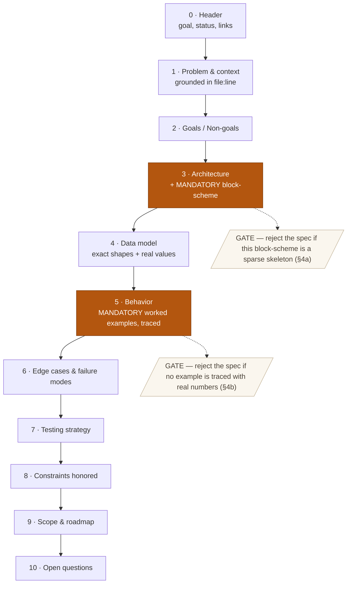
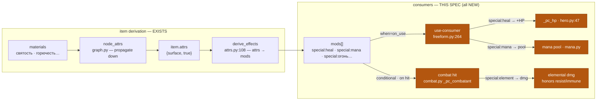
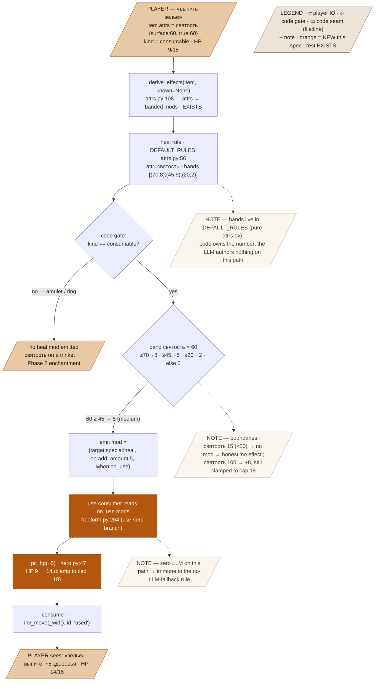

# Spec Standard — House Style for Design Specs

This is the required shape of every design spec in this repo (`docs/superpowers/specs/YYYY-MM-DD-<topic>-design.md`). Discovery and approach-picking happen in `brainstorming`; **this standard governs the written artifact** that comes out the other side. A spec is the contract between *"we agreed what to build"* and *"here is the implementation plan"* — so it must be concrete enough that a reader with zero prior context can picture the system and **trace one real case through it, number by number.**

If you are writing or reviewing a spec, read this whole file first, then obey it.

---

## 1. Principles (non-negotiable)

1. **Concrete over abstract.** Every mechanism is shown with real values. Banned: *"it heals based on holiness."* Required: *"святость 60 → medium band → +5 HP."* If a sentence could be true of ten different implementations, it is too vague.
2. **A detailed block-scheme is mandatory.** Every spec contains at least one **Mermaid `flowchart`** that *traces how the system actually works* — concrete data at each node, every branch drawn, seams named, and note nodes explaining the non-obvious steps. A boxes-and-arrows skeleton is a rejected spec. The reader must be able to follow the real behavior from the diagram alone (see §4a).
3. **A worked example is mandatory.** Every spec traces at least one concrete case **end-to-end**: real inputs → each intermediate value → final output, naming the exact function/rule at every step. At least one boundary or failure case too.
4. **No placeholders in normative sections.** No `TBD`, `handle appropriately`, `and so on`, `etc.` If you don't know a number, the spec is not ready — go find it.
5. **Name the seams.** Reference real files and functions (`file.py:123`) so the implementation plan can be written mechanically off the spec.
6. **State non-goals and out-of-scope explicitly.** A spec that doesn't say what it *won't* do invites scope creep.
7. **Honor project constraints verbatim.** Copy the binding rules (e.g. *code owns dice*, *no LLM fallback*, *tunables in `PB`*) and say, per rule, how the design satisfies it.

---

## 2. The anatomy of a spec (block-scheme)

Every spec has these sections, in this order. The block-scheme below is also a live example of principle #2 — this is what a required diagram looks like.



The two orange nodes (**Architecture block-scheme** and **Behavior worked examples**) are the elements a reviewer will reject the spec for missing. Everything else is required too, but those two are the heart.

---

## 3. Required sections, defined

For each section: what it must contain, and a concrete snippet from the running example (the Item Effects Layer — fully written out in §7).

**0 · Header.** Title, one-sentence goal, status (`draft` / `approved`), links to the brainstorm/memory it came from.
> *e.g.* — **Goal:** make crafted consumables and weapons produce real mechanical effects (heal, mana, on-hit elements) by wiring the consumers `derive_effects` already feeds.

**1 · Problem & context.** What is broken or missing, *grounded in current code with file:line*. Why now.
> *e.g.* — `derive_effects` already emits `special:heal`? No — it emits `special:poison`, `special:mana`, `social:appearance`, and the five elements, but **nothing reads them** except `attack`/`defense` (`combat.py:284`). Drinking a consumable (`freeform.py:264`) just moves it to a `"used"` holder and narrates. `святость` is a fully inert attribute. So healing potions are mechanically empty today.

**2 · Goals / Non-goals.** Bulleted, each testable. Non-goals prevent scope creep.
> *Goal:* святость → a banded heal mod, applied on drink. *Non-goal:* stat buffs (those live in the enchantment channel, Phase 2).

**3 · Architecture.** The components and how they connect, in prose, **plus the mandatory block-scheme**. Name every seam (`file:function`).

**4 · Data model.** Exact shapes — fields, types, **example values**. Prefer a typed dict or a table with real numbers over prose.

**5 · Behavior — worked examples.** The centre of gravity (see §4 for the rules). One fully-traced example per major path.

**6 · Edge cases & failure modes.** Bad input, missing model, boundary values — each with the *concrete* outcome.

**7 · Testing strategy.** What's unit-testable (with example assertions incl. numbers) vs what needs live/integration verification.

**8 · Constraints honored.** Each project-wide rule copied verbatim + how it's satisfied.

**9 · Scope & roadmap.** Phases, what's in the first increment, what's deferred, sequencing.

**10 · Open questions.** Genuine forks left for the reader to decide.

---

## 4. The two mandatory elements, spelled out

### 4a. Block-scheme rules

A block-scheme is a **detailed, annotated trace of how the system works** — a reader must be able to follow the real behavior, its branches, and *why*, from the diagram alone. Sparse "box → box → box" diagrams are rejected. A compliant block-scheme:

- **Carries concrete data at every node** — the shape/values there, not a bare name: `item.attrs = святость {surface:60, true:60}`, not `attrs`.
- **Labels every edge with the transformation and its values/conditions** — `-->|"святость 60 ≥ 45 → 5 (medium)"|`, never a naked arrow.
- **Draws every branch as a decision node.** Each gate, threshold, or conditional in the code becomes a diamond with its outcomes: `{kind == consumable?}`, `{band святость=60: ≥70? ≥45? ≥20?}`, `{target immune?}`.
- **Distinguishes roles by shape** — `[/parallelogram/]` = player input/output, `{diamond}` = gate/branch, `[rect]` = code seam, dotted **note node** = explanation.
- **Names the seam inside the node** — `derive_effects · attrs.py:108`, `_pc_hp · hero.py:47` — so the diagram maps 1:1 to real code.
- **Explains non-obvious steps with note nodes** attached by dotted links (`-.->`): why a gate exists, the boundary values, which constraint it honors.
- **Marks NEW work vs EXISTING** (a `classDef`/colour or `subgraph`) and **includes a legend** node for the shapes/colours.
- A large system gets an **overview diagram plus a detailed per-flow diagram** — never one sparse skeleton standing in for both.

Syntax you'll use:
```
IN[/"player input · concrete values"/]:::io      %% parallelogram = player IO
G{"kind == consumable?"}                          %% diamond = gate/branch
F["derive_effects · attrs.py:108"]                %% rect = code seam (named)
G -->|"60 ≥ 45 → 5"| F                             %% edge = labelled transform
n1[/"NOTE — why this step matters / boundary values"/]:::note
F -.-> n1                                          %% dotted link = annotation
classDef new fill:#b3560f,color:#fff;             %% NEW work stands out
```

### 4b. Worked-example rules

A worked example is not a description — it is a **trace**. It must contain:

1. **Named concrete inputs** with real values (`item.attrs = {святость: {surface:60, true:60}}`).
2. **A step-by-step trace** — one row/step per transformation — each naming *the function or rule that runs* and *the value after it*.
3. **The final observable output** (what the player sees / what state changed).
4. **At least one boundary or failure case** (a value just below a threshold; a missing model; an immune target).
5. **Internally consistent numbers.** If band `≥45 → 5` and the input is `60`, the output is `5` — check your own arithmetic.

Prefer a step table:

| Step | Function / rule | Input | Output |
|------|-----------------|-------|--------|
| 1 | … | … | … |

---

## 5. Review checklist

Run this against every spec before handing it off (self-review, and the `spec` skill's review mode):

- [ ] **Concreteness:** no sentence that could describe ten implementations; real numbers everywhere a number exists.
- [ ] **Block-scheme present** and faithful to the named seams.
- [ ] **≥1 fully-traced worked example** with concrete inputs → intermediate values → output, and ≥1 boundary/failure case.
- [ ] **No placeholders** (`TBD`/`etc.`/`handle appropriately`) in normative sections.
- [ ] **Seams named** with `file:line` where they exist.
- [ ] **Non-goals & out-of-scope** stated.
- [ ] **Every project constraint** listed with how it's met.
- [ ] **Numbers internally consistent** (thresholds, caps, arithmetic).

---

## 6. Template skeleton (copy this)

```markdown
# <Title> — Design Spec

**Goal:** <one sentence>
**Status:** draft
**From:** <brainstorm/memory links>

## 1. Problem & context
<what's broken/missing, grounded in file:line; why now>

## 2. Goals / Non-goals
**Goals:** <testable bullets>
**Non-goals:** <explicit exclusions>

## 3. Architecture
<prose naming components + seams>

​```mermaid
flowchart LR
  <block-scheme of the system>
​```

## 4. Data model
<exact shapes with real example values>

## 5. Behavior — worked examples
### Example A: <path>
| Step | Function/rule | Input | Output |
|--|--|--|--|
| 1 | … | … | … |
### Example B (boundary/failure): <case>
<trace>

## 6. Edge cases & failure modes
<each with concrete outcome>

## 7. Testing strategy
<unit-testable w/ example assertions incl. numbers | needs live verify>

## 8. Constraints honored
- <rule verbatim> — <how satisfied>

## 9. Scope & roadmap
<phases; first increment; deferred>

## 10. Open questions
<genuine forks>
```

---

## 7. Worked example — a complete spec to this standard: **Item Effects Layer (Phase 1)**

Everything below is a real, standard-compliant spec. Read it as *"this is what a spec that obeys §1–§6 looks like."*

### 0 · Header
**Goal:** make crafted consumables heal/restore-mana and crafted weapons deal on-hit elemental damage, by wiring the runtime consumers that `derive_effects` already feeds but that were never built.
**Status:** draft · **From:** [[craft-items-rework]], the effects-layer brainstorm.

### 1 · Problem & context
`derive_effects` (`items/attrs.py:108`) already projects attributes into mods and emits `special:poison`, `special:mana`, `social:appearance`, and the five elemental `special:*` targets. **But the only consumer at runtime is combat, and it reads only `attack`/`defense`** (`_derived_amount`, `combat.py:278`). Consequences:
- Drinking a consumable (`use` verb, `freeform.py:264`) just does `inv_move(..., "used")` + narrates `«…» — израсходовано.` — no HP, no effect.
- The `зелье исцеления` graph node (`itemgraph.json:4276`) has **no attrs and no mods** — mechanically empty.
- `святость` is read by **no rule** — a fully inert attribute.
- Emitted `special:огонь` on a weapon is never applied on a hit.

So a player can craft a "healing potion" or a "flaming sword" and it does nothing. This blocks freeform craft from mattering.

### 2 · Goals / Non-goals
**Goals**
- A `heal` rule: `святость` → a banded `special:heal` mod on consumables.
- A **use-consumer**: on drink, apply `special:heal` → HP and `special:mana` → the player mana pool, then consume.
- An **on-hit consumer**: a weapon's `special:<element>` mods add elemental damage on a landed hit, honoring bestiary `resist`/`immune`.

**Non-goals**
- Stat buffs (+STR) — those are the enchantment channel (Phase 2), not attribute-derived.
- Equip slots — combat keeps auto-selecting best weapon/armor.
- New attributes — reuse `святость`; no 19th attr.

### 3 · Architecture
Derivation already exists (left); this spec builds the **consumers** (right). No new derivation machinery — one new rule plus three read sites: the `use` branch, the mana pool, and the combat hit.

*Overview* — derivation exists (left); this spec builds the three consumers (right, all NEW):



*Traced in full for the heal path* — every value, every gate, seams named, boundaries noted (this is the level of detail a block-scheme must reach):



### 4 · Data model
**New rule** in `DEFAULT_RULES` (`items/attrs.py:56`, a pure module that may own its band constants):
```python
"heal": {"attr": "святость", "bands": [(70, 8), (45, 5), (20, 2)],
         "target": "special:heal", "when": "on_use"},   # emitted only when kind == "consumable"
```
**Emitted mod shape** (unchanged, matches the real `derive_effects` output):
```python
{"target": "special:heal", "op": "add", "amount": 5, "when": "on_use"}
```
**Bands already in the tree, reused as-is:** mana `[(75,3),(50,2),(25,1)]` → `special:mana`; elements `[(70,3),(45,2),(20,1)]` → `special:<element>`.
**Fixed points:** `PB["pc_max_hp"] = 18` (`config.py:115`); mana-band→pool mapping and element-amount→damage are new `PB` tunables.

### 5 · Behavior — worked examples

**Example A — drinking a healing draught** (`святость` 60 on the potion, player at 9/18 HP):

| Step | Function / rule | Input | Output |
|------|-----------------|-------|--------|
| 1 | materialize (craft) | node `зелье исцеления`, святость material | `item.attrs = {святость: {surface:60, true:60}}`, `kind:"consumable"` |
| 2 | `derive_effects` → `heal` rule | святость=60; bands `[(70,8),(45,5),(20,2)]` | 60 ≥ 45 → **medium** → mod `{target:"special:heal", op:"add", amount:5, when:"on_use"}` |
| 3 | use-consumer (`freeform.py` use branch) | mods with `when=="on_use"` | picks `special:heal`, amount 5 |
| 4 | `_pc_hp(+5)` (`hero.py:47`) | HP 9, cap 18 | HP **14** |
| 5 | consume | `inv_move(_wid(), iid, "used")` | potion gone; narrate `«зелье исцеления» — выпито, +5 здоровья.` |

**Example B — a mana draught** (`мана` 80): step 2 → mana rule `[(75,3),…]` → 80 ≥ 75 → band 3 → `special:mana` amount 3 → use-consumer maps band 3 → `+PB["mana_per_band"]×3` to the pool (`mana.py`), then consume.

**Example C — a flaming sword hit** (`горючесть` 50 on a `клинок`, target a goblin with no fire resist):

| Step | Function / rule | Input | Output |
|------|-----------------|-------|--------|
| 1 | `derive_effects` → `elements` (weapon form gate) | горючесть=50; bands `[(70,3),(45,2),(20,1)]` | 50 ≥ 45 → **2** → mod `{target:"special:огонь", op:"add", amount:2, when:"conditional", cond:"при попадании"}` |
| 2 | combat hit resolves (weapon lands) | attacker weapon mods | reads `special:огонь` amount 2 |
| 3 | apply elemental dmg (mirror `_spell_hit`, `magic.py:61`) | goblin, no fire resist | goblin takes **+2 fire**; a fire-**immune** target takes **0** |

**Boundary cases**
- `святость` = 15 (< 20 floor) → `derive_effects` emits **no** heal mod → drinking narrates the honest `no mechanical effect` (still consumed). No stub.
- `святость` = 100 → 100 ≥ 70 → **large** → +8, then `_pc_hp` clamps to cap 18.
- `святость` on a **non-consumable** amulet → the code gate (`kind == "consumable"`) suppresses the heal mod → an amulet does not heal on "use" (that's Phase 2 enchantment).

### 6 · Edge cases & failure modes
- **No LLM anywhere in this path** — heal/mana/element application is pure `derive_effects` + `_pc_hp`/pool/combat arithmetic. It works with the model offline, so it never trips the *no-LLM-fallback* rule.
- **Legacy items** (no `attrs`) → `derive_effects` yields no mods → consumers no-op → unchanged behavior (dual-path preserved).
- **Overheal / overmana** clamp at caps; **immune/resist** zero or reduce elemental damage via the bestiary lookup.

### 7 · Testing strategy
Unit-testable with concrete assertions (no live model needed):
- `derive_effects({attrs:{святость:{surface:60,true:60}}, kind:"consumable"})` → a `special:heal` mod with `amount == 5`.
- use-consumer on that potion → `_pc_hp` rises by 5 (9→14) and the item lands in `"used"`.
- `святость` 15 → no heal mod; 100 → amount 8, HP clamps to 18.
- flaming `клинок` (горючесть 50) hit → +2 to a plain target, +0 to a fire-immune target.
Live verify: drink + swing in a running world, confirm the narration and HP delta.

### 8 · Constraints honored
- **Code owns dice/numbers** — heal magnitude is a band table in the pure `attrs.py` (convo.py exception); the LLM authors nothing here.
- **No LLM fallback** — this path has no LLM; nothing to fall back from.
- **No mechanical gates** — nothing is blocked; a weak potion just heals little; balance comes from consumption + caps.
- **Tunables in `PB`** — `mana_per_band`, element→damage scaling live in `PB`; attribute band tables live in `DEFAULT_RULES` (pure module).

### 9 · Scope & roadmap
- **Phase 1 (this spec):** heal rule + use-consumer (heal/mana) + on-hit elements. Ships standalone; makes existing craftable consumables/weapons real.
- **Phase 2 (separate spec):** enchantment — an item carries a budget-clamped magic *law* (reusing `power_budget`/`clamp_law`/`_apply_law`), run on use/equip; stat buffs added as a `buff` mech. This is where "truly special" and +STR live.

### 10 · Open questions
- `special:mana` band → pool-points mapping: linear (`3×k`) or per-band table?
- On-hit elemental: flat banded amount, or convert the band to dice (e.g. band 2 → `1d4`)?
