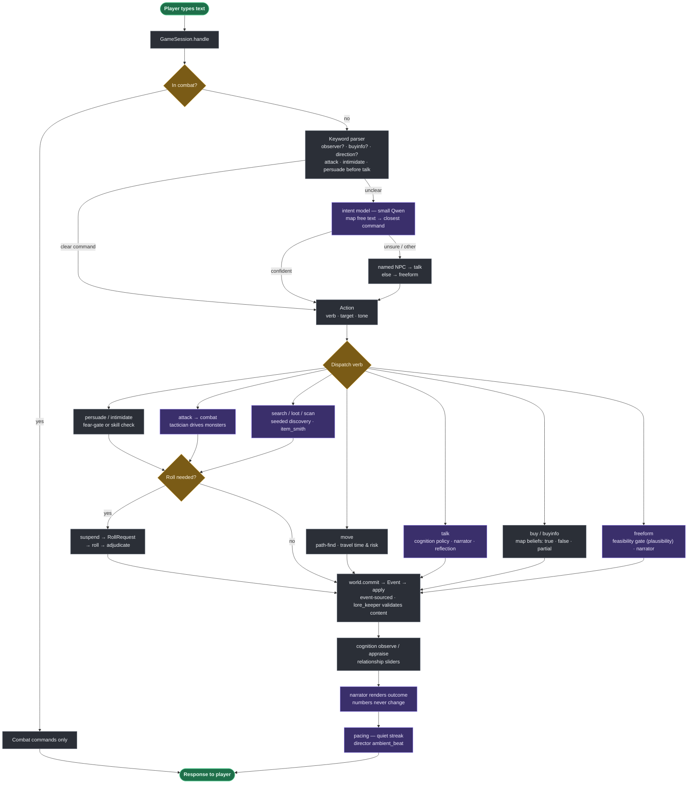

# AI-DnD Engine

A text-tactical **D&D 5e** engine with a persistent, simulated world, level-of-detail
(LOD) NPC simulation, and a set of local **LLM agents**. It implements the nine-layer
architecture from the AI-DnD design package as a vertical slice of *Lost Mine of
Phandalin* (Phandalin town + the Cragmaw region).

Backend in Python, presentation in JS. Only one thing is reused from the older `ai-dnd`
project: the **model-request client** (`OllamaClient`). Everything else is written from
the design docs.

---

## Why it runs without a model

**Determinism is separated from language.** Dice, rules, and world state are
deterministic, auditable code. The LLM is used only to *parse the player's intent* and to
*render results* — it never decides outcomes or computes mechanics. Every LLM path is
guarded (`manager is None or not manager.available()` → `None`) and has a **deterministic
fallback** (templates, seeded RNG, rule tables). So the engine plays end-to-end **with no
model server**; a connected model only raises quality where a role is wired in.

This is also what makes **golden-replay** possible: the same seed + same inputs reproduce
the same `state_hash()`.

---

## Agent roles

Eleven roles, each a system prompt + JSON schema (constrained decoding), each with a
deterministic fallback. All are wired into the live loop.

| Role | Purpose | Deterministic fallback |
|---|---|---|
| `intent` | parse free-text into a structured action | keyword parser (verbs, directions, aliases) |
| `plausibility` | **can the player's action happen here?** (feasibility gate) | rule list of impossible feats |
| `narrator` | render dialogue **and** mechanical outcomes (no number changes) | grounded templates |
| `cognition` | NPC action policy under relationship gates | trust/fear gate table |
| `reflection` | synthesize NPC memories into higher-level beliefs | one aggregating reflection |
| `character_gen` | fill the **NPC pool** under context (enrich + spawn) | skeleton persona |
| `item_smith` | name/describe a spawned **item instance** (flavor, not mechanics) | template name |
| `tactician` | choose a monster's combat action | deterministic target/heuristic AI |
| `director` | pacing: surface hooks, raise random-event odds in a lull | heuristics + seeded ambient beats |
| `quest_writer` | framing + giver lines for assembled side quests | template framing |
| `lore_keeper` | validate generated content against world invariants | invariant checks |

---

## The turn pipeline

What happens after the player types text. Node colour marks the kind of step:
🟣 **LLM-backed** (each has a deterministic fallback) · 🟡 **decision** · 🟢 **in / out**.



Full write-up: [`docs/architecture.md`](docs/architecture.md).

---

## Quickstart (uv)

```bash
uv sync                      # runtime + dev group (pytest, ruff, zensical)
uv run aidnd                 # play in the terminal
uv run aidnd serve           # web UI at http://127.0.0.1:8000  (live map at /map)
uv run aidnd doctor          # check the model server (optional)
uv run pytest -q             # tests
uv run ruff check .          # lint
```

No `uv`? A `.venv` + `pip install -e .` works too; or use `./run.sh`.

### Connecting a model (optional)

The engine runs fully offline. To enable model-rendered narration/judging, expose a local
Ollama server (e.g. an SSH tunnel) and confirm with `uv run aidnd doctor`
(`server available: True`). Without it, deterministic fallbacks are used.

---

## Layout

```
src/aidnd/
  world/        # L1 ECS, event log, knowledge graph, spatial graph, environment
  lod/          # L2 LOD tiers, salience, smart objects
  cognition/    # L3 memory, relationships, reflection
  inference/    # L4 model client, agent prompts+schemas, structured output
  rules/        # L5 deterministic 5e rules + dice
  combat/       # tactical combat (grid, surfaces, spells, tactician)
  gen/          # L7 generation: NPCs, items, quests, discovery, map info
  runtime/      # L6/L8 orchestrator (game loop), director (pacing), snapshots
  content/      # authored Phandalin/Cragmaw content, knowledge, regions, maps
  server/       # L9 FastAPI + WebSocket + web UI (game, /map, /eval)
  eval/         # LLM-as-judge scene/conversation harness
tests/          # pytest suite (deterministic, model-off)
docs/           # documentation site (Zensical)
scripts/        # asset generation (battle maps)
```

---

## Testing & determinism

`uv run pytest -q` — the suite is deterministic (runs model-off). `tests/test_replay.py`
guards golden-replay: identical seed + inputs reproduce identical `state_hash()`. Pacing,
narration, and other model paths are read-only/flavor and never perturb the hash.

## Docs

Built with [Zensical](https://zensical.org): `uv run zensical serve` (or `build`).
Source in [`docs/`](docs/).
