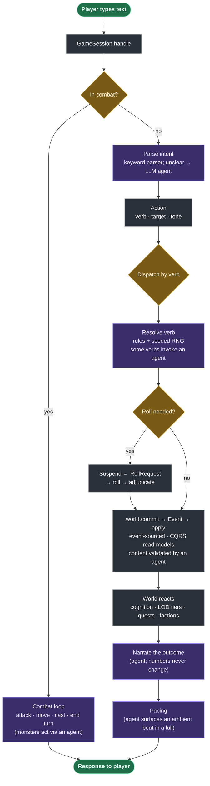

# AI-DnD Engine

A text-tactical **D&D 5e** engine with a persistent, simulated world, level-of-detail
(LOD) NPC simulation, and a set of local **LLM agents**. It implements the nine-layer
architecture from the AI-DnD design package as a vertical slice of *Lost Mine of
Phandalin* (Phandalin town + the Cragmaw region).

Backend in Python, presentation in JS.

---

## Why it runs without a model

**Determinism is separated from language.** Dice, rules, and world state are
deterministic, auditable code. The LLM is used only to *parse the player's intent* and to
*render results* — it never decides outcomes or computes mechanics. Every LLM path is
guarded (`manager is None or not manager.available()` → `None`) and has a **deterministic
fallback** (templates, seeded RNG, rule tables). So the engine plays end-to-end **with no
model server**; a connected model only raises quality where a role is wired in.

This is also what makes **golden-replay** possible: the same seed + same inputs reproduce
the same `state_hash()`.

---

## The pipeline

The general flow after the player types text. This is the **control logic** — where LLM
agents plug in is marked 🟣, but *what each agent does* is documented per-agent in
[LLM agents](#llm-agents) below, not here.

Node colour: 🟣 **may call an LLM agent** (always with a deterministic fallback) ·
🟡 **decision** · 🟢 **in / out** · ⬜ **deterministic engine**.



Stage by stage:

1. **Handle / combat gate** — if a fight is active, only combat commands are accepted.
2. **Parse intent** — a fast keyword parser; if the text isn't a clear command it falls
   back to the `intent` agent, which maps free text onto the closest engine verb.
3. **Dispatch** — the `Action` (verb · target · tone) is routed to a handler
   (`move`, `talk`, `persuade`/`intimidate`, `attack`, `search`/`loot`, `buy`/`buyinfo`,
   `freeform`, inventory, board, …).
4. **Resolve** — deterministic rules + seeded dice decide the outcome; a roll, if needed,
   suspends the turn as a `RollRequest` and resumes on the rolled faces.
5. **Commit** — the only way state changes: `world.commit(verb, …)` appends an `Event` and
   applies it to the read-models (event sourcing / CQRS).
6. **World reacts** — cognition (NPC memory/relationships), LOD promotion, quest predicates,
   and faction standing all update off the committed events.
7. **Narrate & pace** — the outcome is rendered to prose and the director may inject an
   ambient beat during a lull.

Full write-up: [`docs/architecture.md`](docs/architecture.md).

---

## LLM agents

Each agent is a **system prompt + JSON schema** (constrained / structured decoding at
temperature 0) with a **deterministic fallback**. Routing lives in
`ModelManager.ROLE_MODELS`: `intent` uses a small fast model (`INTENT_MODEL`), every other
role uses the base model (`BASE_MODEL`). Code: `src/aidnd/inference/agents.py`.

Twelve roles, grouped by where they fire in the pipeline.

### Input → output

#### `intent` — understand the player
- **Fires at:** *Parse intent*, only when the keyword parser is unsure.
- **In:** player text + scene context (place, present NPCs, exits, affordances).
- **Out:** `{ verb, target, tone, needs_clarification }` (`emit_intent`; `verb` is an enum of
  engine commands).
- **Logic:** few-shot, snaps to the nearest engine verb; unsure/"other" → a named NPC means
  `talk`, otherwise `freeform`.
- **Fallback:** keyword parser (verbs, directions, aliases).

#### `plausibility` — feasibility gate
- **Fires at:** *Resolve* for freeform/ambiguous actions, before anything is narrated.
- **In:** the proposed action + world context.
- **Out:** `{ plausibility 0..1, drivers, verdict_note }` (`estimate_plausibility`).
- **Logic:** conservative — implausible-but-possible scores low, true contradictions and
  impossible feats score near zero.
- **Fallback:** a rule list of impossible feats.

#### `narrator` — render the result
- **Fires at:** *Narrate*, for dialogue replies **and** mechanical outcomes.
- **In:** the structured outcome (verb, damage + damage type, dialogue decision, scene).
- **Out:** prose narration — **never changes numbers**.
- **Logic:** weapon/damage-type fidelity, no anachronisms, no invented NPC lines.
- **Fallback:** grounded templates.

#### `cognition` — how an NPC reacts
- **Fires at:** *World reacts*, during `talk`/social.
- **In:** retrieved NPC memory + the relationship edge (trust/fear/affinity) + player
  verb/tone.
- **Out:** an action policy `{ action, info_disclosed, rationale_tags }` (`propose_action`).
- **Logic:** disclosure is gated by trust/fear; faction standing shifts the gate.
- **Fallback:** a trust/fear gate table.

#### `reflection` — NPC belief synthesis
- **Fires at:** *World reacts*, when an NPC's memory tree summarizes.
- **In:** leaf observations.
- **Out:** higher-level reflections, each citing the observation ids it derives from
  (`emit_reflections`).
- **Fallback:** one aggregating reflection.

#### `character_gen` — fill the NPC pool
- **Fires at:** lazily, at an NPC's first promotion to L3 (and when spawning passersby).
- **In:** a skeleton persona (name, archetype, race, traits).
- **Out:** `{ voice, traits }` enrichment (`emit_persona`); spawns satisfy world invariants
  (workplace, residence).
- **Fallback:** the deterministic skeleton persona.

#### `item_smith` — flavor an item instance
- **Fires at:** *Resolve* for `search`/`loot`, when an item is spawned.
- **In:** the item template + world context.
- **Out:** `{ name, description, properties }` (`forge_item`) — **cosmetic only**; rarity,
  bonuses and numbers stay fixed by the template.
- **Fallback:** the template name.

#### `tactician` — monster turns
- **Fires at:** the *Combat loop*, on each monster's turn.
- **In:** a battle-state digest + the monster's stat block.
- **Out:** `{ intent, target, move_to, ability }` (`choose_tactic`); the rules engine
  resolves dice and movement, the agent only *chooses*.
- **Fallback:** deterministic target selection / heuristic AI.

#### `director` — pacing
- **Fires at:** *Pacing*, after a turn and during lulls.
- **In:** a world digest, active quests, recent events, the quiet streak.
- **Out:** a directive `{ directive, ref, reason }` (`emit_directive`) or an ambient beat.
- **Logic:** raises random-event odds the longer nothing interesting happens, when the scene
  allows it.
- **Fallback:** heuristics + seeded ambient beats.

#### `quest_writer` — side-quest text
- **Fires at:** when a CSP side quest is assembled.
- **In:** the template, filled slots (giver, target, location, reward), world facts.
- **Out:** `{ title, framing, giver_lines, objective_text, completion_text }` (`write_quest`);
  mechanics stay deterministic, the agent only writes flavor.
- **Fallback:** template framing.

#### `lore_keeper` — invariant guard
- **Fires at:** *Commit*, validating proposed/generated content.
- **In:** the proposed content + the world knowledge graph.
- **Out:** a verdict with concrete fixes (every professional NPC has a workplace and
  residence; every shop one owner; every named item an owner and a location).
- **Fallback:** direct invariant checks.

#### `faction_gen` — flesh out a faction
- **Fires at:** lazily, the first time the player inspects a per-world faction.
- **In:** the faction archetype kind + seed name/goals + the town.
- **Out:** `{ name, blurb, goals, values }` (`forge_faction`); persisted via a
  `faction_enrich` event so it survives save/load and replay.
- **Fallback:** the archetype defaults (`rules/factions.py`).

---

## Quickstart (uv)

```bash
uv sync                      # runtime + dev group (pytest, ruff, zensical)
uv run aidnd                 # play in the terminal
uv run aidnd serve           # web UI at http://127.0.0.1:8000  (live map at /map)
uv run aidnd doctor          # check the model server (optional)
uv run pytest -q             # tests
uv run ruff check .          # lint
```

No `uv`? A `.venv` + `pip install -e .` works too; or use `./run.sh`.

### Connecting a model (optional)

The engine runs fully offline. To enable model-rendered narration/judging, expose a local
Ollama server (e.g. an SSH tunnel) and confirm with `uv run aidnd doctor`
(`server available: True`). Without it, deterministic fallbacks are used.

---

## Layout

```
src/aidnd/
  world/        # L1 ECS, event log, knowledge graph, spatial graph, environment
  lod/          # L2 LOD tiers, salience, smart objects
  cognition/    # L3 memory, relationships, reflection
  inference/    # L4 model client, agent prompts+schemas, structured output
  rules/        # L5 deterministic 5e rules, dice, progression, factions
  combat/       # tactical combat (grid, surfaces, spells, tactician)
  gen/          # L7 generation: NPCs, items, quests, factions, discovery, map info
  runtime/      # L6/L8 orchestrator (game loop), leveling, director, persistence
  content/      # authored Phandalin/Cragmaw content, classes, factions, board, quests
  server/       # L9 FastAPI + WebSocket + web UI (game, /map, /city, /world, /eval)
  eval/         # LLM-as-judge scene/conversation harness
tests/          # pytest suite (deterministic, model-off)
docs/           # documentation site (Zensical)
scripts/        # asset generation (battle maps)
```

---

## Testing & determinism

`uv run pytest -q` — the suite is deterministic (runs model-off). `tests/test_replay.py`
guards golden-replay: identical seed + inputs reproduce identical `state_hash()`. Pacing,
narration, and other model paths are read-only/flavor and never perturb the hash.

## Docs

Built with [Zensical](https://zensical.org): `uv run zensical serve` (or `build`).
Source in [`docs/`](docs/).
