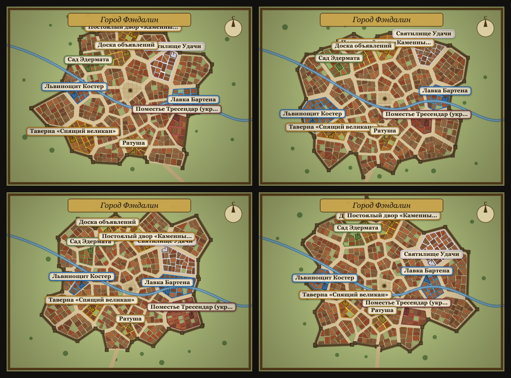

# AI-DnD

Русскоязычная AI-D&D игра: живой фронтирный город (~900 NPC — разум, память, нужды, агенды),
мир-на-пользователя из предсгенерённых пулов, пошаговый мир (действие игрока = тик мира).
LLM парсит намерение, решает в неоднозначности, говорит голосами людей и арбитрит фриформ;
детерминированный код владеет кубами, бюджетами, инвентарями и боем — и клампит всё, что
предлагает модель.

**Без LLM движок не работает.** Офлайн-фоллбэков нет: нет модели → ошибка, а не фейковый
контент. Заглушки существуют только в тестах.



## Запуск

```bash
uv sync
uv run aidnd serve           # web UI: http://127.0.0.1:8000
uv run pytest -q
```

## Документация

- **[docs/LOOP.md](docs/LOOP.md)** — архитектура игрового тика (канон).
  Полная иерархическая структура проекта — в работе; остальные документы удалены как
  устаревшие (история — в git).
