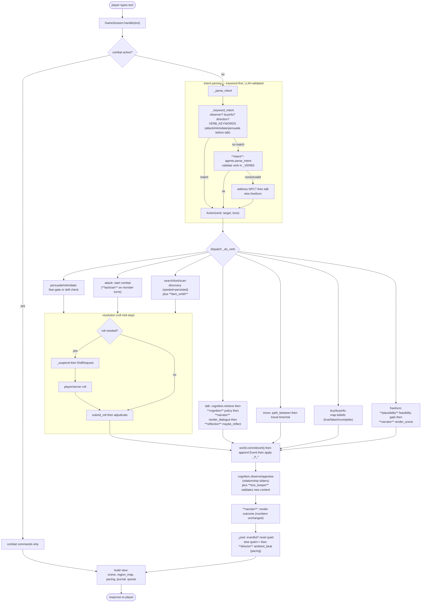

# Architecture

## Nine layers

| Layer | Package | Responsibility |
|---|---|---|
| L1 World State | `world/` | ECS, event log, knowledge graph, spatial graph, environment |
| L2 LOD | `lod/` | LOD tiers, salience, smart objects, off-screen fast-forward |
| L3 Cognition | `cognition/` | NPC memory, relationships (affinity/trust/fear/respect), reflection |
| L4 Inference | `inference/` | model client, agent prompts + schemas, structured output |
| L5 Rules | `rules/` | deterministic 5e checks + dice |
| Combat | `combat/` | tactical grid combat (pathfinding, LoS, cover, surfaces, spells) |
| L7 Generation | `gen/` | NPCs, items, quests, discovery, map-info beliefs |
| L6/L8 Runtime | `runtime/` | orchestrator (game loop), director (pacing), snapshots |
| L9 Presentation | `server/` | FastAPI + WebSocket + web UI |

State changes are **event-sourced**: `world.commit(verb, …)` appends an `Event` and applies
it through `_h_*` handlers. Read-models (scene context, region map, journal) are derived,
never authoritative. This gives auditable history and golden replay.

## The turn pipeline

What happens after the player submits text. Agent roles are in **bold**; each has a
deterministic fallback so the same flow runs with no model.

### Stage notes

- **Intent parsing** is keyword-first and deterministic; the `intent` model is consulted
  only for unmatched free text and is validated against the engine's verb set. Hostile and
  persuade keywords are matched before `talk` so "intimidate… speak!" is not misread as
  chat. Truly free-form input becomes a `freeform` action.
- **Feasibility gate** (`plausibility`): free-form actions are checked for whether they can
  happen here and now; impossible feats are refused before any narration. Offline, a rule
  list handles obvious impossibilities.
- **Resolution** can pause mid-step: when a roll is needed the turn suspends with a
  `RollRequest` and resumes on the result (server-animated or manual). Numbers are computed
  by the rules engine — never by the model.
- **Cognition**: every interaction is observed and appraised, evolving the per-NPC
  relationship vector; gates decide whether secrets are shared or fear triggers flight.
  NPCs periodically **reflect** to form higher-level beliefs.
- **Pacing** (`director`): after each non-combat turn a "quiet" counter tracks the lull;
  when it grows and the location permits, the probability of a context-appropriate random
  event rises (threat cues in the wild, social beats in town). Beats are narrative-only, so
  replay stays reproducible.

## Determinism

Anything that must replay identically is seeded with a `blake2b` sub-seed hierarchy
(`subseed(seed, scope, *parts)`) and committed through the event log. Model output,
pacing beats, and rendered narration are flavor/read-only and are excluded from
`state_hash()`.
