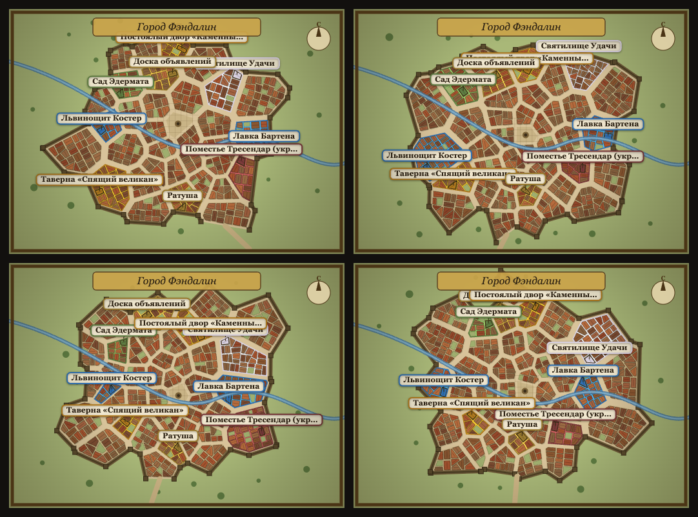
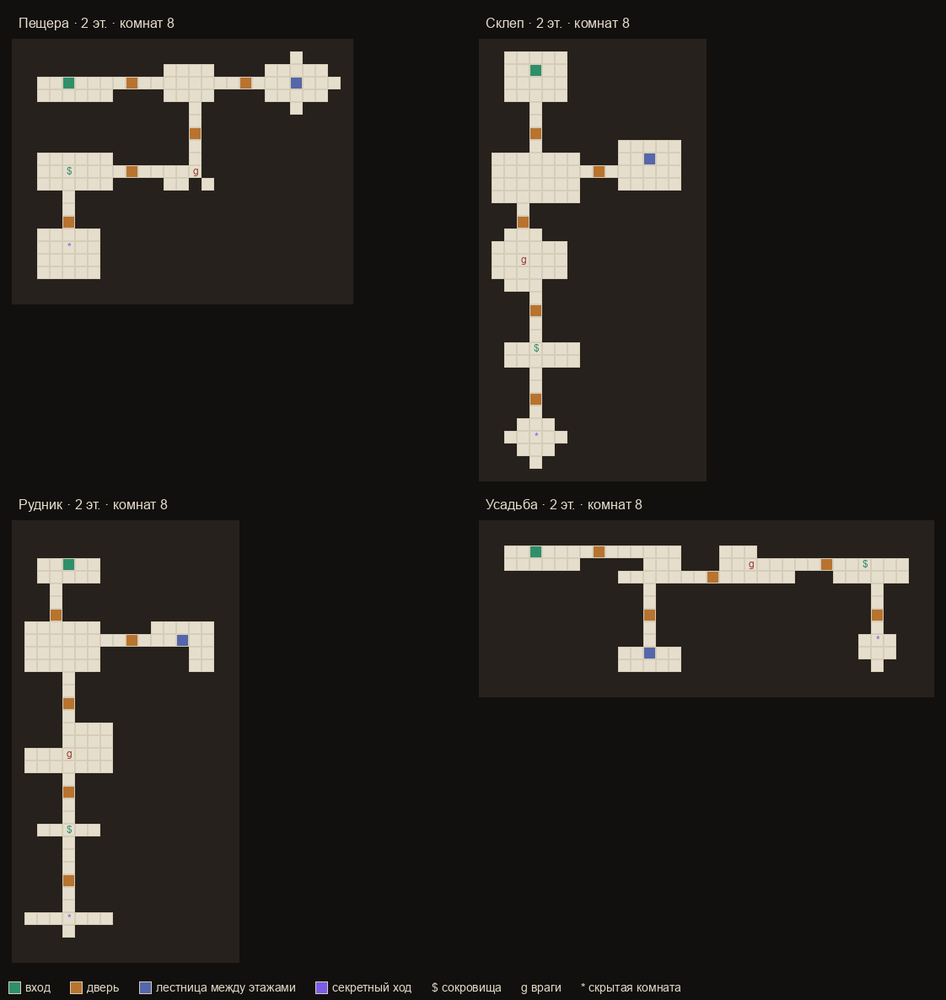
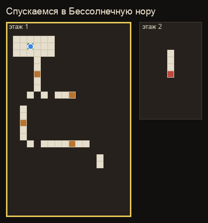

# Maps

The world is procedurally generated and **deterministic** — the same seed reproduces the
same map. Towns are laid out Watabou-style (Voronoi wards, walls, a river, key buildings);
dungeons are multi-level **tile maps** with varied room shapes, lock-and-key progression and
hidden rooms. The model only adds flavor (names, descriptions) — never the layout.

**Towns** — four seeds:

**Dungeons** — four themes (floor 1 shown, secret rooms revealed):

**A dungeon run** — fog lifts room by room, a locked door blocks the boss until the guard
room is cleared, a hidden room is found by searching, then the boss falls (rendered from a
deterministic, model-off playthrough):

Regenerate with `python scripts/gen_map_collages.py dungeons` and
`python scripts/gen_dungeon_anim.py` (dungeons/animation render in Python; town frames come
from the in-browser city generator — see the script docstrings).
