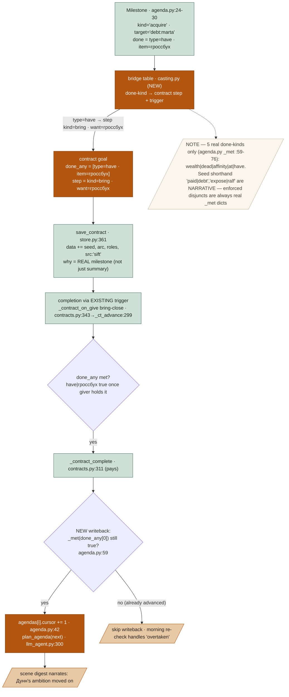

# Emergent Quest Pipeline — Design Spec

**Goal:** turn the town's own sim state (deeds, agendas, affinities) into offered quests — a morning **sift → judge → cast → offer → arc** pipeline where code sifts and prices real facts, one LLM judge ranks for taste, and completing an emergent quest mechanically advances the giver's real `Agenda`.
**Status:** draft · written to [.claude/skills/spec/spec-standard.md](../../../.claude/skills/spec/spec-standard.md)
**From:** the emergent-quests brainstorm (`scratchpad/quest-design-brief.md`, user-locked 2026-07-12) · memories [[combat-guild]], [[mind-decision-core]], [[action-loop]].

---

## 1. Problem & context

The town already **holds** everything a quest is made of, and none of it becomes one:

- Every NPC carries a long-term `Agenda` of `Milestone`s with a real completion predicate `done` (`agenda.py:24-30`); `advance_agendas` (`agenda.py:79`) silently closes a milestone the moment its `_met` predicate (`agenda.py:59-76`) is true. Nobody is ever *asked* to help.
- The improvised personal contract (`_make_contract`, `contracts.py:166`) invents a **fresh** errand from a random world container each time (`_contract_candidates`, `contracts.py:123`), throws the giver's agenda summary into the prompt only as a flavor string `why` (`contracts.py:256`), and **never touches the milestone it was born from**. Complete it and the giver's real ambition has not moved a millimetre.
- The deeds journal (`deeds.py:30`) records broken promises (`deeds.py:60-83`), thefts, murders — rich narrative fuel — that nothing reads back into offered goals.
- Affinity edges (`state.relationships[...]["affinity"]`) encode every grudge and debt, unused by the quest layer.

So the world is dense with *motivated pressure* (a broken promise, a hated creditor, an unavenged murder) and the only thing the player is ever offered is "fetch item X from container Y." This spec wires the pressure into offers, and makes finishing an offer **the same event** as the giver's milestone closing.

## 2. Goals / Non-goals

**Goals**
- A pure-code **sifter** (`quests/seeds.py`) that scans deeds + all pool agendas + affinities each morning and emits fully-bound `QuestSeed`s from **5 launch patterns**.
- A pure-code **salience** score (`quests/salience.py`) ordering seeds; weights in `PB`.
- **One** LLM **judge** call ranking/vetoing the top-K and returning a "why compelling" line that feeds the pitch — no LLM → no emergent offer this morning (honest).
- The **honest bridge (Inc 1)**: an emergent quest's completion predicate is the giver's **verbatim** `Milestone.done`; on completion, mark that milestone done, `Agenda.cursor += 1`, and re-plan (`plan_agenda`). One quest = one milestone, mechanically.
- An **arc**: every chosen seed first *foreshadows* through NPC minds (1–2 ticks), then offers privately (dialogue) or publicly (board); a **twist** beat may ADD an optional OR-predicate mid-quest (widening choice, never invalidating progress); a light **director** FSM keeps one emergent quest in the surfacing window.
- Consequences are **just deeds** → next morning's sift reads them → nemeses/sequels emerge with zero extra machinery ("compost").

**Non-goals**
- **No main-plot integration** — emergent quests are self-contained town business, not a scripted campaign spine.
- **No multi-quest chains / MICE nesting yet** — one seed = one milestone = one contract; the only "chaining" is the compost loop (a quest's deeds seeding a *future, independent* sift), not authored quest trees.
- **No new persistence tables** — the seed/arc/roles/src ride as 4 JSON fields inside the existing contract `data` blob (`store.py:361`), zero migration.
- **Improvised contracts unchanged** — `_make_contract`'s random-container errands (`contracts.py:166`) stay as fallback texture; emergent quests are marked `src:"sift"`, improvised ones are not.
- No new `Milestone.done` predicate *types* (`paid`, `expose` are narrative shorthand, not new `_met` grammar — see §4).

## 3. Architecture

New package `src/aidnd/server/play/engine/quests/` — five pure-ish modules — hung off the existing morning batch (`_world_events`, `routine.py:20`, alongside `_npc_delves + _deal_jobs + incident_spawn + gang_morning` at `routine.py:30` and `_board_npc_fulfill + _board_publish` at `routine.py:36`). The **existing contract object is EXTENDED** (4 JSON fields), never replaced; all completion still flows through the existing triggers `_contract_on_give` (`contracts.py:343`), `_contract_on_move` (`:371`), `_contract_on_talk` (`:380`), `_contract_on_death` (`combat.py:360`) and `_contract_complete` (`:311`).

- **`seeds.py`** — the sifter. 5 patterns over `deeds.py`, `agenda.py`, affinities → bound `QuestSeed`s + twist candidates.
- **`salience.py`** — code-owned score; `PB` weights.
- **`framing.py`** — the **two LLM seams**: the judge call, and the 3-artifact framer (pitch / foreshadow line / twist reveal) with a structural apophenia validator.
- **`casting.py`** — pure code: Doran motivation → contract `kind` + reward shape (real purse/item) + DC/danger from villain's real stats.
- **`director.py`** — tiny persisted FSM: window, queue, interrupt, foreshadow, offer, expiry-compost.

### 3a. Master pipeline (the whole trace)

```mermaid
flowchart TD
    MORNING["morning batch · _world_events<br/>routine.py:20 (hook here, after :30/:36)"] --> SIFT["SIFT 5 patterns · quests/seeds.py<br/>scan deeds.py:30 + pool agendas agenda.py:33 + affinity"]:::new
    SIFT --> TC{"twist candidate present?<br/>2nd fact touching same cast"}
    TC -->|"yes"| SB["seed.twist = {fact, reveal_on}"]:::new
    TC -->|"no"| SN["seed lives · twist beat skipped"]:::new
    SB --> SAL
    SN --> SAL
    SAL["SALIENCE · quests/salience.py<br/>score = w_rare·rarity + w_peak·peak + w_near·prox + w_fresh·fresh"]:::new
    SAL --> TOPK["order desc · top quest_topk=4"]:::new
    TOPK --> LLM1{"LLM available?"}
    LLM1 -->|"no"| NOOFF[/"NO emergent offer this morning · error logged<br/>boards/incidents continue (honest, no-fallback)"/]:::io
    LLM1 -->|"yes"| JUDGE["ONE judge call · quests/framing.py<br/>K seeds+evidence+personas → rank + veto + why-line"]:::new
    JUDGE --> VETO{"judge veto?"}
    VETO -->|"vetoed"| DECAY[/"seed dropped · re-surfaces only if freshness keeps it (natural decay)"/]:::io
    VETO -->|"kept"| DIR["DIRECTOR FSM · quests/director.py<br/>quest_active_max=1 · scored queue (status:queued rows)"]:::new
    DIR --> INT{"interrupt?<br/>new ≥ quest_interrupt_k(2.0) × queued"}
    INT -->|"yes"| BUMP["queued seed → waiting · new takes window"]:::new
    INT -->|"no · window free"| FRAME
    BUMP --> FRAME
    FRAME["FRAMER · quests/framing.py — 3 artifacts<br/>pitch · foreshadow line · twist reveal"]:::new
    FRAME --> APO{"apophenia valid?<br/>every entity ∈ cast/evidence (like _build_step)"}
    APO -->|"invalid"| REGEN{"regenerated once?"}
    REGEN -->|"no"| FRAME
    REGEN -->|"yes"| SKIP[/"skip this morning · honest absence"/]:::io
    APO -->|"valid"| CAST["CASTING · quests/casting.py (pure)<br/>motivation→kind + reward (real purse 41/item) + DC from villain stats"]:::new
    CAST --> PERSIST["save_contract status='queued'<br/>store.py:361 · data += seed,arc,roles,src:'sift'"]:::seam
    PERSIST --> FS["Beat 1 · FORESHADOW (quest_foreshadow_ticks=2)<br/>cast minds get seed as HOT impulse + line via NORMAL mind pipeline"]:::new
    FS --> PP{"private or public?<br/>(seed nature)"}
    PP -->|"private"| OFP["Beat 2 · giver pending_offer<br/>dialogue.py:101 (outranks _contract_offer contracts.py:146)"]:::new
    PP -->|"public"| OFB["Beat 2 · board via _board_publish contracts.py:412<br/>incident_jobs-style merge incidents.py:193 · framer pitch"]:::new
    OFP --> ACC
    OFB --> ACC
    ACC{"offer accepted in<br/>quest_offer_days=2?"}
    ACC -->|"no"| COMPOST[/"EXPIRE→COMPOST · giver acts on his agenda himself (mind)<br/>→ new deeds → next morning's sift reads them"/]:::io
    ACC -->|"yes"| ACTIVE["status='active' · arc.beat='active'<br/>done_any = [verbatim Milestone.done]"]:::new
    ACTIVE --> EVID{"evidence still holds?<br/>(each morning re-check per live seed)"}
    EVID -->|"no · milestone moot"| OVER[/"close 'overtaken' · honest in-fiction giver line<br/>(e.g. Марта paid her own debt)"/]:::io
    EVID -->|"yes"| TW{"twist reveal_on fired?<br/>(first step done / first visit to villain node)"}
    TW -->|"yes"| TWIST["arc.beat='twisted' · APPEND OR-disjunct (real _met dict)<br/>reveal → player journal + giver's next line"]:::new
    TW -->|"no"| PLAY
    TWIST --> PLAY["PLAYER pursues predicate · existing triggers<br/>_on_give :343 / _on_move :371 / _on_talk :380 / _on_death combat.py:360"]:::seam
    PLAY --> MET{"done_any predicate met?<br/>(however obtained: bought/stolen/extorted)"}
    MET -->|"no"| PLAY
    MET -->|"yes"| COMPLETE["_contract_complete · contracts.py:311<br/>pays reward · trust/aff · favor deed"]:::seam
    COMPLETE --> WB["WRITEBACK (NEW) · verify _met(done[0]) → agenda.cursor+=1<br/>agenda.py:42 → plan_agenda llm_agent.py:300 (next milestone)"]:::new
    WB --> LOOP[/"scene digest narrates the change · next morning's sift may find consequences (compost loop)"/]:::io

    n1[/"NOTE — code sifts &amp; prices (deterministic); the LLM only JUDGES taste and WRITES 3 strings.<br/>Two LLM seams total, both in framing.py"/]:::note
    JUDGE -.-> n1
    n2[/"NOTE — no-mechanical-gates: minds are NEVER throttled; the director paces only the TELLING.<br/>quest_active_max caps offers-in-flight, not NPC behavior"/]:::note
    DIR -.-> n2
    n3[/"NOTE — honest bridge: done_any[0] IS the giver's verbatim Milestone.done, so completing<br/>the contract makes _met true by construction → the writeback never lies"/]:::note
    WB -.-> n3
    LG[/"LEGEND ▱ player-visible IO · ◇ code gate · ▭ existing seam (file:line) · orange = NEW this spec · ┈ note"/]:::legend

    classDef io fill:#e7c9a6,stroke:#b3560f,color:#241f1a;
    classDef new fill:#b3560f,stroke:#7a3a0a,color:#fff;
    classDef seam fill:#cfe0d8,stroke:#3f6b58,color:#1a241f;
    classDef note fill:#faf6ee,stroke:#c3b499,color:#4b4237;
    classDef legend fill:#ece4d6,stroke:#8a7c60,color:#241f1a;
```



### 3b. The honest bridge (Inc 1) — milestone → predicate → writeback



## 4. Data model

**`QuestSeed`** (dict, not persisted until chosen — `quests/seeds.py`):
```python
seed = {
  "pattern": "kin_debt",
  "giver": "npc:dunn",
  "goal": {"kind": "acquire", "target": "debt:marta",
           "done": {"type": "have", "item": "гроссбух"}},   # VERBATIM giver Milestone.done (real _met dict)
  "cast": {"villain": "npc:ralf", "prize": "npc:marta"},     # Propp roles, real pids
  "motivation": "serenity",                                  # Doran class → kind + reward shape
  "twist": {"fact": "promise|ralf owes the guild 200",       # 2nd real fact touching the cast
            "reveal_on": "visit:npc:ralf",                   # first visit to villain node
            "adds": {"type": "dead", "id": "npc:ralf"}},     # the OPTIONAL OR-disjunct (real _met dict)
  "evidence": ["deed:d123", "agenda:npc:dunn:0"],            # honesty anchors (deed id, agenda[idx])
  "score": 0.0,
}
```

**Contract gains 4 JSON fields** in the same SQLite `data` blob (`save_contract`, `store.py:361`; zero migration):
```python
data["seed"]   = seed                       # provenance + writeback anchors
data["arc"]    = {"beat": "foreshadow"}      # foreshadow|offered|active|twisted|closed|expired|overtaken
data["roles"]  = {"giver":"npc:dunn","villain":"npc:ralf","prize":"npc:marta"}
data["src"]    = "sift"                      # marks emergent (absent/"improvised" on legacy contracts)
data["done_any"] = [{"type":"have","item":"гроссбух"}]   # disjunction of REAL _met dicts; [0] = verbatim milestone
```

**Bridge table — `Milestone.done` → contract goal** (all 5 real `_met` kinds, `agenda.py:59-76`):

| `Milestone.done` (real `_met` grammar) | `_met` truth (giver-relative) | Contract step | Closing trigger | Delegatable? |
|---|---|---|---|---|
| `{type:"have", item:X}` | giver's loot/carry contains `X` | `{kind:"bring", want:X}` | `_contract_on_give` `contracts.py:343` | **Yes** — player brings X to giver → giver holds X → `_met` true. |
| `{type:"dead", id:V}` | `world.bodies[V].down()` | `{kind:"dead", target:V}` | `_contract_on_death` `combat.py:360` | **Yes** — world-absolute; coincides exactly. |
| `{type:"wealth", value:N}` | `Σ value(loot+carry) ≥ N` | `{kind:"bring", want:<valuable>}` | `_contract_on_give` | **Yes** — bring a valuable → giver's loot value rises → `_met` true. |
| `{type:"affinity", id:X, value:v}` | giver→X affinity ≥ v | `{kind:"deliver", want:<gift>, target:X}` | `_contract_on_give` (deliver) | **Partial** — player carries giver's gift to X; writeback fires only when morning re-check confirms `_met` (affinity is giver-internal). |
| `{type:"at", place:P}` | giver's body at P | — | — | **No** — a giver wanting to *be* somewhere is not delegatable; such milestones are **not sifted** (giver goes himself). |

`paid|debt:marta`, `expose|ralf` are **seed/pitch shorthand for narrative routes**, not new `_met` types. Each enforced disjunct in `done_any` is a real `_met` dict; a narrative route that has no `_met` type funnels back to an existing disjunct (e.g. "expose Ralf to the guild" resolves to the guild neutralising him → `{type:"dead", id:"npc:ralf"}`).

**PB tunables** (`session/config.py`, all new): see §11. **Code constants** owned by the pure modules (like `DEFAULT_RULES` bands): deed-weight table and the 5-day freshness window live in `salience.py`.

## 5. Behavior — worked example: **"The Ledger of Марта"**

### Fixture sim state (day 3, morning)

- **Дунн** (`npc:dunn`, giver) — at the tavern (same node as the player). `Agenda[0]` summary "вернуть гроссбух сестры", `Milestone[cursor=0]`: `kind="acquire"`, `target="debt:marta"`, `done={"type":"have","item":"гроссбух"}`. **Purse 41.** Affinity Дунн→Ральф = **−0.4**.
- **Ральф** (`npc:ralf`, creditor/villain) — at his house. Holds the ledger «гроссбух Марты». Affinity Ральф→Дунн = **−0.1**. Marta→Ральф = **−0.6**.
- **Марта** (`npc:marta`, prize/victim) — Дунн's sister, at the market (node adjacent to the tavern). Has a grudge against Ральф.
- **Deed `d123`** — `promise`, actor `npc:ralf`, obj `npc:marta`, `status:"broken"`, made 1 game-day ago: "Ральф обещал Марте вернуть гроссбух — нарушено." (`deeds.py:60`, `PUBLIC_VERBS`/promise machinery `:22`).
- No murder/theft deeds; no courtship milestones.

### Step 1 — sift: which of the 5 patterns bind (`quests/seeds.py`)

| Pattern | Query vs fixture | Bind? |
|---|---|---|
| **kin_debt** | blocked `acquire` milestone (Дунн's, cursor open) + promise deed naming a relative (`d123` names sister Марта) + affinity(giver→creditor) < 0 (Дунн→Ральф −0.4) | **✔ binds** — giver `dunn`, villain `ralf`, prize `marta` |
| **broken_promise** | promise deed `status:broken` (`d123`) + promiser alive (Ральф) + victim has grudge (Марта −0.6) | **✔ binds** — giver `marta`, villain `ralf` |
| blocked_rival | milestone target owned/guarded by NPC with affinity < −0.2 **both ways**; Дунн→Ральф −0.4 ✓ but Ральф→Дунн −0.1 (not < −0.2) | ✘ — not mutual |
| unanswered_blood | needs a murder/theft deed with witnesses & no clearing answer | ✘ — no such deed in fixture |
| courtship_wall | needs a stalled `courtship` affinity milestone | ✘ — Дунн's milestone is `acquire`, not courtship |

Two seeds survive: **A = kin_debt(dunn)**, **B = broken_promise(marta)**. Both nominate the same twist candidate — "Ральф сам должен гильдии 200" (a second real fact touching the cast).

### Step 2 — salience arithmetic (`quests/salience.py`, weights from `PB`)

Formulas (code-owned; constants in `salience.py`):
`rarity = 1/(1+recent_count)` · `peak = max|affinity edge in cast| + max deed-weight in evidence` (weights: promise 0.5, favor 0.3, theft 0.7, murder 1.0) · `proximity` = same node 1.0 / adjacent 0.6 / else 0.2 · `freshness = max(0, 1 − age_days/5)`.
PB: `w_rare=1.0, w_peak=1.0, w_near=0.6, w_fresh=0.8`.

| Seed | rarity | peak | proximity | freshness | score = 1.0·r + 1.0·p + 0.6·n + 0.8·f |
|---|---|---|---|---|---|
| **A** kin_debt(dunn) | `1/(1+0)=1.0` (unseen lately) | `0.4 + 0.5 = 0.9` (Дунн→Ральф + promise d123) | `1.0` (Дунн same node as player) | `1−1/5=0.8` (d123 1 day old) | `1.0 + 0.9 + 0.60 + 0.64 = ` **3.14** |
| **B** broken_promise(marta) | `1/(1+1)=0.5` (fired once this week) | `0.6 + 0.5 = 1.1` (Марта→Ральф + d123) | `0.6` (Марта adjacent) | `0.8` (same deed) | `0.5 + 1.1 + 0.36 + 0.64 = ` **2.60** |

**Ordering: A (3.14) > B (2.60).** Both fit under `quest_topk=4`, so both go to the judge; A leads.

### Step 3 — judge (LLM seam #1, `quests/framing.py`)

Input (system: "rank these town-rumour seeds for narrative taste; veto any that ring false; give one 'why compelling' line each"). User payload renders **only evidence facts + personas**:
```
seed_dunn_kindebt [kin_debt]: Дунн хочет вернуть гроссбух своей сестры Марты, что в руках Ральфа.
  Факты: Ральф обещал Марте вернуть гроссбух — обещание нарушено (1 день назад); Дунн недолюбливает Ральфа.
seed_marta_broken [broken_promise]: Марта хочет расквитаться с Ральфом за нарушенное слово.
  Факты: то же нарушенное обещание; Марта затаила обиду.
```
Output (strict JSON):
```json
{"rank": ["seed_dunn_kindebt", "seed_marta_broken"],
 "veto": [],
 "why": {"seed_dunn_kindebt": "Брат, вступающийся за сестру против её обидчика — тёплый, ясный крючок.",
         "seed_marta_broken": "Обида жертвы честна, но бледнее — та же ссора глазами послабее."}}
```
No veto → A enters the director. The `why` line for A becomes the framer's pitch seed.

### Step 4 — director window + framer (ticks)

`quest_active_max=1`; window free → A takes it, B waits (`status:"queued"` row). Framer writes 3 artifacts, apophenia validator passes (every entity ∈ {Дунн, Марта, Ральф, гроссбух, гильдия}); casting: motivation `serenity → bring`, reward from **real purse 41** → `reward = min(30, 41) = 30`, DC/danger from Ральф's real stats. Persist `save_contract(status="queued")` with `arc.beat="foreshadow"`.

| Tick | Event | State |
|---|---|---|
| day 3, morning | sift→judge→cast→persist | contract `ct:dunn:…` `status:"queued"`, `arc.beat:"foreshadow"`, `done_any:[{have,гроссбух}]` |
| t+1, t+2 (`quest_foreshadow_ticks=2`) | Дунн's mind gets the seed as a **hot impulse** + line via the normal mind pipeline (same path as disruption→salient) | foreshadow line: «Тебя гложет долг сестры — гроссбух Марты всё ещё у Ральфа.» (player co-present → overheard; elsewhere → unwitnessed, fine) |
| t+5 (private → dialogue) | player talks to Дунн → `pending_offer[dunn]` set (`dialogue.py:101`, outranks improvised `_contract_offer` `:146`); player asks about work | **pitch**: «Чужак… сестра моя, Марта, в долгу у Ральфа, а гроссбух её — у него. Верни мне его, и я не поскуплюсь — тридцать монет.» `arc.beat:"offered"` |
| t+6 | player accepts | `status:"active"`, `arc.beat:"active"` |

### Step 5 — twist + one solution path to completion

| Step | Function / rule | Input | Output |
|---|---|---|---|
| 1 | player walks to Ральф's node → `reveal_on:"visit:npc:ralf"` fires | arc active | **twist**: `arc.beat:"twisted"`; journal + Дунн's next line «Оказывается, Ральф сам должен гильдии двести — его можно прижать.»; `done_any` **appends** `{type:"dead", id:"npc:ralf"}` (narrative "expose", enforced as neutralise). `done_any = [{have,гроссбух},{dead,ralf}]` — widened, nothing removed. |
| 2 | player buys the ledger from Ральф (any route works) | «гроссбух Марты» → pc inventory | player carries the ledger |
| 3 | player gives ledger to Дунн → `_contract_on_give` bring-close (`contracts.py:343`), `_tokens_ru("гроссбух") & _tokens_ru(it.name)` | active contract, giver=dunn | `_ct_advance` → last step → `_contract_complete` |
| 4 | `_contract_complete` (`contracts.py:311`) | reward 30, giver purse 41 | `reward=min(30,41)=30`; `purse_add(dunn,−30)`, `purse_add(pc,+30)`; trust `+PB["complete_trust"]`, aff `+PB["complete_aff"]`; favor deed recorded; ledger now in Дунн's loot |
| 5 | **WRITEBACK (NEW)** | seed.evidence `"agenda:npc:dunn:0"` → `dunn.agendas[0]` | verify `_met({have,гроссбух})` — Дунн's loot contains «гроссбух» → **true** → `agendas[0].cursor: 0→1` (`agenda.py:42`); `plan_agenda(next milestone)` (`llm_agent.py:300`) |
| 6 | scene digest | agenda moved | narrates Дунн's relief and his new ambition; ledger gone from Ральф; player +30 coins |

Observable end state: Дунн's **real** long-term goal advanced (not just a flavor string); coins and the ledger really moved in `live.db`; the twist added a *choice* (settle with Ralf OR neutralise him) without ever changing the goal.

### Step 6 — boundary case: compost (offer ignored 2 days)

Offer surfaced day 3; player never accepts. Day 5 morning sift: director sees `arc.beat="offered"` age ≥ `quest_offer_days=2` → **EXPIRE**. The seed "expires into the world": Дунн pursues his `acquire` milestone **himself** through the ordinary mind pipeline (no throttle) — he confronts Ральф, producing a `brawl` deed (`deeds.record`, `deeds.py:30`). `arc.beat="expired"`, contract closed. Next morning's sift reads the new `brawl` deed → may bind an `unanswered_blood` or fresh `broken_promise` sequel — a nemesis emerges with **zero extra machinery**.

### Step 7 — failure case: no LLM at the judge

Day 3 morning: sift + salience run (pure code) and produce A(3.14), B(2.60). The judge call raises `LLMUnavailable`. Per no-fallback: **no emergent offer this morning** — the error is logged, `arc` never created, and the ordinary board/incidents batch (`routine.py:36`) continues. Never a canned quest. The same seeds re-surface next morning (freshness decays them naturally); nothing is stubbed.

## 6. Edge cases & failure modes

- **No LLM at judge or framer** → no emergent offer this morning; error logged; NEVER a canned quest (§5 Step 7).
- **Framer names an unknown entity / unparseable predicate** → apophenia validator rejects (mirrors `_build_step`'s unknown-entity rejection, `contracts.py:60`) → regenerate **once** → else skip this morning.
- **Cast dies/leaves mid-quest** — giver dead → quest failed (existing rules); villain dead by unrelated hands → a `done_any` disjunct (`{dead,ralf}`) may become true → completion honestly fires; `_contract_complete`'s existing trust/purse check prices the reward.
- **Restart mid-window** → all state lives on persisted contract rows; the director rebuilds its queue from `status:"queued"` rows (`store.py:366`); `arc.beat` restores the exact beat.
- **Milestone moot mid-quest** (Марта pays her own debt → Дунн's `_met` already true, cursor already advanced) → the morning re-check finds `done_any[0]` no longer anchors an open milestone → quest closes `arc.beat="overtaken"` with an honest giver line («Спасибо, но дело уж улажено»). The Step-5 writeback also guards this: it only advances the cursor if `_met(done_any[0])` is still true and the milestone is still open.
- **Interrupt storm** — a new seed only jumps the window at `≥ quest_interrupt_k(2.0)×` the queued seed's score; the bumped seed returns to waiting and is re-scored next morning (stale can be overtaken). Minds are never touched — only the offer order.

## 7. Testing strategy

**Inc 1 (honest bridge)** — unit, no live model:
- Milestone→contract translation for all 5 `done`-kinds (`wealth|dead|affinity|at|have`): assert the produced `step.kind` + `done_any[0]` per the §4 table; `at` yields **no** seed.
- Completion advances the cursor: build Дунн with `Milestone.done={have,гроссбух}`, run the give→`_contract_complete`→writeback path, assert `agendas[0].cursor==1` and `plan_agenda` was called.
- Regression: an improvised contract (`src` absent) still generates and completes with **no** writeback and no cursor change.

**Inc 2 (sift→judge→cast→offer)** — fixture town (Дунн/Марта/Ральф trio):
- Each of the 5 patterns binds exactly (or abstains) against the fixture as in §5 Step 1.
- Salience ordering under controlled `PB` reproduces A=3.14 > B=2.60 (§5 Step 2), number for number.
- Judge & framer **contract-shape** tests with a stub manager: judge returns `{rank,veto,why}` well-formed; framer's pitch passes/fails the apophenia validator on injected good/bad entity names.

**Inc 3 (arc)** — director FSM: window/interrupt/expiry-compost transitions; twist **adds-OR-never-replaces** invariant (`done_any` only grows, `done_any[0]` never mutates); foreshadow impulse reaches the mind context (assert the hot impulse + line appear in the cast's next mind prompt).

**All increments** — live playtest (deepseek profile) + `quest_bench` extension: an emergent offer names **only** real entities; completing it moves the giver's agenda cursor.

## 8. Constraints honored

- **Code owns dice/inventory/numbers; LLM only narrates/judges at the two named seams** — sift, salience, casting, director, writeback are pure code; the LLM appears exactly twice, both in `framing.py` (judge ranking; the 3 written strings). No LLM-authored number, predicate, or entity survives the apophenia validator.
- **No LLM fallback at runtime: no model → honest absence/error, never a canned stub** — no LLM at judge/framer → no emergent offer that morning, error logged, boards/incidents continue (§5 Step 7).
- **No mechanical gates on NPC behavior: the director paces the TELLING only; minds are never throttled** — `quest_active_max`/`quest_interrupt_k`/`quest_offer_days` cap offers-in-flight and their ordering; NPC minds keep deciding and acting every tick (the compost path is a giver pursuing his goal *himself*, ungated).
- **Tunables live in PB (session/config.py)** — all `quest_*` weights/counts/windows in `PB`; only the deed-weight table and 5-day freshness window are code constants in the pure `salience.py` (the `DEFAULT_RULES` precedent).
- **Specs to docs/superpowers/specs/YYYY-MM-DD-<topic>-design.md; no Claude co-author trailer on commits** — this file's location; commits will carry no Claude co-author trailer.

## 9. Scope & roadmap

- **Inc 1 — honest bridge.** Giver's `Milestone.done` lifted verbatim into `done_any[0]`; on completion mark milestone done + `Agenda.cursor += 1` + `plan_agenda`; `why` becomes mechanical truth. Regression: improvised personal contracts keep working (fallback texture; emergent get `src:"sift"`). Ships standalone.
- **Inc 2 — sift → judge → cast → offer.** Pattern registry (5 patterns), salience score, one LLM judge, Propp casting + Doran motivation → contract kind, offers through dialogue/board.
- **Inc 3 — arc.** Twist beat + foreshadow nudges + light director FSM (window/interrupt/expiry-compost).
- **Deferred:** main-plot integration; authored multi-quest chains / MICE nesting; new persistence tables; any change to improvised contracts.

## 10. Resolved questions (user-decided 2026-07-13)

- **Freshness curve** — **linear `1−age/5`** (as used throughout §5's arithmetic). A `salience.py` constant.
- **Affinity-milestone delegation** — **sifted in Inc 2, deliver-gift + morning re-check** (§4 table): the quest step is delivering the giver's gift to the target; the writeback fires only when the morning re-check confirms `_met` (the giver's affinity actually rose). The quest may honestly end "attempted" without the milestone closing.
- **Expiry of unaccepted private offers** — **compost only, never a board leak**: the giver acts on his agenda himself; consequences become deeds the next sift can read. Private grief never appears on a public board.

## 11. PB tunables

| Key | Value | Meaning |
|---|---|---|
| `quest_topk` | 4 | seeds sent to the judge |
| `quest_active_max` | 1 | emergent quests in the surfacing window at once |
| `quest_interrupt_k` | 2.0 | new seed must score ≥ k× queued to jump the window |
| `quest_offer_days` | 2 | days an unaccepted offer lives before compost |
| `quest_foreshadow_ticks` | 2 | ticks of mind-impulse foreshadow before the offer |
| `quest_w_rare` | 1.0 | salience weight — pattern rarity |
| `quest_w_peak` | 1.0 | salience weight — cast affinity/deed peak |
| `quest_w_near` | 0.6 | salience weight — giver↔player proximity |
| `quest_w_fresh` | 0.8 | salience weight — evidence freshness |
| `quest_twist_p` | 0.7 | probability a qualifying twist candidate is planted |

Code constants (pure `salience.py`, not `PB`): deed-weight table `{promise:0.5, favor:0.3, theft:0.7, murder:1.0}`; freshness window 5 days.
