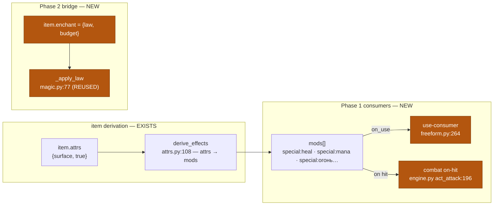
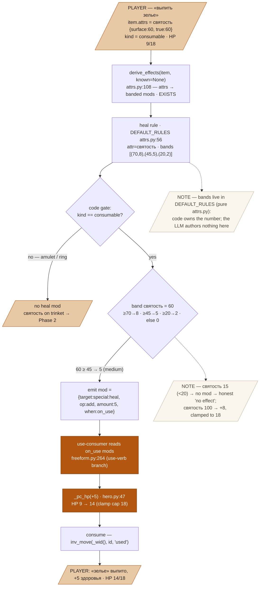
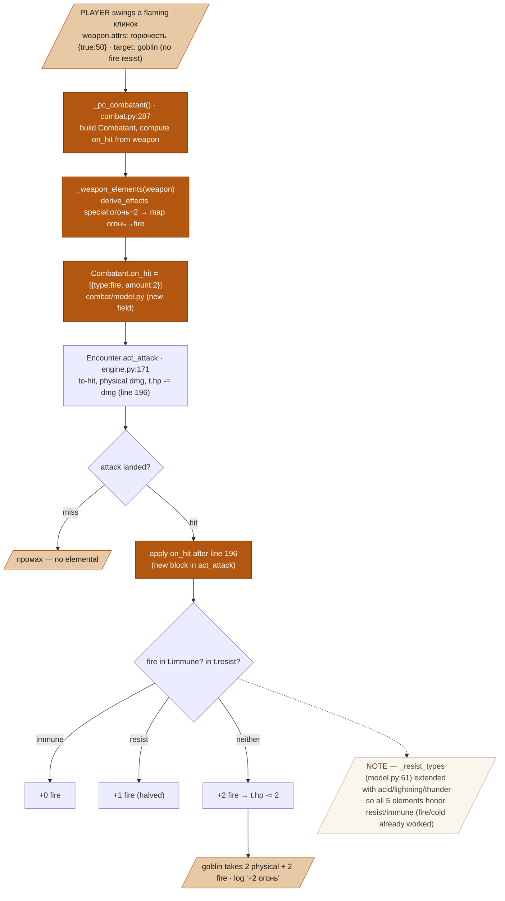
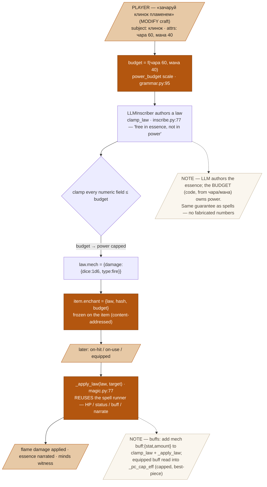

# Item Effects Layer — Design Spec

**Goal:** make crafted items produce real mechanical effects — consumables that heal/restore mana, weapons that deal on-hit elemental damage (Phase 1), and enchanted items that carry a budget-clamped magic law (Phase 2) — by wiring the runtime consumers that `derive_effects` already feeds but that were never built.
**Status:** draft · written to [.claude/skills/spec/spec-standard.md](../../../.claude/skills/spec/spec-standard.md)
**From:** [[craft-items-rework]] · the effects-layer brainstorm (research artifact `scratchpad/craft_research.html`).

---

## 1. Problem & context

Effects in this engine are *derived outputs of attributes*: `derive_effects` (`items/attrs.py:108`) projects an item's attrs into banded mods. It already emits `special:poison`, `special:mana`, `social:appearance`, and the five elemental `special:*` targets — **but the only runtime consumer is combat, which reads only `attack`/`defense`** (`_derived_amount`, `combat.py:278`). Consequences today:

- Drinking a consumable (`use` verb, `freeform.py:264`) just does `inv_move(..., "used")` + narrates — **no HP, no effect.** The `зелье исцеления` node (`itemgraph.json:4276`) has no attrs/mods; it heals nothing.
- `святость` is read by **no rule** — a fully inert attribute.
- A weapon's emitted `special:огонь` is **never applied** on a hit — `Combatant` has no elemental field.
- `чара` feeds only *worth*; the item `мана` attr emits `special:mana` that **nothing consumes**; the magic system (`power_budget`, `clamp_law`, `_apply_law`, `circle_hash`) has **zero coupling** to items.

So a player can craft a "healing potion" or "flaming sword" and it does nothing. This is the gap that makes freeform craft worth building.

## 2. Goals / Non-goals

**Goals**
- Phase 1 · a `heal` rule (`святость` → banded `special:heal`) + a **consumable use-consumer** applying `special:heal`→HP and `special:mana`→pool.
- Phase 1 · an **on-hit elements consumer**: a weapon's `special:<element>` mods add elemental damage on a landed hit, honoring bestiary `resist`/`immune`.
- Phase 2 · **enchantment**: an item carries a magic *law* budgeted by its `чара`/`мана`, run by the existing `_apply_law`; stat **buffs** added as a `buff` mech.

**Non-goals**
- No new attribute — reuse `святость` (holy→heal); no 19th attr.
- No equip-slot system — combat keeps auto-selecting best weapon/armor.
- Buffs are **not** attribute-derived — they live only in the enchantment channel (Phase 2).
- No moderation/dedup of enchant names (rides existing systems).

## 3. Architecture

Derivation exists; this spec builds the **consumers** and (Phase 2) the **item↔magic bridge**. Two shipped systems joined:

*Overview:*



*Phase 1 · heal path, traced in full* (the mandatory detail level):



*Phase 1 · on-hit elements, traced:*



*Phase 2 · enchantment (item = a bound spell-circle):*



## 4. Data model

**New `heal` rule** in `DEFAULT_RULES` (`attrs.py:56`, a pure module that owns its band constants):
```python
"heal": {"attr": "святость", "bands": [(70, 8), (45, 5), (20, 2)],
         "target": "special:heal", "when": "on_use"},   # gated to kind=="consumable" in derive_effects
```
**Emitted mod shape** (unchanged): `{"target":"special:heal", "op":"add", "amount":5, "when":"on_use"}`.

**Element → English map** (new, `combat.py`), used to translate item element mods to `Combatant.resist/immune` keys:
```python
_ELEM_EN = {"special:огонь":"fire", "special:мороз":"cold", "special:кислота":"acid",
            "special:разряд":"lightning", "special:взрыв":"thunder"}
```
**`Combatant.on_hit`** (new field, `combat/model.py`): `list[{"type": str, "amount": int}]`, default `[]`.

**`_resist_types` tuple** (`model.py:61`) extended: `+ ("acid","lightning","thunder")`.

**Phase 2 `item.enchant`** (new field): `{"law": <magic law dict>, "hash": <circle_hash>, "budget": float}`.

**Fixed points:** `PB["pc_max_hp"] = 18` (`config.py:115`); reused bands — mana `[(75,3),(50,2),(25,1)]`, elements `[(70,3),(45,2),(20,1)]`. New `PB`: `mana_per_band`, `elem_dmg_k`.

## 5. Behavior — worked examples

**A — healing draught** (`святость` 60, HP 9/18):

| Step | Function / rule | Input | Output |
|--|--|--|--|
| 1 | materialize | node `зелье исцеления`, святость 60 | `attrs.святость={surface:60,true:60}`, `kind:consumable` |
| 2 | `derive_effects` → heal rule | 60; bands `[(70,8),(45,5),(20,2)]` | 60≥45 → **medium** → mod `{special:heal, amount:5, when:on_use}` |
| 3 | use-consumer (`freeform.py:264`) | on_use mods | picks `special:heal` = 5 |
| 4 | `_pc_hp(+5)` (`hero.py:47`) | HP 9, cap 18 | HP **14** |
| 5 | consume | `inv_move(...,"used")` | gone; narrate `+5 здоровья` |

**B — mana draught** (`мана` 80): mana rule → 80≥75 → band 3 → `special:mana` amount 3 → use-consumer → `_mana_restore(3 × PB["mana_per_band"])`, clamped to cap, consumed.

**C — flaming клинок hit** (`горючесть` 50, target no fire-resist):

| Step | Function / rule | Input | Output |
|--|--|--|--|
| 1 | `derive_effects` → elements (weapon-form gate) | горючесть 50; bands `[(70,3),(45,2),(20,1)]` | 50≥45 → **2** → mod `{special:огонь, amount:2}` |
| 2 | `_weapon_elements` (`combat.py`) | that mod | `[{type:"fire", amount:2}]` (огонь→fire) |
| 3 | `_pc_combatant` → `Combatant.on_hit` | | on_hit set on the combatant |
| 4 | `act_attack` lands (`engine.py:196`) | physical dmg applied | then the on_hit block runs |
| 5 | resist/immune check | goblin: neither | `t.hp -= 2` (+2 fire); a fire-**immune** target → +0; fire-**resist** → +1 |

**D — enchant (Phase 2)** «зачаруй клинок пламенем» (чара 60, мана 40): budget from чара/мана → LLMInscriber authors a fire law → `clamp_law` caps its `power` ≤ budget → `item.enchant` stored (frozen, content-addressed) → on the next weapon hit, `_apply_law` deals the clamped flame damage and narrates the essence (witnessed by minds).

**Boundaries**
- `святость` 15 (<20) → no heal mod → drinking narrates the honest "no effect", still consumed. No stub.
- `святость` 100 → +8, clamped to cap 18.
- `special:кислота` weapon vs an acid-immune target → +0 (only *after* the `_resist_types` extension; before it, acid was silently never in the set → always full damage).
- Enchant with too little мана → budget → `clamp_law` floors power at 1 (a flicker), never zero-cost overkill.

## 6. Edge cases & failure modes

- **No LLM on Phase 1** — heal/mana/element application is pure `derive_effects` + `_pc_hp`/pool/engine arithmetic; works with the model offline, never trips the no-LLM-fallback rule.
- **Legacy items** (no `attrs`) → `derive_effects`/`_derived_amount` return no mods → consumers no-op → unchanged behavior (dual-path).
- **Overheal / overmana** clamp at caps; **immune/resist** zero/halve elemental.
- **Phase 2 enchant with no model** → `LLMUnavailable` propagates to the 503 handler (honest error), exactly as `cast` does today.

## 7. Testing strategy

Unit-testable, no live model:
- `derive_effects({attrs:{святость:{surface:60,true:60}}, kind:"consumable"})` → `special:heal` mod `amount==5`; `святость 15` → no heal mod; `100` → 8.
- use-consumer on that potion → `_pc_hp` 9→14 and item in `"used"`; mana potion → pool rises, clamped.
- `_weapon_elements` (горючесть 50 клинок) → `[{type:"fire",amount:2}]`.
- `_resist_types("acid, lightning")` → `{"acid","lightning"}` (post-extension).
- `act_attack` with `on_hit=[{fire,2}]` on a plain target → target HP drops by physical+2; fire-immune target → +0; fire-resist → +1. (Build a minimal `Encounter`, mirror existing combat tests.)
Live verify (Phase 1): in a running world, drink a крафт-зелье and swing a flaming weapon; confirm HP delta + the `+N огонь` log line.

## 8. Constraints honored

- **Code owns dice/numbers** — heal/element magnitudes are band tables in pure `attrs.py`; Phase-2 enchant power is `clamp_law`-bounded by the code-computed budget. The LLM authors essence only.
- **No LLM fallback** — Phase 1 has no LLM; Phase 2 propagates `LLMUnavailable` (no stub).
- **No mechanical gates** — nothing blocked; weak effects just do little; balance via consumption + caps + budget.
- **Tunables in `PB`** — `mana_per_band`, `elem_dmg_k`; attribute band tables in `DEFAULT_RULES` (pure module, convo.py exception).
- **No Claude co-author**; ship the green increment.

## 9. Scope & roadmap

- **Phase 1 (implement now):** heal rule + consumable use-consumer (heal/mana) + on-hit elements. No LLM, self-contained, high value — makes existing craftable consumables/weapons real. Ships standalone.
- **Phase 2 (next spec-increment):** enchantment bridge (`item.enchant`, budget from чара/мана, `_apply_law` on use/equip) + the `buff` mech + the equipped-buff reader (`_pc_cap_eff`). This is where "truly special" and +STR live. Couples items↔magic (currently zero cross-import) — the bridge lives in the play layer, keeping `aidnd.items` and `aidnd.magic` decoupled.

## 10. Open questions

- `special:mana` band → pool-points mapping: linear `amount × mana_per_band`, or a per-band table?
- On-hit elemental: flat banded amount (chosen for Phase 1) or convert band → dice (band 2 → `1d4`)?
- Phase 2: does an enchanted weapon's law fire *per hit* (like on-hit elements) or on an explicit "activate" — and does мана deplete per use, recharging over rest?
