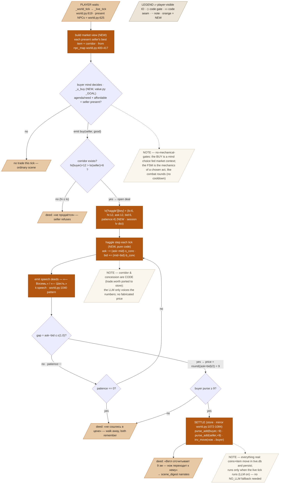

# Emergent NPC Trade & Haggle — Design Spec

**Goal:** make co-present NPCs autonomously buy goods (including weapons) from each other, **haggle over the price across ticks**, and **settle real coins + items in the store** — all observable by a standing player in the scene digest.
**Status:** draft · written to [.claude/skills/spec/spec-standard.md](../../../.claude/skills/spec/spec-standard.md)
**From:** the NPC-economy playtest report (`scratchpad/npc_economy_report.html`); decisions locked with the user — **Model B multi-tick haggle · emergent sellers (any surplus holder) · real store transfer · spec-first.**

---

## 1. Problem & context

The playtest confirmed: **no observable NPC↔NPC trade exists.** The pieces are present but unwired:
- `apply_actions` (`mind/llm_agent.py:348`) can `give` (one-way gift) and `take` (theft) but has **no buy/pay verb**; both mutate only the *mind* world (`Body.carrying`/`.loot`), never the store.
- The barter engine `mind/trade.py` (`worth`, `propose_sale`, `settle_sale`) is **dead code** — one importer, a test. It runs on the mind world.
- `_u_trade` (`value.py:258`) scores only `say:accept`/`say:counter` — talk, no coins.
- The **only** precedent for a *consensual* NPC economic act moving real coins is the food-payment block `world.py:1072-1084`: `purse_add(pid,−2)` / `purse_add(owner,+2)` + a feed deed. Theft's loot-diff reconciliation (`world.py:918-995`) is one-sided and cannot model a two-sided trade.
- NPC agendas are already richly commercial ("buy a cart from smith Gorom") — the *motivation* exists; the *execution* does not.

## 2. Goals / Non-goals

**Goals**
- A `buy` intent an NPC mind can emit (emergent from agenda/need + a fed "market view"), never a scripted trigger.
- A **code-owned haggle FSM** (in the session `lv` dict) that advances an open deal each tick, its offers converging by trait-driven concession, **surfaced as speech the digest narrates**.
- **Real settlement**: on agreement, coins + the item move in `live.db` (purse + inventory), like the food-payment precedent; emitted as a feed deed.
- **Emergent sellers**: any co-present NPC whose value corridor makes a good worth more to a buyer than to them can sell it.

**Non-goals**
- Player participation in NPC↔NPC haggles (the player only *watches*).
- Vendor stock / shop restocking / supply chains (that's the separate daily `economy.py` batch — untouched).
- Changing the player↔merchant trade (`handlers/trade.py`) — out of scope.
- Making the dormant `mind/trade.py` the runtime engine — we port its corridor math to the play layer, we don't wire the mind-world version.

## 3. Architecture

Three layers, cleanly split — **the mind decides, code owns the numbers, the digest narrates:**

- **Decide (mind).** A present buyer emits `{tool:"buy", seller, good}` when its `_u_buy` utility lights up (agenda/need + affordability + a co-present seller holding the good). Emergent — no cooldown.
- **Haggle (play layer, `_live_tick`).** The buy opens a deal in `lv["haggle"]`. Every tick, a pure-code step advances each open deal: seller `ask` and buyer `bid` concede toward the corridor midpoint; each round emits a `speech` feed event with the current number. Settle when the gap ≤ ε; walk when patience runs out.
- **Settle (store).** On settle, `purse_add`/`inv_move` move real coins + the item; a `deed` feed event announces it. `scene_digest` weaves the whole thing into prose.



## 4. Data model

**The haggle state** (new, in `_S["live"]["haggle"]`, keyed `f"{buyer}|{seller}|{item_id}"`):
```python
{"buyer": pid, "seller": pid, "item_id": "npcinv|<seller>|0", "good": "нож",
 "lo": 6.0, "hi": 12.0, "ask": 12.0, "bid": 6.0, "patience": 4, "round": 0}
```
- `lo` = the good's coin-worth to the **seller** (his minimum); `hi` = its coin-worth to the **buyer** (his maximum). Both computed from the store item `worth` and each mind's `money_demand` (ported from `trade.py:23,47`).
- `ask`/`bid` = the live offers; converge over rounds. `mid = (lo+hi)/2`.

**The `buy` action** (new, in the `TOOLSPEC` prompt `llm_agent.py:41` + a light `apply_actions` marker): `{"tool":"buy","seller":"<name>","good":"<name>"}`. The real work is play-layer, read from the actor's `actions` list in `_live_tick`.

**Concession rates** (code, from traits): `s_conc = clamp(0.55 − 0.5·greed(seller) + 0.3·need_wealth(seller), 0.1, 0.8)` (a greedy seller concedes slower); `b_conc = clamp(0.35 + 0.5·need_urgency(buyer) + 0.2·affinity, 0.1, 0.9)` (a needy buyer concedes faster).

**New `PB` tunables** (`session/config.py`): `haggle_patience=4`, `haggle_gap_eps=1.0`, `haggle_s_base=0.55`, `haggle_b_base=0.35`. Reused: `purse_cut` pattern from `world.py:934`.

**Store transfer primitives** (exist): `purse_get/purse_add` (`store.py:334,340`), `inv_move` (`store.py:322`, docstring already lists "purchase"), `inventory`/`get_item` (`store.py:316,301`), item id via `lv["npc_map"][seller][good]` (`world.py:409-417`).

## 5. Behavior — worked examples

**Example A — a knife sold from smith to townsman** (corridor lo=6, hi=12; concession `s_conc`=0.45, `b_conc`=0.50 as produced from the parties' traits; patience 4; ε=1.0; buyer purse 15):

| Tick | Function / rule | ask | bid | gap | outcome |
|--|--|--|--|--|--|
| open | buyer emits `buy`; corridor hi 12 > lo 6 ✓ | 12.0 | 6.0 | 6.0 | deal opens in `lv["haggle"]` |
| 1 | haggle step + speech deed «— Двенадцать.» / «— Шесть.» | 12.0 | 6.0 | 6.0 | patience 4→3 |
| 2 | `ask−=(12−9)·.45`=1.35 ; `bid+=(9−6)·.5`=1.5 | 10.65 | 7.5 | 3.15 | patience 3→2 |
| 3 | `ask−=(10.65−9)·.45` ; `bid+=(9−7.5)·.5` | 9.91 | 8.25 | 1.66 | patience 2→1 |
| 4 | step → gap 0.87 ≤ ε | 9.50 | 8.63 | 0.87 | **settle** |
| 4 | price = `round((9.50+8.63)/2)` = **9**; purse 15≥9 ✓ | | | | `purse_add(buyer,−9)`, `purse_add(seller,+9)`, `inv_move(нож→buyer)` |
| 4 | deed «Ветл отсчитывает 9 зм — нож переходит к нему» | | | | player reads it in the digest; both NPCs remember the deal |

Final observable state: seller +9 coins, buyer −9 coins **and now carries the нож** (inspectable), knife gone from seller's inventory. The whole 4-tick haggle read as overheard speech, then a payment.

**Example B (boundary — no corridor):** buyer wants the smith's нож but values it *less* than the smith does (hi=5, lo=6 → hi ≤ lo). Open-check fails → **no haggle**, one `deed`: «Кузнец качает головой — не продаётся.» No coins move.

**Example C (boundary — walk-away):** a stubborn seller (greed 0.9 → `s_conc`≈0.15) and a poor buyer. Over 4 rounds `ask` falls 12→11.3→10.7→10.2 while `bid` rises 6→6.6→7.1→7.5; gap 2.7 > ε at patience 0 → **walk**: deed «Не сошлись в цене — покупатель уходит.», both remember «не сторговались». No transfer.

## 6. Edge cases & failure modes

- **Buyer can't afford the settle price** → walk (Example C path via the affordability gate), no partial payment.
- **Seller or buyer leaves the place** mid-haggle (moves away) → the deal is dropped from `lv["haggle"]` next tick (co-presence lost), no settle.
- **Item already sold/stolen** (item_id gone from seller inventory before settle) → deal voided, no coin move.
- **NO_LLM tick** → `_world_tick` early-returns (`tick.py:35`), the live tick doesn't run, so no haggle advances — consistent, nothing to fall back on.
- **Same pair, repeat** → no cooldown; if the buyer still wants a good and a corridor exists, a new deal can open (emergent, per no-gates).

## 7. Testing strategy

Deterministic core, no LLM needed (the FSM + settlement own the numbers):
- **Corridor**: `_deal_corridor(good_worth, seller_state, buyer_state)` → `(lo,hi)`; hi ≤ lo → `None`.
- **Haggle step**: given a `lv["haggle"]` entry + traits, one step produces the exact `ask`/`bid` in Example A's table; gap ≤ ε flips to settle; patience 0 with gap > ε flips to walk.
- **Settlement**: build two NPCs with store purses + an item; run to settle; assert `purse_get(buyer)`−9, `purse_get(seller)`+9, `inv_move` put the item on the buyer, and a `deed` was emitted. Assert Example B (no corridor → refuse deed, no move) and Example C (walk, no move).
- **Buy intent**: inject a `{tool:"buy",...}` action (as the craft-parser tests inject plans) → assert a deal opens.
Live verify: run the LLM sim, stand in the smithy, watch two NPCs haggle over a blade and settle in the digest.

## 8. Constraints honored

- **No mechanical gates** — the buy is a *mind* decision fed market context (co-present sellers + corridors); the FSM is the mechanics of a chosen act (like combat rounds), with no cooldown/cap. Verified live that it fires.
- **Code owns dice/numbers** — corridor, concession, settle price, transfer are all code; the LLM (scene_digest) only voices the emitted lines. No LLM-authored price.
- **No LLM fallback** — the whole thing only runs inside the live tick (LLM on); with NO_LLM it's silent. Nothing to stub.
- **Everything real & persists** — settlement moves `live.db` purses + inventory; survives the tick and restart.
- **Tunables in `PB`** — patience, ε, concession bases. **No Claude co-author**; ship the green increment.

## 9. Scope & roadmap

- **This increment (all of Model B):** `_u_buy` + the `buy` intent + the market-view context + the haggle FSM + real settlement + feed deeds + live-verify. Delivered as four build phases: (a) corridor + settlement primitives (deterministic, tested), (b) the haggle FSM over ticks + emitted speech, (c) the mind `buy` intent + `_u_buy` + market context, (d) digest wiring + live verify + deploy.
- **Deferred:** player joining/observing-and-reacting to a haggle; vendor stock economics; NPCs seeking out sellers across the city (this increment trades only among the *already co-present*).

## 10. Open questions

- **Concession curve:** linear-toward-midpoint (specified above) or a trait-skewed target (a shrewd seller converges above mid)? Linear is simpler and the spec assumes it; a skew would make bargaining skill matter more.
- **Who speaks first each round:** seller names the ask, buyer the bid, every round (verbose but clear) — or alternate one line per tick (slower, less chatty)? Spec assumes both per round.
- **Haggle visibility when the player is far:** should distant haggles (earshot tier 3) collapse to a murmur like other speech (`world.py:1091`)? Spec assumes yes — reuse the existing earshot tiers.
