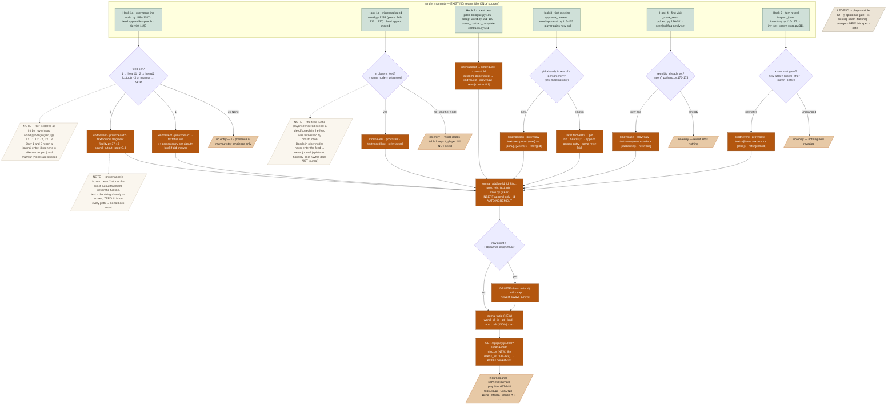

# Player Journal «Хроника» — Design Spec

**Goal:** give the player a browsable, epistemically-honest chronicle — an append-only `journal` table written **only** at render moments (a feed line received, a pitch said to him, a room entered, an item attribute revealed), captured verbatim with **zero LLM calls**, surfaced through a new `#journalpanel` with four tabs.
**Status:** draft · written to [.claude/skills/spec/spec-standard.md](../../../.claude/skills/spec/spec-standard.md)
**From:** the journal brainstorm (`scratchpad/journal-design-brief.md`, user-locked 2026-07-12) · sibling [emergent-quests spec](2026-07-12-emergent-quests-design.md) (quest-beat capture, point 2) · memories [[greenfield-play]], [[sound-audibility]], [[items-system]].

---

## 1. Problem & context

The player accumulates a rich lived history every session, and **none of it is browsable**:

- **No journal table exists.** The only persisted player-side record is `pc.memory` — appended by `_pc_remember` (`pc/hero.py:138`) and `pc.memory.add(..., kind="heard")` on every overheard line (`world.py:1189`). It is an **LLM-retrieval store**, not a UI: saved as the last **400** items only (`_pc_save`, `pc/hero.py:128` — `st.memory.items[-400:]`), unordered by kind, never rendered to a panel. Old memories silently fall off the tail.
- **Overheard fidelity is thrown away after the tick.** When the player half-hears a line, `_overheard` (`world.py:92-99`) computes the L2 **cutout fragment** and pushes it once into the feed (`world.py:1184-1187`); `pc.memory` stores a paraphrase (`«слышал в …: …»`, `world.py:1188`), not the exact fragment the screen showed. There is no store that preserves *what the player actually saw, at the fidelity he saw it*.
- **Completed quests are truncated to the last 3.** `contracts_list` (`world.py:183-202`) returns `done[-3:]` for the jobs strip (`world.py:202`); everything older than the three most recent finished contracts is invisible. The player cannot review a quest he finished an hour ago.
- **The world knows more than the player, and nothing enforces the gap.** The `deeds` table (`worldgen/store.py:54-56`) records every theft/promise/brawl town-wide, including deeds in nodes the player never entered. `/api/play/deeds` (`misc.py:144-149`) will happily dump them all — a design leak if used as a player chronicle.

So there is no place a player can open to answer "who did I meet, what did I overhear, which jobs did I finish, where have I been" — and the raw materials that exist (`pc.memory`, `deeds`) are either lossy, unordered, or omniscient.

## 2. Goals / Non-goals

**Goals**
- A new **append-only `journal` table** (`worldgen/store.py`) written by 5 hooks at **existing render moments only** — capture, never generation.
- **Provenance preserved forever**: an L2 half-heard line is stored as the exact cutout fragment (`prov="heard2"`), never upgraded to the full line.
- Store API: `journal_add(world_id, kind, prov, refs, text, gt)` and `journal_list(world_id, kind=None, limit)`, with a hard cap `PB["journal_cap"]=2000` rows/world (prune oldest on insert).
- `GET /api/play/journal?kind=&limit=` returning `{"entries":[{gt,kind,prov,refs,text}]}` newest-first (`misc.py` pattern, like the unused `/api/play/deeds`).
- A `#journalpanel` in the existing `.workpanel`/`setView()` UI (`play.html:407-487,637-648`) — four tabs **Люди / События / Дела / Места**, provenance marks ✦/◐/◌, People/Places grouped by `refs`-entity.

**Non-goals** (from the brief's "What does NOT journal")
- **Crowd murmur and L3 presence-only hearing** do not journal (the thread keeps ambience; the chronicle keeps the significant).
- **Deeds not witnessed by the player** do not journal — even though the world `deeds` table holds them (epistemic honesty).
- **Scene-digest prose wholesale** does not journal (the thread already renders it; the journal keeps only the typed capture points).
- **No backfill.** Existing worlds start their journal empty when the increment lands; nothing generated post-hoc.
- **Zero LLM.** No summarizing, no rewriting, no "make it prettier" — `text` is the exact string already rendered. (So no-LLM-fallback is moot by construction.)
- Not touching `contracts_list`'s `done[-3:]` jobs strip (`world.py:202`) — the journal is a *parallel* player-facing history, the strip stays as the live HUD.

## 3. Architecture

Five capture hooks sit on **existing render sites**; each calls the one new `journal_add`. The table, the API endpoint, and the panel are the only new surfaces. No new tick, no morning batch, no LLM seam.

- **`journal` table + `journal_add`/`journal_list`** — `worldgen/store.py` (pattern: the `deeds` table `:54-56` and `flag_set`/`flags` `:356`). Append-only, AUTOINCREMENT id, cap-prune on insert.
- **Hook 1 — overheard speech & witnessed deeds** — `world.py:1184-1189` (feed `k:speech` + `pc.memory.add`) and the `k:deed` feed sites (`world.py:1234`, peers `:749,:1212,:1227`). The feed **is** the player's scene, so every feed entry is by construction witnessed.
- **Hook 2 — quest arc beats** — pitch (`dialogue.py:101` `pending_offer`), accept (`contract_accept`, `world.py:161-180`), outcome (`_contract_complete`, `contracts.py:311`). Replaces the `done[-3:]` truncation as the *player-facing* quest history.
- **Hook 3 — first meeting** — the player's state gains a new pid (`appraise_present` first-encounter insert, `mind/appraisal.py:116-125`; player-side mirror of `state.relationships[other.id]=…`).
- **Hook 4 — first visit** — `_mark_seen` sets a `seen|<bid>` flag the first time (`pc/hero.py:176-181`).
- **Hook 5 — item revelation** — `inv_set_known` persists newly-revealed attrs (`inspect_item`, `handlers/inventory.py:110-127` → `store.py:311`).
- **API** — `GET /api/play/journal` in `handlers/misc.py` (mirrors `deeds_list` `:144-149`).
- **UI** — `#journalpanel` peer of `mapwrap`/`invpanel`/`magicpanel` (`play.html:415,434,438`), toggled by `setView('journal')` (`play.html:637-648`).

### 3a. Master pipeline — 5 capture points → journal_add → table → API → panel



## 4. Data model

**New table** in `worldgen/store.py` `_init` (alongside `deeds` `:54-56`, `contracts` `:57-58`; zero migration for old worlds — table created on open, starts empty):

```sql
CREATE TABLE IF NOT EXISTS journal (
  id INTEGER PRIMARY KEY AUTOINCREMENT,   -- monotone; ordering + prune key
  world_id INT, gt INT,                   -- gt = game-time tick at capture
  kind TEXT, prov TEXT,                   -- kind ∈ person|event|quest|place ; prov ∈ saw|heard1|heard2|told
  refs TEXT, text TEXT)                    -- refs = JSON list of real ids ; text = EXACT rendered string
```

**Field grammar (closed sets):**

| Field | Values | Meaning |
|---|---|---|
| `kind` | `person` · `event` · `quest` · `place` | UI tab (Люди · События · Дела · Места) |
| `prov` | `saw` · `heard1` · `heard2` · `told` | provenance mark ✦ · ◐(full) · ◐(fragment) · ◌ |
| `refs` | JSON list of real ids: `["npc:odo"]`, `["node:cellar"]`, `["ct:odo:1"]`, `["itm:dagger7"]` | UI groups Люди/Места by entity |
| `text` | the exact rendered string; **never** rewritten | the L2 fragment, the deed line, the pitch — as shown |

**Store API additions** (`worldgen/store.py`):
```python
def journal_add(self, world_id, kind, prov, refs, text, gt):
    with self._conn() as c:
        c.execute("INSERT INTO journal (world_id,gt,kind,prov,refs,text) VALUES (?,?,?,?,?,?)",
                  (world_id, gt, kind, prov, json.dumps(refs, ensure_ascii=False), text))
        c.execute("DELETE FROM journal WHERE world_id=? AND id NOT IN "
                  "(SELECT id FROM journal WHERE world_id=? ORDER BY id DESC LIMIT ?)",
                  (world_id, world_id, PB["journal_cap"]))          # prune oldest beyond cap

def journal_list(self, world_id, kind=None, limit=200):
    q = "SELECT gt,kind,prov,refs,text FROM journal WHERE world_id=?" + (" AND kind=?" if kind else "")
    q += " ORDER BY id DESC LIMIT ?"
    args = (world_id, kind, limit) if kind else (world_id, limit)
    ...  # rows → [{"gt":…, "kind":…, "prov":…, "refs":json.loads(refs), "text":…}]
```

**Emitted-entry shapes (real values):**
```python
# Hook 1a, L2 overheard
{"kind":"event","prov":"heard2","refs":[],           "text":"… так и не … Марты, …"}
# Hook 1b, witnessed theft
{"kind":"event","prov":"saw","refs":["npc:garm"],    "text":"Гарм ныряет рукой в чужой кошель"}
# Hook 3, first meeting
{"kind":"person","prov":"saw","refs":["npc:odo"],    "text":"встретил Одо — трактирщик, Трактир «Пьяный вол»"}
# Hook 2, accept + done
{"kind":"quest","prov":"told","refs":["ct:odo:1"],   "text":"взялся за дело для Одо: bring — бочонок сидра (погреб)"}
{"kind":"quest","prov":"saw","refs":["ct:odo:1"],    "text":"выполнено для Одо: бочонок сидра доставлен"}
# Hook 5, item reveal
{"kind":"event","prov":"saw","refs":["itm:dagger7"], "text":"кинжал: открылось — острота"}
```

**PB tunable** (`session/config.py`, new — the file already holds `sound_cutout_keep:0.4` `:96`, `sound_mem_l2:0.12` `:98`):
```python
"journal_cap": 2000,   # rows kept per world; prune oldest on insert
```

## 5. Behavior — worked example: **one evening in the tavern**

### Fixture

Player is inside **Трактир «Пьяный вол»** (`node:tavern`), game-time `gt` running through the evening. Present: **Бронт** (`npc:bront`, a patron, already known to the player), **Гарм** (`npc:garm`, a cutpurse), **Одо** (`npc:odo`, the barkeep — never met before). Elsewhere on the map: **Тед** (`npc:ted`) at the market node (`node:market`), not co-present. The journal currently holds up to id 1846.

### The evening, event by event

**(a) Overhears an L2 fragment.** Бронт mutters to a neighbour: `«Ральф так и не вернул гроссбух Марты, старый скряга»` (9 words). Бронт is one zone over → `audibility(...)` returns **`"L2"`**.

| Step | Function / rule | Input | Output |
|---|---|---|---|
| 1 | `_overheard` (`world.py:92-99`) | tier `"L2"` | `int("L2"[1]) = 2` → tier **2** |
| 2 | `overheard_line`→`cutout` (`fidelity.py:17-34,42`) | 9 words, `sound_cutout_keep=0.4`, seed `"hear|512|npc:bront"` | `keep = max(1, round(9×0.4)) = round(3.6) = 4`; kept idx `[1,2,3,6]` → `«… так и не … Марты, …»`; `mw = sound_mem_l2 = 0.12` |
| 3 | feed push (`world.py:1184-1187`) | `{k:speech, tier:2, text:disp}` | line shown in thread |
| 4 | **journal hook** — tier gate | tier == 2 → `heard2` | `journal_add(kind="event", prov="heard2", refs=[], text="… так и не … Марты, …", gt=512)` → **id 1847** |

The stored `text` is the **exact fragment the screen showed** — not the full sentence, not a paraphrase. Provenance is frozen at `heard2`.

**(b) Witnesses a theft, same node.** Гарм picks a pocket in the tavern; the deed reaches the player's feed at `world.py:1234` as `{k:deed, who:"Гарм", text:"ныряет рукой в чужой кошель"}`.

| Step | Function / rule | Input | Output |
|---|---|---|---|
| 1 | witnessed gate | deed IS in the player's feed → same node | witnessed = true |
| 2 | journal hook | `k:deed` feed entry | `journal_add(kind="event", prov="saw", refs=["npc:garm"], text="Гарм ныряет рукой в чужой кошель", gt=512)` → **id 1848** |

**(c) A deed happens in another node — NO entry (boundary).** At the same tick, Тед steals fruit at `node:market`. `deeds.record` writes it to the world `deeds` table (`store.py:54-56`), and it will show in `/api/play/deeds`. But the player is at `node:tavern` → the market deed **never enters his feed** → the journal hook never fires. **No journal row.** The chronicle structurally cannot know it. (Row count still 1848.)

**(d) Meets a new NPC.** The player addresses Одо; the player's state gains `relationships["npc:odo"]` for the first time (mirror of `appraise_present`, `appraisal.py:121-125` — `if other.id in state.relationships: continue` guards re-fire).

| Step | Function / rule | Input | Output |
|---|---|---|---|
| 1 | first-meeting gate | `"npc:odo"` not yet in player relationships | new pid |
| 2 | journal hook | Одо's persona: имя «Одо», роль «трактирщик», место «Трактир «Пьяный вол»» | `journal_add(kind="person", prov="saw", refs=["npc:odo"], text="встретил Одо — трактирщик, Трактир «Пьяный вол»", gt=513)` → **id 1849** |

**(e) Accepts an improvised contract, then completes it.** Одо pitches an errand (`pending_offer`, `dialogue.py:101`) — pitch text «Сходи в погреб, принеси бочонок сидра — налью тебе за счёт заведения». (That pitch also journals `quest/told`; shown in prose, omitted from the row table for brevity.) The player accepts (`contract_accept`, `world.py:161-180`), later delivers.

| Step | Function / rule | Input | Output |
|---|---|---|---|
| 1 | accept (`contract_accept` `world.py:167-179`) | contract `ct:odo:1`, kind `bring`, want «бочонок сидра», where «погреб» | `journal_add(kind="quest", prov="told", refs=["ct:odo:1"], text="взялся за дело для Одо: bring — бочонок сидра (погреб)", gt=514)` → **id 1850** |
| 2 | complete (`_contract_complete` `contracts.py:311`) | sider delivered, contract closes `done` | `journal_add(kind="quest", prov="saw", refs=["ct:odo:1"], text="выполнено для Одо: бочонок сидра доставлен", gt=516)` → **id 1851** |

Unlike the jobs strip (`done[-3:]`, `world.py:202`) which will eventually drop this, the journal keeps both beats permanently, tab **Дела**, grouped by `refs=["ct:odo:1"]`.

**(f) An item inspection reveals an attribute.** The player inspects a looted dagger (`itm:dagger7`); `item_inspect` reveals `острота` and `inspect_item` grows the known-set (`inventory.py:126`) before `inv_set_known` persists it (`inventory.py:127` → `store.py:311`).

| Step | Function / rule | Input | Output |
|---|---|---|---|
| 1 | new-attr gate | `known_before = {}` → `known_after = {"острота"}` | new attrs `{острота}` |
| 2 | journal hook | dagger name «кинжал», new attrs `{острота}` | `journal_add(kind="event", prov="saw", refs=["itm:dagger7"], text="кинжал: открылось — острота", gt=517)` → **id 1852** |

### Accumulated journal rows

| id | gt | kind | prov | refs | text |
|---|---|---|---|---|---|
| 1847 | 512 | event | heard2 | `[]` | `… так и не … Марты, …` |
| 1848 | 512 | event | saw | `["npc:garm"]` | `Гарм ныряет рукой в чужой кошель` |
| — | — | — | — | — | *(c) market theft — NO ROW (unwitnessed)* |
| 1849 | 513 | person | saw | `["npc:odo"]` | `встретил Одо — трактирщик, Трактир «Пьяный вол»` |
| 1850 | 514 | quest | told | `["ct:odo:1"]` | `взялся за дело для Одо: bring — бочонок сидра (погреб)` |
| 1851 | 516 | quest | saw | `["ct:odo:1"]` | `выполнено для Одо: бочонок сидра доставлен` |
| 1852 | 517 | event | saw | `["itm:dagger7"]` | `кинжал: открылось — острота` |

### API response — `GET /api/play/journal?limit=50` (newest-first)

```json
{"entries":[
  {"gt":517,"kind":"event","prov":"saw",   "refs":["itm:dagger7"],"text":"кинжал: открылось — острота"},
  {"gt":516,"kind":"quest","prov":"saw",   "refs":["ct:odo:1"],   "text":"выполнено для Одо: бочонок сидра доставлен"},
  {"gt":514,"kind":"quest","prov":"told",  "refs":["ct:odo:1"],   "text":"взялся за дело для Одо: bring — бочонок сидра (погреб)"},
  {"gt":513,"kind":"person","prov":"saw",  "refs":["npc:odo"],    "text":"встретил Одо — трактирщик, Трактир «Пьяный вол»"},
  {"gt":512,"kind":"event","prov":"saw",   "refs":["npc:garm"],   "text":"Гарм ныряет рукой в чужой кошель"},
  {"gt":512,"kind":"event","prov":"heard2","refs":[],             "text":"… так и не … Марты, …"}
]}
```
`GET /api/play/journal?kind=person` returns only id 1849. `kind=quest` returns 1851, 1850.

### What each UI tab shows

| Tab | kind filter | rows here | render |
|---|---|---|---|
| **События** | event | 1852, 1848, 1847 | ✦ «кинжал: открылось — острота» · ✦ «Гарм ныряет…» · ◐ «*… так и не … Марты, …*» (fragment, ellipsis styling) |
| **Дела** | quest | 1851, 1850 | grouped by `ct:odo:1`: ✦ «выполнено…» over ◌ «взялся за дело…» |
| **Люди** | person | 1849 | grouped by `npc:odo`: ✦ «встретил Одо — трактирщик…» |
| **Места** | place | — | (empty this evening — no first-visit fired inside the tavern he was already in) |

### Boundary / failure cases

- **(c) unwitnessed deed** — the market theft is in the world `deeds` table but produced **no** journal row, because it never reached the player's feed. The journal cannot leak what the screen never showed.
- **Cap-prune.** Suppose the world already holds exactly 2000 rows (ids 1..2000) and event (f) is the 2001st insert. `journal_add` inserts id **2001**, then `DELETE ... WHERE id NOT IN (... ORDER BY id DESC LIMIT 2000)` removes the single oldest survivor, **id 1** (`gt` earliest). Row count stays **2000**; the newest (2001) survives, the oldest is gone. Invariant: `count ≤ journal_cap`, newest always retained.
- **L3 / murmur skip.** Had Бронт been two zones away, `audibility` returns `"L3"` → tier 3, feed text «у «зала» о чём-то говорят» (`fidelity.py:43`) → tier gate skips → **no row**. A fully-inaudible line returns `None` → `murmur` (`world.py:1181-1182`) → no feed entry, no row.
- **Item reveal, nothing new.** Re-inspecting the dagger when `острота` is already known → `known_after == known_before` → new-attr gate false → **no row** (no duplicate).
- **Revisit.** Re-entering a building whose `seen|<bid>` flag is already set (`_seen`, `pc/hero.py:170-173`) → `_mark_seen` no-ops → **no place row**.

## 6. Edge cases & failure modes

- **No LLM anywhere in this system.** Every hook copies an already-rendered string into a row via pure SQL. It works with the model fully offline; there is nothing to fall back from, so the *no-LLM-fallback* rule is satisfied by construction.
- **Restart mid-evening.** The `journal` table is durable SQLite in the world DB; ids are AUTOINCREMENT and monotone. A restart loses no rows and never re-fires a hook (the render already happened once).
- **Existing worlds (no backfill).** On first open after the increment, `CREATE TABLE IF NOT EXISTS journal` makes an empty table; entries begin from the next render moment. No historical reconstruction (that would require generation — forbidden).
- **heard1 vs heard2 provenance never upgrades.** If the same underlying sentence is later heard at L1, that is a **separate render event** → a **separate** `heard1` row with the full text; the earlier `heard2` fragment row is untouched. The journal is a log of *renderings*, not of *facts*.
- **Person facts about a known pid.** After the first-meeting row, a later line said TO the player about that pid (told) or overheard about them (`about=[pid]`, heard1/heard2) appends a **new** person row sharing `refs=[pid]` — the Люди tab groups all of them under that entity.
- **Malformed refs.** `refs` is always a JSON list; empty `[]` is valid (ambient event with no entity). `journal_list` `json.loads` round-trips it; a non-entity event simply groups nowhere.

## 7. Testing strategy

Unit-testable with concrete assertions (no live model):

- **Epistemic honesty.** Feed a witnessed theft (player node) and an unwitnessed one (other node); assert exactly **one** `event/saw` row, `refs=["npc:garm"]`, and none for the market deed.
- **Fidelity provenance.** The line `«Ральф так и не вернул гроссбух Марты, старый скряга»` at L2, seed `"hear|512|npc:bront"` → asserts one `event/heard2` row with `text == "… так и не … Марты, …"` (keep=4, idx `[1,2,3,6]`); the *same* line at L1 → one `event/heard1` row with the **full** text. L3 → **no** row.
- **Quest beats in order.** Improvised-contract fixture: assert rows appear `quest/told` (accept) then `quest/saw` (done), both `refs=["ct:odo:1"]`, in id order.
- **Person accumulation.** First-meet Одо → 1 `person/saw` row `refs=["npc:odo"]`; a later `about=["npc:odo"]` overheard line → a 2nd row sharing `refs=["npc:odo"]`; `journal_list(kind="person")` returns both, groupable by ref.
- **First visit once.** Enter a building twice → exactly **one** `place/saw` row (2nd visit adds nothing; `seen|bid` guard).
- **Item reveal.** `inv_set_known` with a genuinely new attr → 1 `event/saw` row `refs=["itm:dagger7"]`; `inv_set_known` with an unchanged known-set → **no** row.
- **Cap-prune.** Seed 2000 rows, insert 1 more → `count == 2000`, `min(id)` advanced by 1, newest present. Assert monotone.
- **API shape.** `GET /api/play/journal` → entries **newest-first**; `?kind=person` filters; `?limit=N` caps length.

Live verify: play one tavern evening on the deepseek profile, open Хроника, confirm each tab shows exactly the captured strings and the ◐ fragment renders with ellipsis styling.

## 8. Constraints honored

- **Code owns dice/inventory/numbers; the journal has ZERO LLM seams (capture only)** — every row is a verbatim copy of an already-rendered string via pure SQL; no number, entity, or text is model-authored on any journal path.
- **No LLM fallback at runtime: not applicable by construction — nothing is generated** — there is no LLM call to fail; the system is capture-only, so there is nothing to fall back from.
- **No mechanical gates on NPC behavior: the journal only records; it never gates** — the hooks read render moments after the fact; no NPC decision, tick, or budget is throttled or blocked by journaling.
- **Tunables live in PB (session/config.py)** — `journal_cap=2000` lives in `PB`; no journal magic number is hardcoded elsewhere.
- **Specs to docs/superpowers/specs/YYYY-MM-DD-<topic>-design.md; no Claude co-author trailer on commits** — this file's location; commits will carry no Claude co-author trailer.

## 9. Scope & roadmap

- **This increment (one green slice):** `journal` table + `journal_add`/`journal_list` (with cap-prune) + the 5 capture hooks + `GET /api/play/journal` + `#journalpanel` (4 tabs, ✦/◐/◌ marks, People/Places grouped by refs) + the §7 unit tests. Ships **independently** of the emergent-quest increments 1–3.
- **Interlock with the quest pipeline.** Hook 2 today captures the beats that exist for **improvised** contracts (pitch/accept/outcome). When the [emergent-quest pipeline](2026-07-12-emergent-quests-design.md) lands (its `src:"sift"` arcs, `arc.beat` transitions), the **same** `quest/told` hook simply gains the extra beats it already emits — **twist reveal** (`arc.beat="twisted"`, sibling §5 Step 5) and **foreshadow** — with no journal change: the reveal string that already goes to the player's screen is captured verbatim like any other. No coupling, no migration.
- **Deferred:** cross-referencing (click a person → filter their events); search; export; any backfill of pre-journal history; and using the journal as LLM-retrieval context (it stays a pure UI log — `pc.memory` remains the retrieval store).

## 10. Resolved questions (user-decided 2026-07-13)

- **Person-fact volume** — **global cap only** (`journal_cap=2000`, no per-pid limit): what you heard is what's written; a chatty town yields a chatty chronicle, and the Люди tab stays scannable through per-pid grouping.
- **`refs` for ambient overheard lines** — **`refs=[]`, honest ambiguity**: an overheard fragment stores words, not an entity link (you heard a voice, not necessarily whose); События shows it unattributed, like real eavesdropping.
- **Place `refs` granularity** — **building id only** (`refs=[bid]`), matching the `seen|` flag exactly; a future map cross-link resolves `bid→node` when that UI exists.
