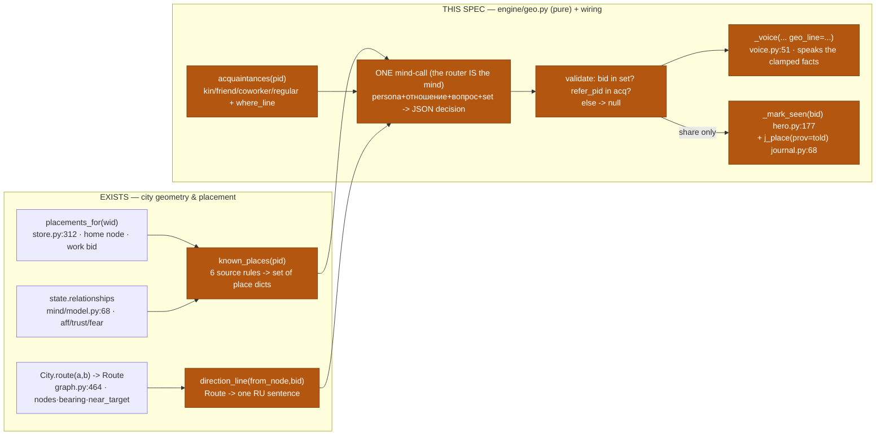
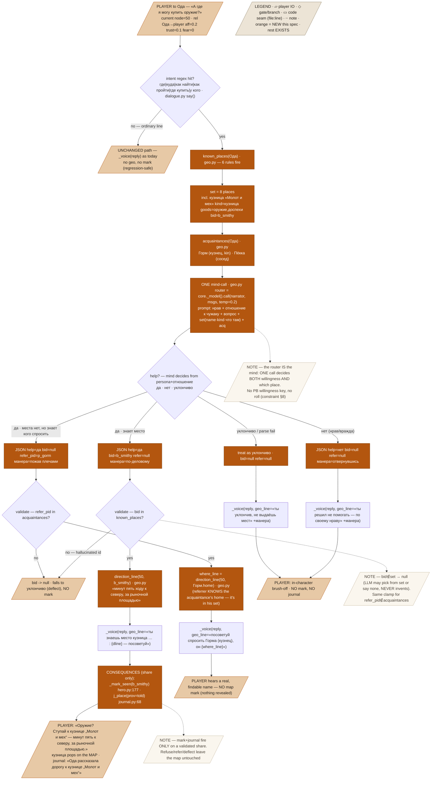
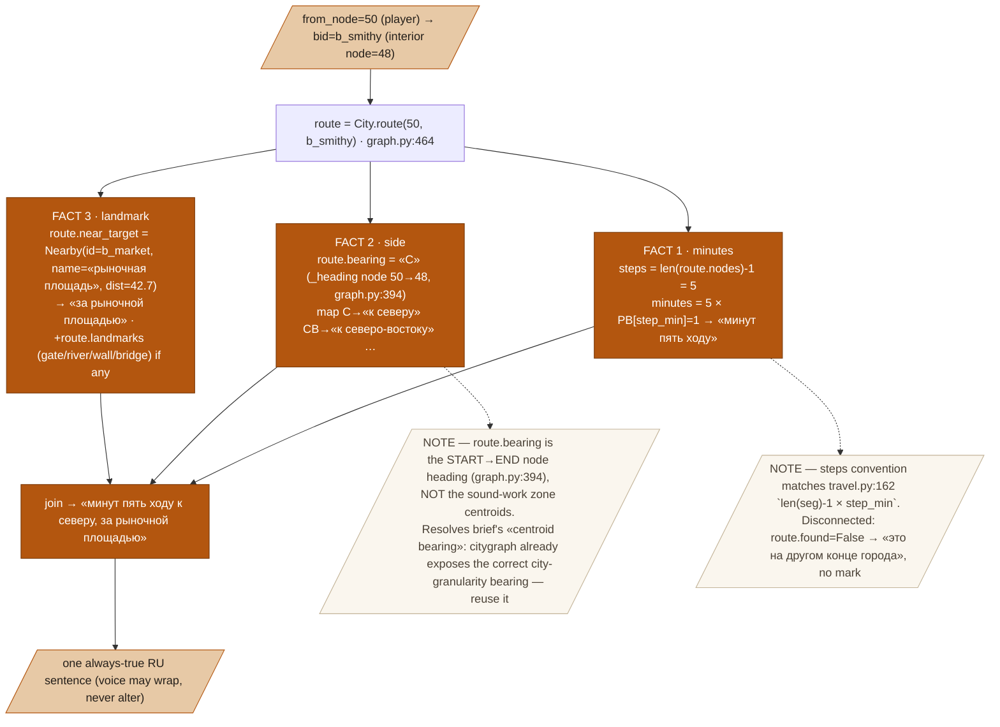

# NPC geographic knowledge — Design Spec

**Goal:** let an NPC answer «где …?» / «где купить X?» / «где дом Y?» with a *geometry-true* direction the player can trust — one mind-call decides whether he helps and which place/person he names (bounded to the places he could plausibly know), code computes the actual route facts, and a share reveals the building on the map + writes a journal row.
**Status:** draft
**From:** [[greenfield-play]], [[citygraph-module]], [[mind-decision-core]]; user-approved brief `scratchpad/geo-design-brief.md` (2026-07-13). Sibling workstream: emergent quests (`docs/superpowers/specs/2026-07-12-emergent-quests-design.md`).

---

## 1. Problem & context

Today the say-path (`handlers/dialogue.py:190` `say()`) feeds the player's line into `_voice(p, rel, "reply", text, …)` (`dialogue.py:228` → `narrator/voice.py:51`) and the NPC improvises an answer from persona alone. There is **no geographic grounding**: nothing computes a real route, nothing constrains *which* places the NPC could know, nothing marks the map.

Live playtest finding (the reason this spec exists): the player asked two different townsfolk the way to the **same** house and got **contradictory** improvised directions —

> Ода: «за рыночной площадью, у колодца»
> Горм: «в северном конце, у мельницы»

Both were fabricated by the narrator LLM with zero geometry behind them. One is wrong; possibly both. The `«Красный корень»` wild-goose-chase (a quest pitch naming a place that does not exist) is the same failure on the quest side: `framer` (`quests/framing.py:265`) can name a location the giver has no route to.

Everything needed to fix this already exists but is unused by dialogue:
- `citygraph.graph.City.route(a, b) -> Route` (`citygraph/graph.py:464`) already returns `nodes`, `length`, `bearing` (start→end 8-wind heading via `_heading`, `graph.py:394`), `near_target` (nearest key building except the target, `_nearest_other_building`, `graph.py:485`) and `landmarks` (river/wall/gate/bridge at target, `_landmarks_at`, `graph.py:498`). **All the direction facts are one call away** — dialogue just never asks.
- Placements (`placements` table, `worldgen/store.py:40`; accessor `placements_for(world_id)`, `store.py:312`) give every NPC his `home` node and `work` building.
- `_mark_seen(bid)` (`pc/hero.py:177`) already reveals a building on the player's fog-of-war map (flag `seen|<bid>`).
- `journal._emit(kind, prov, refs, text)` (`journal.py:26`) already writes typed rows; `j_place` (`journal.py:68`) exists but hardcodes `prov="saw"`.

So the pieces are on the shelf; nothing wires the player's where-question to them, and nothing bounds the NPC's answer to what he could plausibly know. This spec is that wiring.

---

## 2. Goals / Non-goals

**Goals**
- A pure module `engine/geo.py` with three functions: `known_places(pid)`, `direction_line(from_node, bid)`, `acquaintances(pid)` — no stored state, computed per query.
- `known_places(pid)` composes an NPC's known-set from **6 source rules** (home · work · routine venues · town landmarks · kin/friend homes · neighbors), each tagging `why_known`.
- `direction_line(from_node, bid)` returns one always-true RU sentence: minutes (A* steps × `step_min`) + compass side + nearest landmark — a thin formatter over `City.route`.
- A where-question in `say()` triggers **ONE mind-call** — the router IS the mind deciding *both* «хочу ли помочь» *and* «какое место/кого назвать», from persona + relationship, bounded to `known_places(pid)`.
- Code validates the chosen `bid`/`refer_pid` ∈ the code-provided sets; out-of-set → null.
- On a **share** decision only: `_mark_seen(bid)` map reveal + a `prov="told"` journal place-row.
- On unknown/none: honest «не знаю» + **referral** — the mind may name an acquaintance (kin/friend/coworker/venue-regular) and the NPC says where to find that person (whose home he knows).
- Quest-framer integration: the giver's `_allowed` set gains his known-place names; a pitch naming a location gets the real `direction_line` appended.

**Non-goals**
- NPC-to-NPC gossip grounding / biographical lies — separate workstream (chip `task_4f229de1`).
- No persistence, no new tables, nothing precomputed at worldgen — the known-set is derived on demand.
- No escort / «вести за собой» pathfinding UI — referral gives a name + where-line, not a follow-path.
- The `askkey_*` PB keys (lock flow) stay untouched — unrelated.
- No new **willingness** PB keys and no willingness roll — willingness lives in the mind-prompt (constraint §8).

---

## 3. Architecture

Three layers, one new module. **Code owns every geographic fact** (`geo.py` + `citygraph`); the **LLM only decides** (help / refuse / refer / which place) and **speaks** (`voice.py`); **validation clamps** the LLM's chosen ids to code-provided sets before anything is spoken or revealed.

- **`engine/geo.py` — NEW, pure.** `known_places(pid)` reads placements + citygraph + relationships and returns a list of `{bid, node, name, kind, goods, why_known}`. `direction_line(from_node, bid)` calls `City.route` (`graph.py:464`) and formats its `nodes`/`bearing`/`near_target`/`landmarks` into one RU sentence. `acquaintances(pid)` returns `{pid, name, role, where_line}` for referrals.
- **`handlers/dialogue.py` `say()` — MODIFIED.** Before the existing `_voice` call (`dialogue.py:228`) a cheap regex classifies the line as a where-question; if so, run the geo mind-call, validate, and pass its decision into `_voice` via a new `geo_line` kwarg. Non-place lines flow through **unchanged** (regression-safe).
- **`narrator/voice.py` `_voice` — MODIFIED.** New optional `geo_line: str | None` param, injected into `bits` exactly like `offer_pitch`/`active_pitch` (`voice.py:138-149`). The voice wraps the fixed facts in character but may not alter them.
- **Consequences (code, share only):** `_mark_seen(bid)` (`hero.py:177`) + `j_place(text, bid, prov="told")` (`journal.py:68`, gaining a `prov` param).
- **Framer (`quests/pipeline.py:101` `_allowed` + `quests/framing.py:265` `framer`) — MODIFIED.** Whitelist the giver's known-place names; append `direction_line` for a named location.

### 3.1 Overview



### 3.2 Master flow — where-question through `say()`



### 3.3 `direction_line` construction (small diagram)

`direction_line` computes **nothing new** — it calls `City.route(from_node, bid)` (`graph.py:464`, which already runs A*, `_heading`, `_nearest_other_building`, `_landmarks_at`) and formats three of its fields into one RU sentence.



---

## 4. Data model

### 4.1 `known_places(pid)` entry shape

```python
# geo.py — list[dict], computed per query, nothing stored
{
  "bid":  "b_smithy",            # building id (citygraph key building / house id)
  "node": 48,                    # its interior graph node (City._resolve target)
  "name": "кузница «Молот и мех»",  # _binfo(bid)["name"] · core.py:136
  "kind": "кузница",            # society/places kind or _TYPE_ROLE bucket (core.py:148)
  "goods": "оружие, доспехи",  # goods hint for «купить X» questions; "" when none
  "why_known": "все знают",     # ∈ {живу, работаю, хожу, все знают, свои, соседи}
}
```

**The 6 source rules** (each fires independently; a bid may be tagged by the first rule that claims it):

| # | Rule | Source seam | `why_known` | Notes |
|---|------|-------------|-------------|-------|
| 1 | **home** | `placements_for(wid)` row `home` node → its building | `живу` | one entry |
| 2 | **work** | placement `work` bid → `_binfo` | `работаю` | one entry, has `goods` from kind |
| 3 | **routine venues** | approx: work + nearest tavern/temple/market via `worldsim._place_index`/`_candidates` (see §4.3) | `хожу` | 1–3 entries, bounded to his district |
| 4 | **town landmarks** | `pool_buildings` filtered to landmark kinds (taverns, market, wells, guild, temple, gates, smithy, mills) — `society/places.py:43` `PLACES` detect + `_TYPE_ROLE` | `все знают` | everyone knows these |
| 5 | **kin, friend & coworker homes** | kin: `_fam(name)` surname match (`quests/seeds.py:28`); friend: `_aff(p,other) > PB[geo_friend_aff]=0.3` (`seeds.py:32`); coworker: shared non-empty `work` bid → their `home` | `свои` | homes only (T1-review: coworker закреплён как третий источник) |
| 6 | **neighbors** | buildings whose interior node is within `PB[geo_neighbor_hops]=2` graph hops of his home node | `соседи` | homes near home |

Rule 4 `goods` hints derive from kind: кузница → «оружие, доспехи»; лавка/рынок → market wares; таверна → «выпивка, слухи»; храм → «свечи, благословение». **NOT in the set:** arbitrary houses, hidden places — referral covers those gaps (texture, not a bug).

### 4.2 Mind-call JSON contract

**Prompt** (system), assembled in `geo.py`, sent via `core._model().call("narrator", msgs, options={"temperature": 0.2})`:
```
Ты — {имя} ({роль}). Нрав: {persona/нрав}.
Перед тобой ЧУЖАК. Твоё отношение к нему: приязнь={aff}, доверие={trust}, страх={fear}.
Что помнишь о нём: {memories about PLAYER or «ничего»}.
Он спрашивает: «{вопрос}».
МЕСТА, КОТОРЫЕ ТЫ ЗНАЕШЬ (выбирай ТОЛЬКО из них, не выдумывай):
  - кузница «Молот и мех» · кузница · оружие, доспехи
  - рыночная площадь · рынок · всякий товар
  - «Пьяный гусь» · таверна · выпивка, слухи
  … (known_places rendered name·kind·goods)
КОГО МОЖЕШЬ ПОСОВЕТОВАТЬ, если места нет: Горм (кузнец), Пёкка (сосед).
Реши по своему нраву и отношению: помочь ли, и если да — какое МЕСТО из списка назвать,
или кого посоветовать. Ответь СТРОГО JSON:
{"help":"да|нет|уклончиво","bid":"<id из списка или null>","refer_pid":"<id из совета или null>","манера":"<1 фраза, как ты это скажешь>"}
```

**Output** (parsed with the `voice.py:164` `_parse` idiom — first `{` … last `}` → `json.loads`):
```json
{"help": "да", "bid": "b_smithy", "refer_pid": null, "манера": "по-деловому, коротко"}
```

**Validation** (code, `geo.py`, before anything is spoken/revealed):
- `bid` not in `{p["bid"] for p in known_places(pid)}` → `bid = None`.
- `refer_pid` not in `{a["pid"] for a in acquaintances(pid)}` → `refer_pid = None`.
- Parse failure / non-dict → `{help:"уклончиво", bid:None, refer_pid:None, манера:""}`.
- After clamp: `help=="да" and bid` → **share**; `refer_pid` → **refer**; `help=="нет"` → **refuse**; else → **deflect**.

### 4.3 Routine-venues approximation (documented)

There is **no clean stored `frequents(npc)` accessor**. Frequented venues are computed on the fly inside `worldsim._candidates` (`worldsim.py:79`), which is a private `_S`-globals-dependent function over a live person, not a pure library call. **Adopt the brief's documented approximation:** rule 3 = the NPC's `work` venue + the nearest tavern + nearest temple + nearest market to his `home` node, found via `worldsim._place_index(people, keynode)` (`worldsim.py:31`, city nodes bucketed by kind) + `City.route` distance. This matches what `_candidates` seeds anyway (home/work + nearest tavern/temple/market). Stated here as an approximation, per constraint.

### 4.4 Fixed points / PB

- `PB["step_min"] = 1` (`session/config.py:19`) — reused for minutes; matches `travel.py:162` `len(seg)-1 × step_min`.
- `PB["geo_neighbor_hops"] = 2` — **NEW**, geometric (neighbor radius in graph hops). Numeric-tunable, not willingness.
- `PB["geo_friend_aff"] = 0.3` — **NEW**, reuses the existing `0.3` affinity literal already used at `quests/seeds.py:203`. Social threshold, not willingness.
- **No willingness PB key** — willingness is entirely in the mind-prompt.

---

## 5. Behavior — worked examples

### Fixture NPC — Ода Вент

- role: лавочница; persona/нрав: практичная, не злая, ценит дело.
- placement: `home` node **42** (house `b_house_oda`), `work` **`b_market_stall`** (лавка on the market, node 55).
- rel Ода→player: `{affinity:0.2, trust:0.1, fear:0.0}`; no memories about the player.
- kin: brother **Горм Вент** (кузнец, home `b_house_gorm` node 40). neighbor: **Пёкка** (home `b_house_pekka` node 43).
- Player стоит at node **50**.

`known_places(Ода)` → **8 entries** (all 6 rules fire):

| # | rule | bid | node | name | kind | goods | why |
|---|------|-----|------|------|------|-------|-----|
| 1 | home | b_house_oda | 42 | дом Оды | дом | — | живу |
| 2 | work | b_market_stall | 55 | лавка Оды | рынок | ткани, снедь | работаю |
| 3 | routine | b_tavern_goose | 60 | «Пьяный гусь» | таверна | выпивка, слухи | хожу |
| 4 | landmark | **b_smithy** | **48** | кузница «Молот и мех» | **кузница** | **оружие, доспехи** | все знают |
| 4 | landmark | b_market | 54 | рыночная площадь | рынок | всякий товар | все знают |
| 4 | landmark | b_well | 51 | колодец | колодец | вода | все знают |
| 5 | kin | b_house_gorm | 40 | дом Горма | дом | — | свои |
| 6 | neighbor | b_house_pekka | 43 | дом Пёкка | дом | — | соседи |

### Example A — «А где я могу купить оружие?» (share)

| Step | Function / rule | Input | Output |
|------|-----------------|-------|--------|
| 1 | intent regex (`dialogue.py` say) | «А где я могу **купить** оружие?» | `где купить` matches → where-question branch |
| 2 | `known_places(Ода)` | placements + citygraph + rel | the 8-entry set above (incl. `b_smithy` goods=«оружие, доспехи») |
| 3 | `acquaintances(Ода)` | kin + neighbors | `[{pid:p_gorm, name:Горм, role:кузнец, where_line:…}, {pid:p_pekka, name:Пёкка, role:сосед, …}]` |
| 4 | mind-call | prompt (§4.2) with aff=0.2 | JSON `{"help":"да","bid":"b_smithy","refer_pid":null,"манера":"по-деловому"}` |
| 5 | validate | `b_smithy` ∈ set? yes | share; `bid=b_smithy` kept |
| 6 | `direction_line(50, b_smithy)` | `City.route(50,b_smithy)` | see arithmetic below → «минут пять ходу к северу, за рыночной площадью» |
| 7 | `_voice(reply, geo_line=…)` | «ты знаешь место кузница «Молот и мех»: {dline} — посоветуй» + манера | «Оружие? Ступай к кузнице „Молот и мех“ — минут пять к северу, за рыночной площадью.» |
| 8 | `_mark_seen("b_smithy")` (`hero.py:177`) | share | flag `seen|b_smithy` set → кузница appears on map |
| 9 | `j_place(text, "b_smithy", prov="told")` (`journal.py:68`) | share | journal row `place/told/[b_smithy]` — «Ода рассказала дорогу к кузнице „Молот и мех“» |

**Step 6 arithmetic** — `City.route(50, b_smithy)` (`graph.py:464`), target interior node 48:
- `route.nodes = [50, 52, 53, 47, 46, 48]` → `steps = len(nodes)-1 = 5` → `minutes = 5 × step_min(1) = 5` → **«минут пять ходу»** (matches `travel.py:162`).
- `route.bearing` = `_heading(50→48)` (`graph.py:394`): node 50 xy `(120,300)`, node 48 xy `(125,180)`; `ang = atan2(-(180-300), 125-120) = atan2(120, 5) ≈ 87.6°`; `(87.6+22.5)//45 = 2` → `dirs[2] = "С"` → map → **«к северу»**.
- `route.near_target` = `_nearest_other_building(48)` (`graph.py:485`): market `b_market` xy `(110,220)`, `dist = √((110-125)²+(220-180)²) = √1825 ≈ 42.7`, closest key building ≠ кузница → `Nearby(b_market, «рыночная площадь», 42.7)` → **«за рыночной площадью»**.
- `route.landmarks` at 48 = `[]` (not at river/wall/gate/bridge) → nothing appended.
- Join → **«минут пять ходу к северу, за рыночной площадью»**.

### Example B — hostile NPC (aff = −0.5) refuses

Same question, but rel Ода→player `{affinity:-0.5, trust:0, fear:0.1}` and a memory «игрок мне грубил».

| Step | Function / rule | Input | Output |
|------|-----------------|-------|--------|
| 1-3 | as A | — | same 8-entry set + acquaintances |
| 4 | mind-call | prompt with aff=−0.5 + hostile memory | JSON `{"help":"нет","bid":null,"refer_pid":null,"манера":"отвернувшись"}` |
| 5 | validate | help=нет | refuse |
| 6 | `_voice(reply, geo_line=«ты решил не помогать — по своему нраву» + «отвернувшись»)` | — | «Сам ищи. Мне недосуг.» |
| 7 | consequences | refuse | **none** — no `_mark_seen`, no journal |

The map stays dark. Willingness came from the mind reading aff=−0.5, not from any code gate.

### Example C — «где дом Ветла?» → refer (Ветл ∉ set)

Ветл's home is **not** in Ода's known_places (arbitrary house). Player at node 50.

| Step | Function / rule | Input | Output |
|------|-----------------|-------|--------|
| 1 | intent regex | «где дом Ветла?» | `где дом` matches |
| 2 | `known_places(Ода)` | — | 8 entries, **no Ветл** |
| 3 | `acquaintances(Ода)` | kin | includes `{pid:p_gorm, name:Горм, role:кузнец, where_line:…}` |
| 4 | mind-call | prompt (Ветл absent from set) | JSON `{"help":"да","bid":null,"refer_pid":"p_gorm","манера":"пожав плечами"}` |
| 5 | validate | `bid=null`; `refer_pid=p_gorm` ∈ acquaintances? yes | refer |
| 6 | `direction_line(50, b_house_gorm)` for the where_line | `City.route(50,40)` → `nodes=[50,51,40]` steps=2, bearing «З», near=колодец | «в паре минут к западу, у колодца» |
| 7 | `_voice(reply, geo_line=«посоветуй спросить Горма (кузнец), он в паре минут к западу, у колодца»)` | — | «Ветл? Не скажу. Спроси Горма-кузнеца — он тут рядом, к западу, у колодца.» |
| 8 | consequences | refer | **no map mark** (nothing about Ветл revealed) — but Горм is a real, findable person |

### Example D — router returns out-of-set bid → clamp → deflect

Mind hallucinates `{"help":"да","bid":"b_castle","refer_pid":null,"манера":"махнув рукой"}` but `b_castle` ∉ known_places.

| Step | Function / rule | Input | Output |
|------|-----------------|-------|--------|
| 5 | validate | `b_castle` ∈ set? **no** | `bid → null` |
| 5b | post-clamp classify | help=да but bid=null, refer=null | falls to **deflect** |
| 6 | `_voice(reply, geo_line=«ты уклончив, не выдаёшь мест» + «махнув рукой»)` | — | «Где-то там, поспрашивай на рынке.» |
| 7 | consequences | deflect | **none** — no mark |

The LLM could not invent a place: the clamp nulled the fabricated id, and no map lie reached the player.

### Example E — parse failure

Mind returns non-JSON garbage. `_parse` (`voice.py:164`) fails → `{help:"уклончиво", bid:None, refer_pid:None}` → deflect (Example D step 6). No crash, no canned directions (honest deflection, constraint §8).

---

## 6. Edge cases & failure modes

- **Router garbage / parse fail** → уклончиво deflect (Example E). No mark, no stub direction.
- **Out-of-set bid** → null → deflect (Example D). LLM may choose from the set or say none — never invents.
- **Asked-about person transient / no home** — target has no `home` placement → `direction_line` can't route → landmark-level fallback «где-то у рынка» via `near_target` of his last-seen node, or refer; no mark.
- **Disconnected graph target** — `City.route` returns `found=False` → «это на другом конце города», no mark.
- **No LLM** — the say-path already raises `LLMUnavailable` and the app returns the honest 503 «Рассказчик недоступен» (`app.py:47`; `dialogue.py:141` local catch). The where-branch runs the same `_model().call`, so it inherits the same honest failure — the ask-path simply never produces a fabricated answer.
- **Ordinary (non-place) line** — regex misses → the existing `_voice(reply)` path runs byte-for-byte as today (regression-safe).
- **Empty known-set** (isolated NPC, no placement) — `known_places` returns `[]` → mind can only refer or deflect; never a mark.

---

## 7. Testing strategy

**Unit-testable (stub model, fixture graph — no live LLM):**
- `known_places` composition: fixture NPC with home/work/kin/friend/landmarks/neighbors → assert all 6 `why_known` buckets present; assert a far arbitrary house is **absent**; assert `b_smithy` carries `goods=="оружие, доспехи"`.
- `direction_line` exact string on a fixture graph: `direction_line(50, b_smithy) == "минут пять ходу к северу, за рыночной площадью"`; assert `step_min` scaling (set `step_min=2` → «минут десять»); disconnected node → «это на другом конце города».
- Bearing mapping: `_heading` «С»/«СВ»/… → «к северу»/«к северо-востоку»/… table, all 8 winds.
- Mind-call contract with stub manager: feed canned JSON for share / refuse / refer variants → assert classification; feed out-of-set `bid` → assert clamp to null → deflect; feed non-JSON → assert deflect.
- Consequences: on **share** assert `flags_prefix(wid,"seen|")` contains `seen|b_smithy` AND a `place/told` journal row exists; on **refuse** and **refer** assert **neither**; assert a non-place line leaves both untouched.
- Framer: a seed whose pitch names a known place → `_allowed` contains the place name AND the offer text ends with its `direction_line`; a place ∉ giver's set → cannot appear (allowed-set unchanged).

**Needs live verification (deepseek playtest):**
- «где дом Ветла?» (exact-name, refer chain) and «а где я могу купить оружие?» (need-router share) against a running world.
- Hostile NPC (aff < 0) refusal texture reads in-character.
- Follow a referral to the named person and confirm he is real and findable.
- Confirm the shared building actually appears on the player's map and the journal row is present.

---

## 8. Constraints honored

- **Code owns geometry/facts; LLM only DECIDES and SPEAKS.** Every distance/bearing/landmark comes from `City.route` (`graph.py:464`); the LLM authors no geography. Its chosen `bid`/`refer_pid` are clamped to code-provided sets before use.
- **No mechanical gates on NPC behavior.** Willingness lives entirely in the mind-prompt (persona + aff/trust/fear + memories) — one mind-call, no formula, no cooldown, no cap, no roll. No PB willingness key.
- **No LLM fallback.** Parse failure / no model → honest deflection or the existing 503 (`app.py:47`); never canned directions, never a stub.
- **Tunables in PB only if truly numeric.** `geo_neighbor_hops` (geometric) and `geo_friend_aff` (reuses the existing `0.3` literal) are added; `step_min` reused. **No willingness key added** (per brief).
- **Specs to `docs/superpowers/specs/`; Russian commits; no Claude co-author trailer.** This file lives there; commits will be Russian and un-co-authored.

---

## 9. Scope & roadmap

- **Inc 1** — `geo.py` core (`known_places` + `direction_line` + `acquaintances`) + **exact-name ask-flow** («где дом X») wired into `say()` with intent regex + `_voice` `geo_line` kwarg + `_mark_seen`/`j_place(prov="told")` consequences. Ships standalone: exact-place questions get real, map-marking directions. Unit-tested end to end.
- **Inc 2** — the **mind-router for need-questions** («где купить X», goods-hinted set) + **referral** (acquaintances → `refer_pid` → where_line) + **framer integration** (`_allowed` whitelist + `direction_line` appended to location-naming pitches) + live deepseek playtest.

Sequencing: Inc 1 proves the geometry + consequence wiring with a trivial matcher; Inc 2 adds the persona-driven router and quest grounding on top.

---

## 10. Open questions

- Routine-venues (rule 3): ship the documented approximation (work + nearest tavern/temple/market), or invest in a clean `frequents(pid)` extracted from `worldsim._candidates`? (Inc 1 uses the approximation.)
- `direction_line` minutes phrasing: RU numeral words for 1–10 («минут пять») then «минут N» beyond — or always «минут N»? (Spec assumes the numeral-word map for small counts.)
- Should a **refer** also mark the acquaintance's home on the map (he told you where the person lives), or stay mark-free? (Brief says mark-free; flagged for playtest feel.)
