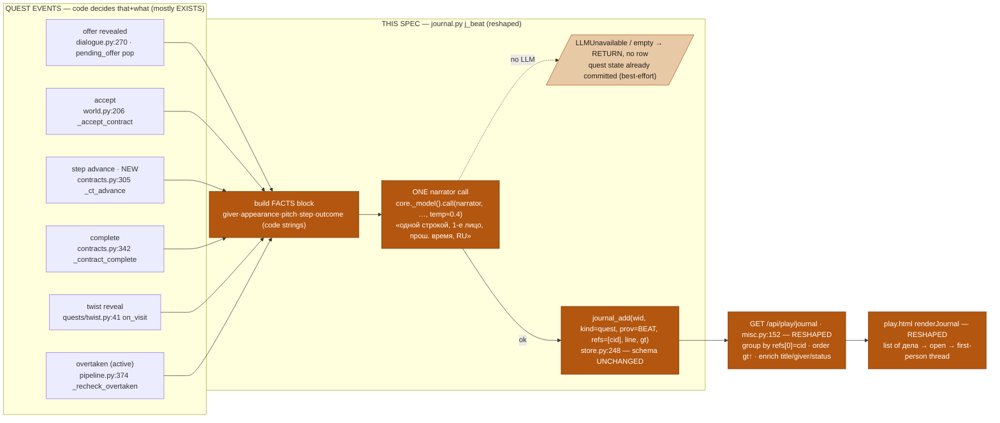
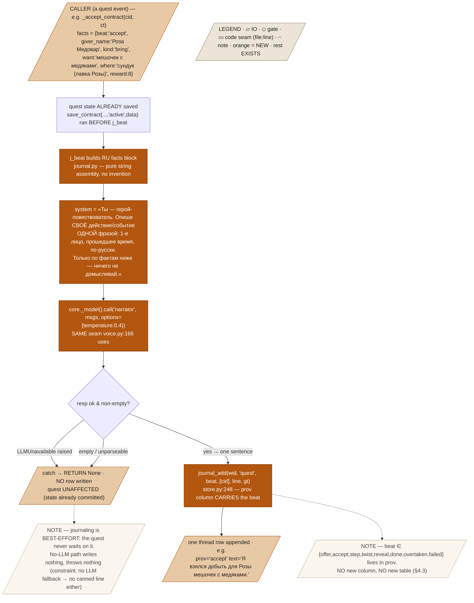
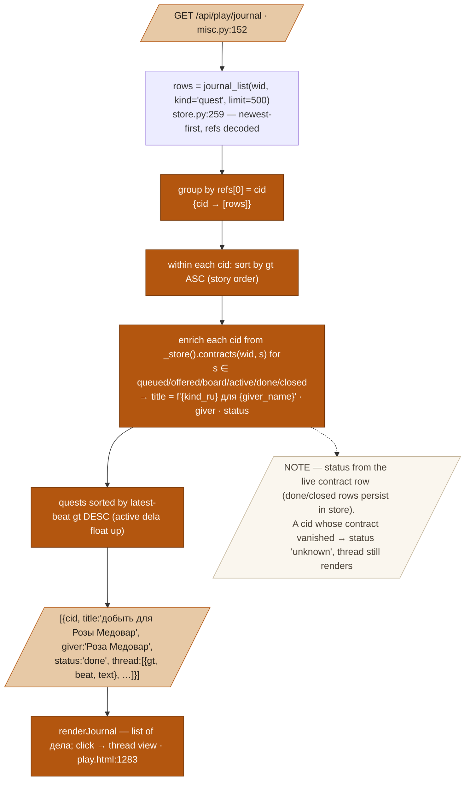

# Quest Journal «Хроника → дела» — Design Spec

**Goal:** turn the player journal from an ambient chronicle (overheard lines, met-people, visited-places, plus quest rows) into a **collection of дел** — one first-person past-tense history thread per quest, written by the narrator LLM from code-supplied facts on real quest events only, so the «Хроника» tab reads «Ко мне обратился мужчина, назвавшийся Пигельмуль → Он попросил меня… → …я обыскал помещение и понял, что он хотел меня ограбить → Так и завершилось это дело.»
**Status:** draft
**From:** [[quests-emergent]] (sift→judge→cast→offer→arc pipeline + «Хроника»); user-locked brief (2026-07-13, this session). **Supersedes** fix **F6** in `docs/superpowers/plans/2026-07-13-grand-tour-fixes.md` — kind-aware pruning of `journal_feed`/`j_person`/`j_place` becomes **moot**: those writes are removed from the journal entirely, so there is nothing to prune.

---

## 1. Problem & context

Today the journal is a **flat, mixed-kind chronicle** written from five capture hooks, most of them ambient:

- `journal_feed(feed)` (`engine/journal.py:72`, called every tick from `world.py:1300`) writes one `kind=event` row per overheard tier-1/tier-2 speech line and per witnessed deed — the market-noise firehose F6 was created to throttle.
- `j_person_once(pid, …)` (`journal.py:51`, from `handlers/dialogue.py:120`) writes a `kind=person` row on the first real talk with anyone.
- `j_place(text, bid)` (`journal.py:68`, from `pc/hero.py:184` inside `_mark_seen`) writes a `kind=place` row on every first visit and on every geo-share.
- `j_event` also fires from `handlers/freeform.py:376` (gave coins) and `handlers/inventory.py:133` (item reveal).
- `j_quest(prov, text, cid)` (`journal.py:43`) writes `kind=quest` rows at **five** beats already: offer-pitch reveal (`dialogue.py:270`), accept (`world.py:206` `_accept_contract`), completion (`mechanics/contracts.py:342` `_contract_complete`), twist reveal (`quests/twist.py:41`), and overtaken-close of an accepted quest (`quests/pipeline.py:374`).

The frontend (`server/web/play.html:1283` `renderJournal`) renders these as four provenance-marked tabs (**События · Люди · Дела · Места**, `play.html:478-481`), each a flat `kind`-filtered list newest-first (`GET /api/play/journal?kind=…`, `handlers/misc.py:152`). The rows are **flat text with a provenance glyph** (`JMARK={saw:'✦',heard1:'◐',heard2:'◐',told:'◌'}`, `play.html:1281`); the **Дела** tab is an ungrouped list of quest one-liners, not a per-quest thread.

Two problems:
1. **The journal is 90% ambience.** The persistent chronicle is dominated by overheard-speech noise and met-people/visited-place bookkeeping that duplicates state the map (`seen|<bid>` flags, `hero.py:173`) and the NPC cards (`/api/play/npc`, `world.py:289`) already own.
2. **Quests aren't stories.** The five existing `j_quest` rows are scattered one-liners in a flat **Дела** list; there is no per-quest thread, no first-person voice, no «Ко мно обратился X → он попросил → …деяния… → так и завершилось».

The pieces to fix it are all on the shelf: `j_quest` already fires at the right code events; `journal_add`/`journal_list` (`worldgen/store.py:248`/`:259`) already carry `refs=[cid]`; the narrator seam (`_model().call("narrator", …)`, used by `narrator/voice.py:166`) is one call away. This spec **reshapes the journal into a quest-only, LLM-worded, thread-grouped дела collection** and **removes every non-quest write**.

---

## 2. Goals / Non-goals

**Goals**
- The journal is a **collection of дел**: `GET /api/play/journal` returns quests grouped `[{cid, title, giver, status, thread:[{gt, beat, text}]}]`, newest-quest-first, each thread oldest-beat-first (reads top-to-bottom as a story).
- Every thread line is written by the **narrator LLM in first person, past tense, RU, one sentence**, from a **code-built facts block** — code decides *that* and *what* happened; the LLM only *words* it.
- Entries fire **only on code-level quest events** — the enumerated hooks in §3.2, every one verified `file:line`. No ambient capture.
- **Nothing non-quest is written** to the persistent journal: `journal_feed`, `j_person`/`j_person_once`, `j_place`, and the two `j_event` sites are removed from the journal (map `seen|` flags and NPC-card memory keep their own state; the **live feed** keeps its in-scene ambience — only the *persistent* journal changes).
- **Best-effort journaling:** on `LLMUnavailable` the beat's entry is simply **not written**; the quest state itself is never blocked or delayed by journaling.
- Minimal storage change: **no new table, no new column** — quest-only rows reuse the existing `journal` table with `kind='quest'`, `refs=[cid]`, and the **beat tag carried in the existing `prov` column**.
- Frontend: the **Дела** tab becomes a two-level view — a list of дела (active + завершённые) that each open a first-person thread; the other three tabs (События · Люди · Места) are removed.

**Non-goals**
- **No retro-fill.** Past quests that predate this rework get no synthesized thread; their old rows are purged (§4.3) and they simply have no history. New quests thread from their next beat forward.
- **The ambient live feed is untouched** (`world.py` scene/feed, `convo.py`) — only the *persistent journal* stops capturing it.
- **Map seen-flags and NPC-card state are untouched** — `_mark_seen` still sets `seen|<bid>` (map reveal); dialogue memory still records meetings. Only their *journal rows* die.
- **No speculation.** Interpretive beats (reveal/twist) state only what mechanics revealed — never a guess beyond code knowledge.
- **No new willingness/gates/rolls** — journaling is a pure best-effort side-write; it gates nothing.
- No cross-quest narrative, no chapter summaries, no player-authored notes.

---

## 3. Architecture

**One reshaped API (`journal.py` `j_quest` → `j_beat`), one narrator call per event, one grouping endpoint, one two-level UI.** Code owns *which* beat fires and *what facts* it carries; the LLM only *words* the sentence; the store only *appends and groups*.

- **`engine/journal.py` — REPLACED.** The five ambient helpers (`journal_feed`, `j_event`, `j_person`, `j_person_once`, `j_place`) are **deleted**. `j_quest(prov, text, cid)` is **reshaped into `j_beat(cid, beat, facts)`**: it builds the RU facts block, makes **one** `_model().call("narrator", …)` (temperature low, ~0.4), parses one sentence, and appends a row via `journal_add(wid, "quest", beat, [cid], line, gt)` — the **beat name lives in the `prov` column**. On `LLMUnavailable` (or empty/garbled output) it **returns without writing** (best-effort; the caller's quest transaction already committed).
- **`worldgen/store.py` — UNCHANGED schema.** `journal_add`/`journal_list` keep their signatures. A **one-time migration** deletes all non-`quest` rows (§4.3). `prov` now holds a beat tag from the closed set `{offer, accept, step, twist, reveal, done, overtaken, failed}` for `kind='quest'` rows.
- **`handlers/misc.py` `journal_endpoint` — RESHAPED.** `GET /api/play/journal` drops the `kind` filter, reads all `kind='quest'` rows, **groups by `refs[0]`=cid**, orders each thread by `gt` ascending (story order), enriches each group with `{title, giver, status}` from `_store().contracts(...)` across all statuses, and returns quests newest-first (by latest beat gt).
- **Quest-event call sites — REWIRED** to `j_beat(cid, beat, facts)`. The five existing `j_quest` sites keep firing (remapped to named beats); **two new** sites are added: **step progress** (`contracts.py:305` `_ct_advance`) and **offer intro** folded into the offer beat.
- **`narrator/` — REUSED.** `j_beat` calls the existing `"narrator"` role via `core._model()` — the same manager `voice.py:166` uses. No new role, no new manager. Cost is negligible: quest events are rare (a few per in-game day) vs. the per-tick narration load.
- **`server/web/play.html` — RESHAPED.** `renderJournal` (`play.html:1283`) becomes a two-level дела view; the four `jtab` buttons (`play.html:478-481`) collapse to a single дела list; `JMARK` glyphs are repurposed as optional beat markers.

### 3.1 Overview



### 3.2 Quest-event hooks (each verified `file:line`)

| Beat (`prov`) | Fires at | Status today | Facts block feeds | «…» first-person line |
|---|---|---|---|---|
| `offer` | `handlers/dialogue.py:270` — player asks about work, `pending_offer` pops, «Уговор» card shows | EXISTS (`j_quest("told", pitch, cid)`) — **reshaped** to intro+ask | giver `name`, `role`, appearance (`persona.look.clothing`), `pitch` | «Ко мне обратился {name}, {appearance}. Он попросил меня {суть pitch}.» |
| `accept` | `engine/world.py:206` `_accept_contract` (both `contract_accept` and `board_take`) | EXISTS (`j_quest("told", summary, cid)`) | `kind`, `want`/`target_name`, `where`, `reward` | «Я взялся за это дело.» |
| `step` | `mechanics/contracts.py:305` `_ct_advance` (multi-step partial) | **NEW — no journal today** | completed `step_narr`, next `_step_desc`, `nstep`/`len` | «Я {step_narr}; оставалось {next}.» |
| `twist` | `engine/quests/twist.py:41` `on_visit` (villain-node visit) | EXISTS (`_j_quest("told", reveal, cid)`) | `framer.reveal` text | «Я {reveal — что вскрылось}.» |
| `reveal` | same site as `twist` when the reveal exposes deception/voids the contract (interpretive) | EXISTS (folded into `twist`) | `framer.reveal` (mechanics-confirmed only) | «Я обыскал помещение и понял, что он хотел меня ограбить.» |
| `done` | `mechanics/contracts.py:342` `_contract_complete` | EXISTS (`j_quest("saw", …)`) | giver `name`, `what` (want/target), `kind` | «Так и завершилось это дело — {what} доставлен.» |
| `overtaken` | `engine/quests/pipeline.py:374` `_recheck_overtaken` (accepted quest only) | EXISTS (`j_quest("saw", line, cid)`) | giver line «дело уж улажено — поздно» | «Дело уладилось без меня — я опоздал.» |
| `failed` | reserved — no accepted-quest fail path exists today (only `overtaken`); `expired` offers were never accepted → never in journal | not wired | — | (reserved; same shape as `overtaken`) |

**Not journaled (deliberately):** `foreshadow→offered`/`_surface` (`pipeline.py:276`) and `expire_stale` (`pipeline.py:311`) act on offers the player **never accepted** — invisible to him, so no thread. `sift` single-step predicate closes route straight to `done` (`_contract_complete`), so no separate `step` beat for them. `foreshadow→offered` becomes visible only when the giver reveals the pitch (→ the `offer` beat).

### 3.3 `j_beat` — the one write path (traced)

`j_beat` is the *only* thing that reaches the persistent journal. It runs **after** the quest transaction commits, so a skipped write never rolls anything back.



### 3.4 Read path — grouping into дела (traced)



---

## 4. Data model

### 4.1 `j_beat` signature & facts block

```python
# engine/journal.py — REPLACES j_quest; the ONLY persistent-journal writer
def j_beat(cid: str, beat: str, facts: dict) -> None:
    """One thread line for a quest event. beat ∈ {offer,accept,step,twist,reveal,done,overtaken,failed}.
    Builds an RU facts block, makes ONE narrator call, appends kind='quest' prov=beat refs=[cid].
    BEST-EFFORT: LLMUnavailable / empty output → returns without writing; NEVER raises to the caller
    (the quest transaction has already committed). No canned fallback line (no-LLM-fallback rule)."""
```

**Facts dict per beat** (code strings only — every value comes from the contract/giver, none invented):

```python
# offer  (from the giver Person `p` + contract `ct`, at dialogue.py:270)
{"giver_name": "Роза Медовар", "giver_role": "лавочник",
 "appearance": "в переднике, руки в муке",          # persona.look.clothing or "" 
 "pitch": "Сбегай к моему сундуку за мешочком медяков — награжу."}
# accept (from ct, at world.py:206)
{"kind": "bring", "want": "мешочек с медяками",
 "where": "сундук (лавка Розы)", "reward": 8, "giver_name": "Роза Медовар"}
# step   (from _ct_advance, contracts.py:305 — NEW)
{"step_narr": "Есть, добыто.", "next": "отнести «мешочек» Гвен", "n": 2, "total": 3}
# twist / reveal (from ct.framer.reveal, twist.py:41)
{"reveal": "Всплыло: сундук был приманкой — Роза метила тебя обобрать."}
# done   (from _contract_complete, contracts.py:342)
{"giver_name": "Роза Медовар", "what": "мешочек с медяками", "kind": "bring"}
# overtaken (from _recheck_overtaken, pipeline.py:374)
{"giver_line": "спасибо, но дело уж улажено — поздно", "giver_name": "Роза Медовар"}
```

**Narrator message** (assembled in `j_beat`, one call):
```
system: Ты — герой этой истории, ведёшь дневник дел. Опиши событие ниже ОДНОЙ короткой
        фразой: от ПЕРВОГО лица, в ПРОШЕДШЕМ времени, по-русски, только по фактам —
        ничего не домысливай и не добавляй. Верни ТОЛЬКО фразу, без кавычек и пояснений.
user:   Событие ({beat}): {rendered facts block}.
```
Parsed as the raw stripped line (no JSON needed — the narrator returns one sentence). Empty/whitespace → treat as unavailable → no row.

### 4.2 Journal row (existing shape, reused)

```python
# journal_add(world_id, kind, prov, refs, text, gt)  — store.py:248, UNCHANGED
{"gt": 21360, "kind": "quest", "prov": "accept",       # prov CARRIES the beat
 "refs": ["ct:sift:p_roza:20880"], "text": "Я взялся добыть для Розы мешочек с медяками."}
```

### 4.3 Storage evolution & migration

**Decision: keep the table, no new column, encode the beat in `prov`.** Rationale: `journal_add`/`journal_list` already accept an arbitrary `prov` string and `refs=[cid]`; the beat is exactly a per-row tag; adding a column would be a schema migration for zero gain. The read path already decodes `refs` to a list, so grouping by `refs[0]` is free.

**One-time purge of legacy rows.** Existing non-`quest` rows (person/place/event) are now unreadable (the API only groups `kind='quest'`) and — worse — they share the global per-world `journal_cap=2000` prune (`store.py:255-257`, deletes oldest across *all* kinds), so leaving thousands of stale event rows would compost fresh quest rows. So run a **single** `DELETE FROM journal WHERE kind != 'quest'` per world, lazily on the first `journal_list` after deploy (guard flag `journal_purged`). Justification: cheap, one-shot, protects the quest cap; retro-fill is a non-goal so the deleted rows have no future reader. Legacy `kind='quest'` rows survive but carry old `prov` values (`told`/`saw`) — they still group and render (the UI treats unknown beats as plain lines), so old quests degrade gracefully into un-typed threads rather than breaking.

### 4.4 Fixed points / PB

- `PB["journal_cap"] = 2000` (`session/config.py:231`) — reused as-is; now effectively a **quest-thread-rows** cap. Few-per-day beats never approach it, so F6's kind-aware pruning is unnecessary.
- **No new PB keys.** Narrator temperature (~0.4) is a local literal in `j_beat`, matching the `voice.py:166` idiom (0.85 there; lower here for faithful wording). If it must be tunable, add `PB["journal_temp"]=0.4` — flagged in §10, not required.
- **No thread-length or beat-count caps** — beats are code events, inherently bounded by the quest's own step count.

---

## 5. Behavior — worked examples

### Fixture — the fraud arc (Пигельмуль-style, real pool NPC)

- Giver: **Роза Медовар**, лавочник (real pool row). `persona.look.clothing = "в переднике, руки в муке"`.
- Emergent (`src:"sift"`) contract `ct:sift:p_roza:20880`, single `bring` step: want «мешочек с медяками», `where="сундук (лавка Розы)"`, `reward=8`.
- A twist was planted (`_gate_twist` passed): `seed["twist"].reveal_on = "visit:p_roza"`, `framer.reveal = "сундук был приманкой — Роза метила тебя обобрать"`.
- Player game-time advances across the arc; `gt` in minutes.

**Thread built, beat by beat:**

| gt | Event (seam) | beat | Facts block → narrator | Line written (plausible) |
|----|--------------|------|------------------------|--------------------------|
| 20940 | player asks Роза about work; `pending_offer` pops, «Уговор» card shows — `dialogue.py:270` | `offer` | `{giver_name:"Роза Медовар", giver_role:"лавочник", appearance:"в переднике, руки в муке", pitch:"Сбегай к сундуку за мешочком медяков — награжу"}` | «Ко мне обратилась Роза Медовар, лавочница в переднике, и попросила добыть из её сундука мешочек медяков.» |
| 21360 | `contract_accept` → `_accept_contract` — `world.py:206` | `accept` | `{kind:"bring", want:"мешочек с медяками", where:"сундук (лавка Розы)", reward:8, giver_name:"Роза Медовар"}` | «Я согласился взяться за это дело.» |
| 22080 | player reaches Роза's node (villain node) → `on_visit` fires the twist — `twist.py:41` | `reveal` | `{reveal:"сундук был приманкой — Роза метила тебя обобрать"}` | «Я обыскал помещение, на которое она указала, и понял, что она всё это затеяла, чтобы меня обобрать.» |
| 22080 | `_contract_complete` — predicate met, payout — `contracts.py:342` | `done` | `{giver_name:"Роза Медовар", what:"мешочек с медяками", kind:"bring"}` | «Так и завершилось это дело — мешочек с медяками я всё же добыл.» |

**API grouping** (`GET /api/play/journal`) → one дело:
```json
[{"cid":"ct:sift:p_roza:20880","title":"добыть для Розы Медовар","giver":"Роза Медовар",
  "status":"done","thread":[
    {"gt":20940,"beat":"offer","text":"Ко мне обратилась Роза Медовар, лавочница в переднике, и попросила добыть из её сундука мешочек медяков."},
    {"gt":21360,"beat":"accept","text":"Я согласился взяться за это дело."},
    {"gt":22080,"beat":"reveal","text":"Я обыскал помещение, на которое она указала, и понял, что она всё это затеяла, чтобы меня обобрать."},
    {"gt":22080,"beat":"done","text":"Так и завершилось это дело — мешочек с медяками я всё же добыл."}]}]
```
Reads top-to-bottom exactly like the user's example.

### Example B — multi-step improvised contract, with a `step` beat (NEW)

Giver **Гвен Тихвуд** (знахарка), 3-step chain: bring трава → deliver зелье → befriend.

| gt | Event | beat | Facts | Line |
|----|-------|------|-------|------|
| 30000 | offer reveal | `offer` | `{giver_name:"Гвен Тихвуд", appearance:"", pitch:"собери травы, свари зелье, помири меня с соседкой"}` | «Ко мне обратилась знахарка Гвен Тихвуд и попросила помочь ей с зельем и ссорой.» |
| 30300 | accept | `accept` | `{kind:"bring", want:"полынь", reward:12, giver_name:"Гвен Тихвуд"}` | «Я взялся за её просьбу.» |
| 31000 | `_ct_advance` step 1→2 — `contracts.py:305` | `step` | `{step_narr:"Есть, добыто.", next:"отнести зелье соседке", n:2, total:3}` | «Я добыл полынь; оставалось отнести зелье соседке.» |
| 32000 | `_ct_advance` step 2→3 | `step` | `{step_narr:"Передал из рук в руки.", next:"помирить Гвен с соседкой", n:3, total:3}` | «Я вручил зелье; оставалось лишь их помирить.» |
| 33000 | `_contract_complete` | `done` | `{giver_name:"Гвен Тихвуд", what:"дружба сведена", kind:"befriend"}` | «Так и уладилось это дело — я свёл их дружбу.» |

### Boundary — LLM down on the accept beat

Same fraud arc; at gt 21360 the model is unavailable when `_accept_contract` calls `j_beat`.

| Step | Function/rule | Input | Output |
|------|---------------|-------|--------|
| 1 | `_accept_contract` (`world.py:196-199`) | — | `save_contract(..., 'active', data)` **commits** — quest is accepted |
| 2 | `_accept_contract` (`world.py:206`) → `j_beat(cid,"accept",facts)` | facts | narrator call raises `LLMUnavailable` |
| 3 | `j_beat` catch | exception | **returns, writes no row** — no canned line (no-LLM-fallback) |
| 4 | player state | — | quest is active; delivery package handed (`world.py:201-203`); **thread just skips the accept line** |
| 5 | later `done` beat (LLM back) | — | writes normally; thread reads offer → (gap) → done — still coherent |

Journaling never blocked the accept; the mechanic ran to completion regardless.

### Boundary — minimal thread (offer → done, zero optional beats)

A `sift` single-step `visit` quest, LLM up throughout, no twist, no multi-step:

```
[{cid, title:"наведаться для …", status:"done", thread:[
  {beat:"offer", text:"Ко мне обратился … и попросил наведаться в …"},
  {beat:"accept", text:"Я согласился."},
  {beat:"done", text:"Так и завершилось это дело — место я осмотрел."}]}]
```
Three lines still read as a complete little story — offer, accept, close.

---

## 6. Edge cases & failure modes

- **No LLM anywhere** — every `j_beat` returns without writing; the journal simply has fewer lines this session; **no quest is ever blocked** and **no canned line** is invented (both the no-LLM-fallback rule and best-effort journaling honored).
- **Empty / unparseable narrator output** — treated identically to no-LLM: no row.
- **Beat fires twice** (e.g. `twist` and `reveal` at the same site) — the fraud arc emits `reveal` (deception exposed) *instead of* a plain `twist` when `framer.reveal` names an exposure; otherwise `twist`. Only one row per villain-visit (guarded by the existing `arc.beat=="twisted"` check, `twist.py:24`).
- **cid with no live contract row** (rare — contract deleted) — grouping still renders the thread; `status="unknown"`, `title` falls back to the first row's text prefix.
- **Legacy `kind='quest'` rows** (old `prov` `told`/`saw`) — group and render as plain (un-beat-typed) lines; UI shows them without a beat marker. Graceful, no crash.
- **Ambient sites after removal** — `world.py:1300` (`journal_feed`), `dialogue.py:120` (`j_person_once`), `hero.py:184` (`j_place` inside `_mark_seen`), `freeform.py:376` & `inventory.py:133` (`j_event`) have their journal calls deleted. `_mark_seen` **keeps** `seen|<bid>` flag-set (`hero.py:180-182`); only its `j_place` line (`:184`) goes. The geo-share path (`dialogue.py:236-238`) still marks the map, just writes no journal row.
- **Best-effort ordering** — `j_beat` runs *after* `save_contract`, so a mid-write crash in journaling can never corrupt quest state.

---

## 7. Testing strategy

**Unit-testable (stub narrator manager, no live LLM):**
- **Facts builders** — feed a fixture contract to each beat's facts assembler; assert the exact dict (`accept` → `{"kind":"bring","want":"мешочек с медяками",…}`), no invented keys.
- **`j_beat` best-effort** — stub manager returning a canned sentence → asserts a row `kind='quest' prov='accept' refs=[cid]` appended; stub raising `LLMUnavailable` → asserts **no row** and **no exception** propagates; stub returning `""` → no row.
- **Grouping API** — seed 4 quest rows across 2 cids with mixed gt → `GET /api/play/journal` returns 2 дела, each `thread` gt-ascending, quests latest-gt-first; assert `title/giver/status` enriched from a fixture contract.
- **No non-quest writes anywhere** — assert `journal_feed`, `j_event`, `j_person`, `j_person_once`, `j_place` are **gone** (import fails / attribute absent); drive a tick with a feed + a first-talk + a first-visit → assert `journal_list(wid)` gains **zero** non-quest rows; assert `_mark_seen(bid)` still sets `seen|bid` but writes no journal row.
- **Migration** — a world pre-seeded with person/place/event rows → first `journal_list` after deploy → those rows deleted once, `journal_purged` flag set, quest rows untouched.
- **Beat enumeration** — drive offer→accept→step→reveal→done through the real seams with a stub narrator → assert exactly those `prov` values land in order.

**Live playtest (deepseek/haiku player-agent, the standing `/playtest` method):**
- Run the Роза fraud arc end-to-end; open «Хроника»; assert the thread reads like the user's example — «Ко мне обратилась… → Я согласился… → Я обыскал… и понял… → Так и завершилось это дело.» — coherent first-person past tense, no fabricated facts beyond the reveal.
- Confirm the ambient noise is **gone** from the journal (no overheard-speech / met-people / visited-place rows) while the **live feed** still shows in-scene ambience.
- Confirm map markers and NPC cards still populate (state preserved) though their journal rows vanished.

---

## 8. Constraints honored

- **Code owns dice/facts; LLM only words.** `j_beat` builds every fact string from the contract/giver; the narrator receives them verbatim and returns one sentence — it decides no *what*, only phrasing. Faithfulness is instructed («только по фактам, ничего не домысливай») and the interpretive beats feed only mechanics-confirmed `framer.reveal`.
- **No LLM fallback.** On `LLMUnavailable`/empty output `j_beat` writes **nothing** — no canned line, no stub. The beat is simply absent; the quest state (committed before the call) is never blocked. This is the explicit user decision: journaling is best-effort, mechanics never wait on it.
- **No mechanical gates.** Journaling gates nothing — no cooldown, cap, or roll on quest behavior; it is a pure side-write after the fact.
- **Tunables in PB.** Reuses `PB["journal_cap"]`; adds no willingness key. Narrator temperature is a local literal (optional `PB["journal_temp"]` flagged in §10).
- **Specs to `docs/superpowers/specs/`; Russian commits; no Claude co-author trailer.** This file lives there; the eventual commit will be Russian and un-co-authored.
- **Supersedes F6.** The pruning F6 proposed for `journal_feed`/person/place is moot — those writes are removed, not throttled.

---

## 9. Scope & roadmap

- **Inc 1 — quest-only journal + threads.** Reshape `j_beat`; delete the five ambient helpers and their call sites; rewire the five existing quest sites + add the `step` site; migration purge; reshape the grouping API; reshape the frontend дела view. Ships the full user-locked design. Unit-tested; one live fraud-arc playtest.
- **Inc 2 (deferred, optional).** Richer beat markers/glyphs in the thread UI; a `failed` beat if/when an accepted-quest failure path is added; optional `PB["journal_temp"]`.

Sequencing: back-end first (j_beat + hooks + API + migration, unit-green), then the frontend two-level view, then the live playtest gate.

---

## 10. Open questions

- **Offer beat granularity** — one row («…обратилась… и попросила…») or two rows (intro + ask) to more literally match the user's two-arrow example? Spec assumes **one** narrator call / one row for cost and coherence; splitting doubles calls.
- **Narrator temperature** — keep the local `0.4` literal, or promote to `PB["journal_temp"]`? (Spec keeps it local; flagged if a tuner wants it.)
- **Legacy quest rows** — render old un-typed `prov` rows in-thread (spec's choice, graceful) or purge them too for a clean slate? (Spec keeps them; retro-fill stays a non-goal either way.)
