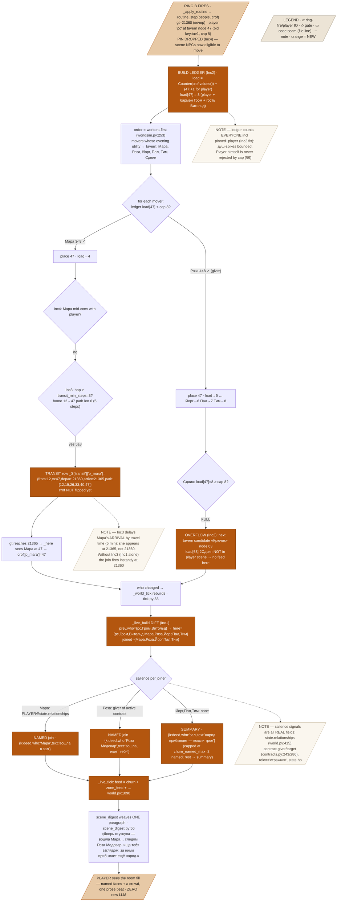
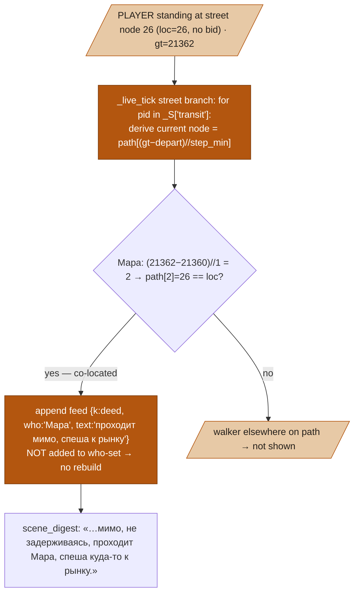

# SIM-STITCHING «сшивка слоёв» — Design Spec

**Goal:** stitch the passive city sim (ring B — routine relocates ~1354 residents every 30 game-min) to the player's live scene (ring A) so that people **arrive and leave the player's scene as visible, code-generated feed events**, venues have a **hard capacity with overflow**, town-crossing NPCs become **derived walkers you can see pass on the street**, and a present NPC the routine moves **actually leaves** (no more pinning) — all with **zero new LLM calls**.
**Status:** draft
**From:** [[citysim-design]] (the C→A→B→D→E sequence, "next phase = STITCHING the seams"); [[greenfield-play]]; user-locked brief (2026-07-14, this session). Grounded in the audit of `worldsim.routine_step`, `tick.py`, `world._live_build`.

---

## 1. Problem & context

The two rings never talk. Today they are welded shut at four seams:

1. **Passive movement is invisible.** `routine_step` (`engine/worldsim.py:208`) is the **only writer of `crof`** (the pid→node placement, `worldsim.py:278` `crof[pid]=node`), keyed every 30 game-min (`loop/routine.py:61`, called from `_apply_routine` at `routine.py:82`). When it moves people, **nothing tells the player** — there is no arrival/departure event anywhere in the codebase.
2. **Scene NPCs are frozen.** `_apply_routine` pins the live scene out of the sim: `routine_step(_S["people"], _S["crof"], pin=set(_here(_S["loc"], _S["crof"])))` (`routine.py:82`); inside `routine_step`, `if pin and pid in pin: continue` (`worldsim.py:255`). So **a resident standing in the player's tavern never relocates** — the room is a stopped clock until the player leaves.
3. **The who-set is a trigger, never a diff.** `_world_tick` rebuilds the scene only when the occupant set changes — `if not lv or lv["loc"] != loc or lv.get("who") != frozenset(_here(loc, crof)): _live_build(...)` (`loop/tick.py:33-34`). The set is *compared* to decide "rebuild yes/no" but **never diffed** into "who joined / who left". `_live_build` (`world.py:363`) stores it once as `"who": frozenset(here)` (`world.py:576`) and reads every occupant with `here_all = _here(loc, crof)` — explicitly "no LOD cap" (`world.py:429`). The end-of-tick `scene_digest` (`narrator/scene_digest.py:56`) narrates only the `feed`; churn is not in the feed, so it is never narrated.
4. **Passive movement teleports.** `routine_step` writes the destination node straight into `crof` — no route, no travel time. `city.route` is used only inside `predict()` (`worldsim.py:161`), a pure forecast query. Only the **player's** travel is real-time-and-interruptible (`handlers/travel.py:139-166`, `_gt_add(step_min×steps)` at `:162`, `_path_interrupt` at `:56/:156`). So asking "где Мара" can never answer «в пути» — she is always already *somewhere*.

**Capacity is soft and per-call.** `_building_cap(bid)` sums social-zone caps (default 14, min 6) (`worldsim.py:61-68`); `_candidates` skips a full venue (`worldsim.py:101-104`) — but `load` is a **local dict reset every call** (`worldsim.py:251`), commitments/appointments bypass it entirely (`worldsim.py:266-269`), and **pinned scene NPCs are never counted** (they `continue` before `load[node]+=1`). So the observed "134 душ" spikes are un-capped in practice.

**Why now.** The city sim (rings, needs, gravity jobs, households) and the live scene (mind + LLM + zones) are both on prod and both mature. The seam between them is the last inert layer: the town *moves* and the scene *breathes*, but a player never sees the town's motion touch his scene. This spec is that seam.

---

## 2. Goals / Non-goals

**Goals**
- **Churn as feed events (Inc1).** At every scene rebuild, code diffs the previous occupant set against the new one and emits **join/leave feed items** — *named* for salient persons, *aggregated into one summary line* for everyone else — narrated by the existing `scene_digest` with **no new LLM call**.
- **Hard capacity + overflow (Inc2).** A durable per-venue load ledger counts **everyone** (scene NPCs, pinned, and the player); a full venue routes the NPC down an **overflow chain** to the next candidate of the same need-kind; commitments/appointments respect capacity too.
- **Transit as derived state (Inc3).** A town-crossing reassignment writes a **transit row** `{pid, from, to, depart_gt, arrive_gt, path}`; position is **derived on demand** — `_here` and `predict` see a walker "in transit" until `arrive_gt`, when `crof` flips to the destination. Zero per-NPC ticking.
- **Unpin (Inc4).** `routine_step` no longer skips scene NPCs: a present NPC the routine moves **leaves** (departure feed event + transit), except one who is **mid-conversation with the player** — his departure is postponed **one slot** (world logic, code-owned).
- **Zero new LLM calls** in Inc1/2/4; Inc3 adds none (pure derivation). Every increment ships independently green.

**Non-goals**
- **No mind-level «уйти» tool.** Departures are driven by the *routine* (ring B), not by a new mind primitive. Modeling "the NPC chose to leave because bored" is a later phase.
- **No NPC↔NPC street encounters during transit.** Walkers pass through; they do not stop to talk to each other or trigger interactions mid-path.
- **No open-hours / schedule-window changes.** `work_kinds` windows (`worldsim.py:121-125`) are untouched.
- **No transit interruption by world events.** `_path_interrupt` (`travel.py:56`) stays player-only; an NPC's derived transit is never broken by a sign/event node (stated in §6).
- **The player is never blocked by capacity** (§6) — the ledger counts him but never rejects his move.
- **No new table / no schema migration.** Transit rows and the venue ledger live in `_S` (in-memory session state, rebuilt from `crof` on load), exactly like `crof`, `commit`, `crof_kind` already do.

---

## 3. Architecture

The stitch is **four small edits to two existing hot paths** plus **two new in-memory `_S` structures**. `routine_step` gains a durable ledger + overflow + transit-writing; `_here` becomes transit-aware; `_live_build` diffs the who-sets and stashes churn feed items that `_live_tick` prepends to the feed. Nothing new calls the LLM — churn lines ride the existing `scene_digest`.

- **`engine/worldsim.py` `routine_step` — EXTENDED (Inc2/3/4).** (a) The `load` ledger is recomputed **from `crof` for all pids + the player** at the top of the call, not per-candidate (Inc2); (b) commitment/appointment placement checks the ledger and **overflows** if full (Inc2); (c) a settled reassignment of ≥ `PB["transit_min_steps"]` nodes writes a **transit row** into `_S["transit"]` instead of an instant `crof` flip (Inc3); (d) the `pin` parameter is **dropped** — scene NPCs relocate, with a one-slot **polite postpone** for anyone in active conversation with the player (Inc4).
- **`engine/core.py` `_here` — EXTENDED (Inc3).** `_here(node, spot)` additionally includes any pid whose **derived transit position** equals `node` at the current `gt`. Cheap: only pids in `_S["transit"]` are checked, each O(1) via `(gt − depart)//step_min` indexing into the precomputed path.
- **`engine/world.py` `_live_build` — EXTENDED (Inc1).** Before overwriting `_S["live"]`, it **diffs** `prev["who"]` against the new `here` set, classifies each joiner/leaver by **salience**, and stashes `churn` feed items in the new live dict. Everyone non-salient collapses into **one summary line** with a direction word.
- **`engine/world.py` `_live_tick` — EXTENDED (Inc1/3).** Prepends the stashed `churn` items to `feed` (alongside `zone_feed`, `world.py:1090`); for a **street** scene it appends **pass-through** lines for transit walkers currently co-located with the player (Inc3). The existing `scene_digest` narrates them like any feed item.
- **`loop/tick.py` `_world_tick` — UNCHANGED trigger, richer diff.** The `who != frozenset(_here(...))` rebuild trigger (`tick.py:33`) still fires; the diff work happens **inside** `_live_build`. To avoid rebuild thrash from brief walkers, the `who` set counts only **settled** occupants (`crof`), never transit walkers (§3.3).

### 3.1 Overview

```mermaid
flowchart LR
    subgraph ringB["RING B — passive sim (EXISTS, EXTENDED)"]
      RS["routine_step · worldsim.py:208<br/>every 30 game-min · only crof writer"]
      LED["venue LEDGER · Counter(crof)+player<br/>counts EVERYONE incl pinned · Inc2"]:::new
      OVF{"venue full?<br/>load ≥ _building_cap"}
      TR["TRANSIT row → _S['transit']<br/>{pid,from,to,depart,arrive,path} · Inc3"]:::new
    end
    subgraph derive["DERIVED POSITION (EXISTS, EXTENDED)"]
      HERE["_here(node,crof) · core.py:243<br/>+ transit-aware walkers · Inc3"]:::new
    end
    subgraph ringA["RING A — live scene (EXISTS, EXTENDED)"]
      DIFF["_live_build DIFF prev.who vs here<br/>world.py:363 · Inc1"]:::new
      SAL{"salient?<br/>знакомый · квест · стража/раненый"}
      NAMED["named join/leave feed item<br/>{k:deed, who:name} · Inc1"]:::new
      SUMM["ONE summary feed item<br/>{who:'зал', 'вошли трое'} · Inc1"]:::new
      TICK["_live_tick prepends churn to feed<br/>world.py:1090 · Inc1/3"]:::new
      DIG["scene_digest · scene_digest.py:56<br/>weaves feed → prose · EXISTS · zero new LLM"]
    end
    RS --> LED --> OVF
    OVF -->|"no"| CROF["crof[pid]=dest (near hop) · EXISTS"]
    OVF -->|"yes"| CHAIN["overflow → next same-kind candidate · Inc2"]:::new
    RS -->|"far hop ≥ transit_min_steps"| TR
    TR --> HERE
    CROF --> HERE
    HERE --> DIFF --> SAL
    SAL -->|"yes"| NAMED
    SAL -->|"no"| SUMM
    NAMED --> TICK
    SUMM --> TICK
    TICK --> DIG
    classDef new fill:#b3560f,stroke:#7a3a0a,color:#fff;
    class LED,TR,HERE,DIFF,NAMED,SUMM,TICK,CHAIN new;
```



### 3.2 Detailed flow — one 30-min slot, traced



### 3.3 Two design decisions inside the locked frame

- **Rebuild trigger counts only *settled* occupants, not transit walkers.** `_live_build`'s `who` frozenset (`world.py:576`) and the `tick.py:33` trigger are computed from `crof` alone, so a walker passing through the player's street node does **not** thrash a full scene rebuild every tick. Transit walkers surface only as **pass-through feed lines** computed each `_live_tick` (§3.4). This keeps Inc3 cheap and decoupled from Inc1's diff.
- **Polite postpone is a one-slot, code-owned world rule, not a behavior gate.** In `routine_step`, before moving a scene NPC, if that pid is in an **active conversation with the player** (`_S["dlg"]==pid`, or the pid shares a live `conv` with `PLAYER`), the move is skipped **this slot only** and a `postpone` flag is set on the pid; the next slot moves him regardless. This is not a cooldown on his mind — it is the same kind of world constraint as capacity: «занятый разговором человек не срывается с места на полуслове». Bounded at one slot so it can never trap an NPC.

### 3.4 Street pass-through (Inc3, traced)



---

## 4. Data model

### 4.1 Venue load ledger (Inc2) — recomputed, in-memory

```python
# built at top of routine_step from the FULL placement (all residents) + the player
# worldsim.py — replaces the per-call local `load = {}` at :251
from collections import Counter
load: dict[int, int] = Counter(crof.values())          # every resident counted, incl. pinned/scene
load[_S["loc"]] = load.get(_S["loc"], 0) + 1            # + the player himself
# cap per node: _building_cap(n2b[node]) — EXISTS, worldsim.py:61 (Σ social-zone caps, min 6, dflt 14)
```
The ledger is **not persisted** — it is a pure function of `crof` (which is), so it is correct after any restart. "Durable across calls" is satisfied by *always recomputing from the durable `crof`*, which is strictly simpler and cannot drift. Placement during the loop increments `load[node]` so later movers in the same slot see the filling venue.

### 4.2 Transit rows (Inc3) — `_S["transit"]`

```python
_S["transit"]: dict[str, dict] = {
  "p_mara": {
     "from": 12, "to": 47,
     "depart_gt": 21360, "arrive_gt": 21365,             # = depart + steps × PB["step_min"](=1)
     "path": [12, 19, 26, 33, 40, 47],                   # city.route(from,to).nodes
  },
}
# derived current node at time gt (O(1), no per-NPC tick):
def _transit_node(row, gt):
    if gt >= row["arrive_gt"]: return row["to"]          # arrived — caller flips crof
    i = (gt - row["depart_gt"]) // PB["step_min"]        # step index
    return row["path"][min(i, len(row["path"]) - 1)]
```
`crof` still holds the walker's **origin** until `arrive_gt`; the flip happens the first time `_here`/`routine_step` observes `gt ≥ arrive_gt` (lazy, query-shaped — nothing ticks). A row is deleted on flip.

### 4.3 Salience predicate (Inc1) — all real fields

```python
def _salient(pid, people, active_givers, active_targets) -> bool:
    p = people[pid]
    return (
        PLAYER in p.state.relationships          # знакомый — same signal as world.py:415 known_by
        or pid in active_givers                  # contract giver — contracts.py:243 ct["giver"]
        or pid in active_targets                 # contract target person — contracts.py:286 ct["target"]
        or p.role == "стражник"                  # visibly notable: guard
        or p.state.hp < p.state.max_hp           # раненый — model.py:63/35 (real hp fields)
    )
# active_givers/targets built once per diff:
#   {c["giver"] for c in _store().contracts(_wid(),"active")+contracts(_wid(),"offered")}
#   {c.get("target") for c in ... if c.get("target")}
```

### 4.4 Churn feed items (Inc1) — existing feed shape, reused

```python
# named (salient) — {k:"deed"} exactly matches the feed shape _event_lines consumes (scene_digest.py:37)
{"k": "deed", "who": "Мара",        "pid": "p_mara", "text": "вошла в зал"}
{"k": "deed", "who": "Роза Медовар","pid": "p_roza", "text": "вошла, ищет тебя взглядом"}
# summary (non-salient, aggregated) — one item per direction per tick
{"k": "deed", "who": "зал", "text": "народ прибывает — вошли трое"}   # arrivals dominate
{"k": "deed", "who": "зал", "text": "зал пустеет — вышли двое"}       # departures dominate
```
Stashed as `live["churn"]`; `_live_tick` sets `feed = list(zone_feed) + live.pop("churn", [])` at the existing seam (`world.py:1090`).

### 4.4b Direction summary rule
Non-salient joiners `J` and leavers `L` (over the `churn_named_max` cap or plain background) aggregate:
- `J>0, L=0` → «народ прибывает — вошли {N}» ; `L>0, J=0` → «зал пустеет — вышли {N}».
- both non-zero → two summary items (one each direction). `N` rendered via a small RU numeral helper (`двое/трое/четверо/…`, fallback «N человек»).

### 4.5 PB tunables (named — house rule: tunables in PB, `session/config.py`)

| Key | Default | Meaning | Inc |
|---|---|---|---|
| `transit_min_steps` | `3` | reassignment shorter than this many nodes stays an **instant** `crof` flip (no transit row); ≥ this → walker | 3 |
| `churn_named_max` | `2` | max **named** churn feed items per direction per tick; salient overflow folds into the summary | 1 |
| `overflow_max_hops` | `2` | max venues tried down the overflow chain before the NPC falls back to `street` | 2 |
| `depart_postpone_slots` | `1` | slots a mid-conversation NPC's departure is postponed (world politeness, bounded) | 4 |
| `step_min` | `1` (exists, `config.py:19`) | game-min per graph step — reused for `arrive_gt` and derived position | 3 |

---

## 5. Behavior — worked examples

### Example A — a tavern evening fills up (Inc1 + Inc2, LLM up)

**Fixture.** Tavern «Пьяный вол», node 47, `bid=key:tav1`, `_building_cap=8` (two social zones cap 4+4). Player `pc` inside at 47. Already present (pinned scene, in `crof`): бармен **Гром** (`p_grom`, worker), гость **Витольд** (`p_vit`). Evening slot `gt=21360`. Six residents' evening utility resolves to «tavern»: **Мара** (`p_mara`, знакомая — `PLAYER∈relationships`), **Роза Медовар** (`p_roza`, giver of active `ct:sift:p_roza:20880`), background **Йорг/Пал/Тим**, and **Сдвин** (`p_sdv`, background).

| Step | Function / rule (seam) | Input | Output |
|---|---|---|---|
| 1 | build ledger (`worldsim.py:251` replaced) | `crof` + player | `load[47]=3` (pc+Гром+Витольд) |
| 2 | order workers-first (`worldsim.py:253`) | 6 movers | Мара, Роза, Йорг, Пал, Тим, Сдвин |
| 3 | place Мара (`worldsim.py:277`) | `load[47]=3 < 8` | `crof[p_mara]=47`, `load→4` |
| 4 | place Роза, Йорг, Пал, Тим | `4,5,6,7 < 8` | `load 5→6→7→8`; all at 47 |
| 5 | place Сдвин — **capacity gate** (`_candidates`/ledger) | `load[47]=8 ≥ 8` FULL | overflow → «Крючок» node 63, `load[63] 2<6` → `crof[p_sdv]=63` |
| 6 | rebuild trigger (`tick.py:33`) | `who` grew | `_live_build` runs |
| 7 | diff (`world.py` new, Inc1) | prev `{pc,p_grom,p_vit}` vs here `{+p_mara,p_roza,p_yorg,p_pal,p_tim}` | `joined={p_mara,p_roza,p_yorg,p_pal,p_tim}` |
| 8 | salience (`_salient`) | Мара (rel), Роза (giver), 3×none | 2 named, 3 summary |
| 9 | emit feed (Inc1) | — | `{who:Мара,'вошла в зал'}`, `{who:Роза Медовар,'вошла, ищет тебя'}`, `{who:зал,'народ прибывает — вошли трое'}` |
| 10 | `scene_digest` (`scene_digest.py:56`) | 3 feed items + place | one paragraph (below) — **no new LLM call beyond the digest that already runs** |

**Player sees** (plausible digest): «Дверь стукнула — в зал вошла Мара, кивнув знакомо; следом протиснулась Роза Медовар, ища тебя взглядом. За ними прибывает ещё народ — вечерний зал полнится.»
Сдвин is invisible to the player (he went to «Крючок»). Ledger arithmetic: `47: 3→8` (capped), `63: 2→3`.

### Example B — the same slot with transit (Inc3 layered on A)

Мара's `crof` origin is her home node 12; `city.route(12,47).nodes = [12,19,26,33,40,47]` → 5 steps.

| Step | Rule | Input | Output |
|---|---|---|---|
| 1 | hop length gate (`transit_min_steps=3`) | 5 steps ≥ 3 | **transit row**, not instant flip |
| 2 | write `_S["transit"][p_mara]` | route | `{from:12,to:47,depart:21360,arrive:21365,path:[…]}`; `crof[p_mara]` stays 12 |
| 3 | player asks «где Мара» (`predict`/geo, `worldsim.py:134`) at gt 21362 | transit-aware `_here` | «в пути к «Пьяному волу»» (derived node `path[2]=26`) |
| 4 | gt reaches 21365, next `_here` (`core.py:243`) | `gt ≥ arrive_gt` | flip `crof[p_mara]=47`, delete row |
| 5 | that tick: who grew → diff → Мара's **join** fires at 21365 | — | arrival now **lags her travel by 5 min** (emergent realism) |

Roza's hop (her shop node 44 → tavern 47) is `[44,47]` = 1 step `< 3` → **instant** flip, no transit row → her join still fires at 21360. So Inc3 delays only genuine cross-town arrivals.

### Example C — unpin + polite postpone (Inc4)

Same tavern; **Витольд** (`p_vit`, a pinned scene patron) has a night routine → home node 51.

- **C1 (free).** Витольд is *not* talking to the player. Pin dropped → `routine_step` evaluates him → `crof[p_vit]=51` (or a transit row if far). Diff sees `left={p_vit}`; Витольд is non-salient → summary `{who:'зал', text:'зал редеет — вышел один'}`. Digest: «…у дальнего стола поднялся и вышел один из гостей.»
- **C2 (postpone).** Витольд *is* mid-conversation: `_S["dlg"]==p_vit`. In `routine_step`, the postpone guard fires: move **skipped this slot**, `postpone` flag set; `crof[p_vit]` unchanged; **no departure event**. State: «человек, занятый разговором, не срывается на полуслове». Next slot (`gt+30`) the flag is cleared and he leaves normally → departure event then. Bounded at `depart_postpone_slots=1` so he can never be trapped.

### Boundary cases

| Case | Path | Outcome |
|---|---|---|
| **Empty diff** | `who` unchanged → `tick.py:33` trigger false | `_live_build` never runs, **zero churn events** — no spam on a still room |
| **Player watches a walker pass** (§3.4) | loc=26, Мара's transit node==26 at gt 21362 | one pass-through feed line «проходит мимо, спеша к рынку»; **not** added to `who` → no rebuild thrash |
| **Player's own move into a full venue** | player moves to node 47, `load[47]=8` | player **ignored by cap** — always admitted; the venue simply reads as crowded in the scene (§6) |
| **Overflow chain exhausted** | both taverns full over `overflow_max_hops=2` | NPC falls back to a `street` candidate (always node-available) — never stuck, honest "milling outside" |
| **Committed venue full** (Inc2) | appointment node at cap | NPC placed but the ledger is honored: he arrives «у входа» (waits outside) rather than phantom-stacking inside — simplest honest option, stated |
| **Transit interrupted?** | world event on an NPC's path | **non-goal** — NPC transit is pure derived position; only the *player's* travel is interruptible (`_path_interrupt`, travel.py:56). The walker arrives regardless |

---

## 6. Edge cases & failure modes

- **Zero new LLM anywhere.** Inc1/2/4 are pure code (diff, Counter, node math); the only model call in the whole flow is the **pre-existing** `scene_digest` that already runs every non-empty-feed tick. Inc3 is pure derivation. So the *no-LLM-fallback* rule is untouched — there is nothing to fall back from, and no path invents a canned line.
- **Player never blocked by capacity.** The ledger counts the player (so venues fill honestly around him) but `move` (`handlers/travel.py:138`) does not consult it — the player is a special actor, always admitted. A "full" venue affects only where **NPCs** route.
- **душ-spike bounded.** With the durable ledger counting pinned + scene + player, the observed 134-душ pile-ups become impossible: `_building_cap` (min 6, default 14) is now enforced against the *true* occupancy, not a per-call reset that ignored the crowd already there.
- **Restart safety.** `_S["transit"]` and the ledger are pure functions of `crof` (durable). On restart `transit` is empty (walkers resolve to their `crof` origin) and the ledger recomputes — no corruption, at worst one lost in-flight animation.
- **Salience with missing fields.** `state.hp`/`max_hp` always exist (`model.py`); `role` always set; `relationships` may be empty (→ not salient, correct); no contract → `active_givers` empty (→ role/hp still decide). No `KeyError` path.
- **Ordering.** Ledger build and diff run **after** `routine_step` has settled `crof`, so the who-diff always reflects final placement; a mid-loop overflow can never leak a phantom joiner.
- **Feed-shape compatibility.** Churn items use `{k:"deed", who, text}` — exactly what `_event_lines` (`scene_digest.py:37`) already renders as `- действие/звук: {who}: {text}`. No digest change needed.

---

## 7. Testing strategy

**Inc1 — churn events (unit, no LLM):**
- Diff builder: `prev={a,b}`, `here={a,b,c,d,e}` with `c` salient (giver), `d,e` background → assert one named `{who:c…}` item + one summary `{who:'зал', text:'…вошли двое'}`; leavers symmetric.
- Salience predicate: an NPC with `PLAYER∈relationships` → salient; a `стражник` → salient; `hp<max_hp` → salient; a plain civilian → not.
- `churn_named_max=2`: 3 salient joiners → 2 named + 1 folded into summary.
- Empty diff → no items. Feed items are `k:"deed"` and survive `_event_lines` unchanged.

**Inc2 — capacity + overflow (unit, no LLM):**
- Ledger counts pinned+player: seed `crof` with 8 pids at node 47 + player, `cap=8` → a 9th mover overflows to the next candidate; assert `crof` lands him at node 63, `load[47]` never exceeds 8.
- Commitment respects cap: an appointment to a full node → NPC «у входа», not stacked inside.
- Overflow exhausted → falls back to a street node.

**Inc3 — transit (unit, no LLM):**
- `transit_min_steps`: a 2-step hop → instant `crof` flip, no row; a 5-step hop → row written, `crof` unchanged until `arrive_gt`.
- `_transit_node`: at `depart+2` (step_min=1) returns `path[2]`; at `≥arrive_gt` returns `to`.
- `_here` transit-aware: mid-transit, `_here(path[2])` includes the pid; `_here(to)` does not until arrival; after `arrive_gt`, `_here(to)` includes and `crof` is flipped.
- `predict`/geo answers «в пути к X» while a row is live.

**Inc4 — unpin + postpone (unit, no LLM):**
- Pin dropped: a scene NPC whose routine moves → `crof` changes + a departure item emitted.
- Postpone: `_S["dlg"]==pid` → move skipped one slot, flag set, no event; next slot moves + event.

**Live playtest (haiku player-agent, the standing `/playtest` method):**
- Sit in a tavern across an evening → watch named acquaintances/quest-givers arrive and the crowd summary lines, all in coherent digest prose; confirm no LLM-call count increase per tick.
- Stand on a street node → see a named walker pass through toward the market.
- Talk to an NPC whose routine wants to send him home → he stays for the conversation, then leaves the following slot.

---

## 8. Constraints honored

- **No mechanical gates on behavior.** Capacity is a **world constraint** (a room physically holds N), not a cooldown on any NPC's mind — a full venue reroutes via the missing world piece (overflow to the next real venue), exactly the [[no-mechanical-gates]] pattern. The polite postpone is a **one-slot, bounded world rule** («не срывается на полуслове»), never a per-NPC timer that suppresses a decision. Minds are unchanged.
- **No LLM fallback.** Every increment is pure code except the pre-existing `scene_digest`; there is no new LLM path, so no fallback and no canned stub is ever emitted.
- **Code owns dice/positions; LLM only narrates.** Diff, ledger, overflow, transit position are all code; the LLM only *words* the churn via the digest it already ran. The player-visible line is authored, not fabricated by mechanics.
- **Tunables in PB.** `transit_min_steps`, `churn_named_max`, `overflow_max_hops`, `depart_postpone_slots` live in `session/config.py`'s `PB`; `step_min` reused.
- **Query-shaped sim (the geo philosophy: nothing ticks per NPC).** Transit position is derived on demand (§4.2); the ledger is a pure function of `crof`; no new per-NPC background loop is introduced.
- **Specs to `docs/superpowers/specs/`; Russian commits; no Claude co-author trailer.** This file lives there; the eventual commits are Russian and un-co-authored, shipped per-increment via `/deploy`.

---

## 9. Scope & roadmap

Each increment is independently green and deployable (user-locked sequencing):

- **Inc1 — вход/выход (events).** who-diff in `_live_build`, salience predicate, named + summary feed items, `_live_tick` prepend, `churn_named_max`. Pure code; unit-tested; one tavern playtest. **No pin change yet** — Inc1 shows arrivals of NPCs that were *always* going to appear on rebuild (e.g. player enters), plus any that the sim moved into an *adjacent* rebuild. Ships the churn machinery.
- **Inc2 — вместимость (ledger + перелив).** Durable-from-`crof` ledger counting everyone, capacity-respecting commitments, overflow chain, `overflow_max_hops`. Bounds душ-spikes. Unit-tested.
- **Inc3 — транзит (derived walkers).** `_S["transit"]`, `_transit_node`, transit-aware `_here`/`predict`, street pass-through lines, `transit_min_steps`. Adds "в пути" answers and street walkers. Unit-tested.
- **Inc4 — анпин (+ вежливый postpone).** Drop the `pin` parameter from `routine_step`/`_apply_routine`; departure events for moved scene NPCs; one-slot conversation postpone, `depart_postpone_slots`. This is the increment that makes the room truly breathe (present NPCs leave). Ships last because it depends on Inc1's events and Inc3's transit to look right.

Sequencing rationale: events (Inc1) give the vocabulary; capacity (Inc2) makes movement honest; transit (Inc3) makes it visible in motion; unpin (Inc4) finally lets the player's own scene lose people — safe only once the first three exist.

---

## 10. Open questions

- **Wound signal fidelity.** `state.hp < state.max_hp` is a real field but is only mutated in combat contexts; passive residents may never drop below max. If "раненый" salience should fire for sim-injured NPCs, a passive injury flag would be needed later (not in scope). Guard/acquaintance/quest signals carry salience meanwhile.
- **Summary numeral rendering.** «вошли трое» vs «вошли 3 человека» — spec assumes a tiny RU numeral helper (`двое/трое/четверо`, fallback «N человек»); is the helper worth a shared util or inline?
- **Fast-path churn.** On `_world_tick_fast` (move/enter, `tick.py:55`) `_live_build` runs but `_live_tick` does not (streamed later). Churn stashed during the fast build is consumed by the following `/live` turn — acceptable lag, or should the move handler surface an immediate short churn line? Spec assumes the former (simplest).
- **Transit granularity for `predict`.** Should `crosses()`/ambush planning (`worldsim.py:171`) treat a transit walker's *current* node or its *whole* path as "crossing"? Spec leaves `crosses` on the forecast path (unchanged); only `_here` becomes transit-aware.
