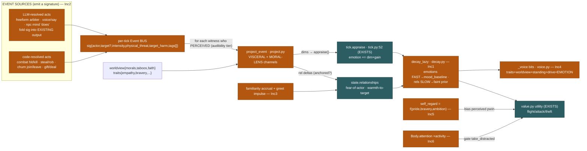
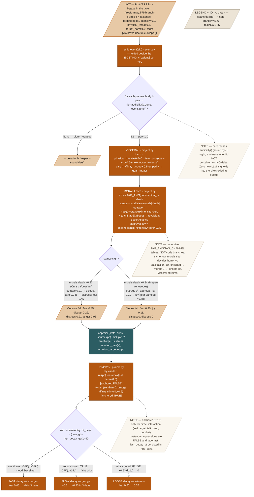
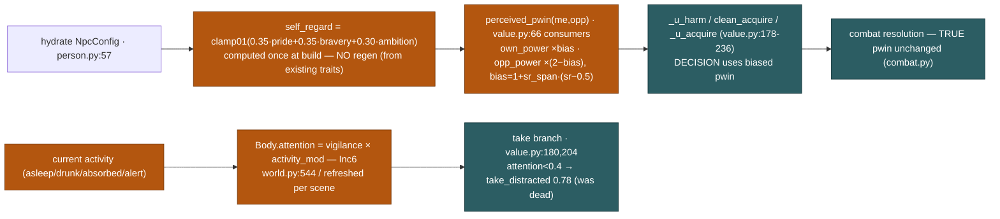

# «МОЗГ» — Design Spec (affective/social loop closed + NPCs act & speak true to character)

**Goal:** close the affective-social loop (корень B) and make every NPC *feel*, *decide* and *speak* true to its now-enriched worldview — by turning each act (player or NPC) into an **objective-signature Event** that projects onto every witness through **two channels** (visceral + a worldview *moral lens*), by giving affect a **two-speed lazy decay floor**, and by feeding the **structured character** into the decision (`pwin` bias, attention) and the **voice** — all at **zero new LLM calls**.
**Status:** draft
**From:** audit `docs/superpowers/2026-07-15-systems-weakness-audit.md` (корень B + mind items 2, 4); enriched entity `docs/superpowers/specs/2026-07-15-npc-entity-enrichment-design.md` (worldview/traits/skills/drives seeded on 1354 NPCs, on prod); runtime `src/aidnd/mind/{value,appraisal,memory,model,tick,llm_agent}.py`, `src/aidnd/server/play/engine/{world,core}.py`, `.../narrator/voice.py`.

---

## 1. Problem & context

The affective-social contour is **almost open** (audit корень B). Grounded in code at HEAD:

- **Discrete events don't move affect.** A witnessed killing/robbery enters a witness only as *text*: `_witness_crime` (`core.py:346-365`) enrages the **victim** (`anger += 0.7`) and drops a **memory** on each bystander (`memory.add("видел(а): чужак …")`, `core.py:357`) — but bystanders get **zero** fear/disgust/distress. The one mechanical affect driver, `appraise_present` (`appraisal.py:105`), fires **only from co-presence** (reading a body's *surface*), never from what someone *did*.
- **The same event lands identically on everyone.** Even where affect moves, it ignores the witness's worldview. A `Багровый` головорез (`morals.death=+0.84`, `pool:0225`) and a Светлая-Мать lavочник (`morals.death=−0.23`, `pool:0645`) — both seeded, both on prod — would react the same. The `worldview` slice has **no consumer** yet (enrichment spec §2 C1: "reads today = event×relationship-bucket only").
- **Affect only grows, never fades toward a floor.** Relationships are written monotonically: `rel["affinity"] = min(old, −0.5)`, `rel["fear"] = max(old, 0.85)` (`llm_agent.py:387-389`, `core.py:351`, `world.py:626`). `_decay_emotion` (`tick.py:28`) *does* relax emotions toward `emotion_baseline`, but **only per-tick for NPCs in the current scene** (`world.py:1094`) — an NPC out of scene for game-days keeps a stale grudge, and there is **no relationship decay at all**.
- **The LLM can zero its own affect.** `feel`/`need` tools write **absolute** values: `state.emotion[e] = float(v)` (`llm_agent.py:449`), `state.needs[n] = float(v)` (`llm_agent.py:455`) — a model reply can erase a justified grudge or hunger in one call.
- **Newcomers stay strangers, nobody greets.** `appraise_present(..., skip_seed_id=player)` (`appraisal.py:129`) never seeds a relationship from mere sight of the player, and `_MUST_WHY` (`world.py:725`) has no "newcomer in the room" impulse — so no NPC is ever *pulled* to approach a fresh face (audit `[PT]` "никто не заговаривает первым").
- **Character is only flavor in the voice.** `_voice` (`voice.py:64-195`) folds in `persona.{origin,voice,quirk,wants,stance,secret}` — pure prose — but **never** the structured trait vector, `worldview` (faith/morals/taboos), `standing`, top drive, or the NPC's **current emotion**. A callous proud cultist and a fearful pious peasant read the same.
- **Self-regard is absent; the theft primitive is dead.** `value.pwin` (`value.py:66`) uses *true* power for the DECISION, so no NPC ever over/under-estimates a fight (audit "нет самооценки"). `Body.attention` is now static from `perception.vigilance` (`world.py:544`), never dropping when an NPC is asleep/drunk/absorbed, so `take_distracted` (`value.py:180,204`) never fires (audit "примитив кражи мёртв").

**Why now.** The entity enrichment (worldview/traits/skills seeded on all 1354, on prod) is the *first consumer's* fuel; it is inert until this program reads it.

### Code contradiction found (must resolve in Inc1)
The task brief states the `anchored` flag "already exists on rel dicts from the enrichment wiring." **It does not.** Every rel-writing site produces `{affinity, trust, fear}` with **no `anchored` key**: `_hydrate_rels` (`person.py:50`), `appraise_present` prior (`appraisal.py:131` via `impression`), the pre-acquaintance seed (`world.py:625-627`), `_witness_crime` (`core.py:351`), the attack write (`llm_agent.py:387`). Inc1 therefore **introduces** `anchored` and back-tags the interaction-driven writes. Second contradiction: `_npc_save` (`hero.py:149-166`) persists only `relationships/needs/memory` — **not** `emotion` and no decay clock — so Inc1's lazy decay must add a persisted `last_decay_gt` (relationships are the slow, *persisted* carrier; emotions are in-memory and already reset to 0 on restart).

---

## 2. Goals / Non-goals

**Goals** (each an independently green, deployable, playtested increment):
- **Inc1** — two-speed *lazy* decay floor (emotions fast → mood-baseline; relationships slow → faint prior), keyed on a new `anchored` flag; clamp `feel`/`need` to bounded ±deltas.
- **Inc2** — the **Event bus**: an objective signature per act, projected onto every *perceiving* witness via a **visceral** channel and a **moral-lens** channel (data-driven `tag×channel→dim`, worldview `morals`/`taboos`/`faith` multiply/flip the delta). Subsumes `appraise_present` as a low-intensity co-presence Event. Zero new LLM.
- **Inc3** — familiarity accrual (repeated co-presence seeds a faint unanchored tie) + a newcomer-greet impulse (a sociable/host NPC is *drawn* to approach a fresh face; ≤1 greeter).
- **Inc4** — voice speaks the character: feed the salient trait/worldview/standing/drive/**current emotion** into `_voice` bits. Same one voice call.
- **Inc5** — derived `self_regard[0..1]` biases the NPC's *perceived* `pwin` in `value.py` decision consumers (real combat unchanged) → over/under-confidence.
- **Inc6** — activity-modulated `Body.attention` (asleep/drunk/absorbed lower it) → `take_distracted` fires → opportunistic pickpocketing.

**Non-goals** (explicit):
- Faction hostility *activation* (`ENEMY_FACTIONS` widening, guild wars) — separate program.
- Memory pruning / unbounded-growth fix (audit item 3) — separate root.
- Agenda persistence (audit корень A) — separate; noted where it touches Inc1's save payload.
- Narrator punctuation post-filter — optional follow-up, not here.
- Any *new* LLM call — the whole program is arithmetic + fold-into-existing-output.

---

## 3. Architecture

Two new pure-code services plus five read-site edits. **The Event bus** (`mind/event.py`, NEW) is the driver: a `sig(actor, target?, intensity, physical_threat, target_harm, tags[])` descriptor, emitted by every act-resolution site, is `project`-ed (`mind/project.py`, NEW) onto each witness who *perceived* it (reusing the audibility/sight tier), producing appraise-`dims` fed to the **existing** `tick.appraise()` plus direct relationship deltas. **Decay** (`mind/decay.py`, NEW, lazy by `gt`) relaxes emotions fast and relationships slow on scene hydration. Downstream, `self_regard` biases `value.pwin` consumers and `Body.attention` gates theft; the character flows into `_voice`.

### 3a. Overview — where each increment sits on the contour



### 3b. Detailed flow — one killing, projected & decayed (the heart, traced)



### 3c. Self-regard & attention seams (Inc5 / Inc6)



---

## 4. Data model

### 4.1 Event signature (Inc2) — objective, NOT pre-judged
```python
@dataclass
class Event:
    actor: str                    # body id who acted (pc or npc)
    target: str | None            # body id acted upon (None for ambient acts)
    intensity: float              # [0..1] overall salience of the act
    physical_threat: float        # [0..1] danger radiated to onlookers (weapon out, blow)
    target_harm: float            # [0..1] harm done to target (0 none … 1.0 killed)
    tags: list[str]               # semantic labels, descriptive: [убийство, насилие, смерть]
    zone: str | None = None       # event location (for the audibility/sight perception gate)
```
Example (the traced killing): `Event("pc","npc:beggar",0.9,0.7,1.0,["убийство","насилие","смерть"],zone="стол у очага")`.
Example (a gift): `Event("npc:0301","npc:0142",0.2,0.0,0.0,["дар"],...)` — `target_harm 0`, warmth-only.
Example (co-presence, subsumes `appraise_present`): `Event(other,me,0.05,0.0,0.0,["видит"],...)` — low-intensity, visceral surface read only.

### 4.2 `tag → axis / channel` tables (data-driven, `mind/project.py`)
```python
TAG_AXIS = {           # which worldview.morals axis a tag is scored against
  "убийство":"death", "смерть":"death", "осквернение-мёртвых":"death", "людоедство":"death",
  "насилие":"violence", "избиение":"violence",
  "воровство":"theft", "грабёж":"theft", "кража":"theft",
  "колдовство":"magic", "кощунство":"magic",
  "клятвопреступление":"authority", "вероломство":"authority",
  "чужак-насилие":"outsiders",
}
TABOO_KEYS = {"убийство","воровство","кощунство","людоедство",
              "клятвопреступление","осквернение-мёртвых","кровосмешение"}  # match worldview.taboos
```
The **dominant tag** = the first tag present in `TAG_AXIS` (severity-ordered list); `stance = worldview.morals.get(axis, 0.0)`.

### 4.3 The `anchored` flag on rel dicts (Inc1 — NEW key)
```python
# rel dict grows a 4th key. Written TRUE only by direct interaction; FALSE for impressions.
{"affinity": -0.5, "trust": 0.0, "fear": 0.8, "anchored": True}
```
Anchored **True**: attack write (`llm_agent.py:387`), `_witness_crime` on the *victim* (`core.py:351`), deal/promise (`llm_agent.py:465`), gift acceptance, real talk that shifts affinity. **False** (default): `appraise_present` prior, pre-acquaintance seed, familiarity accrual, **bystander** event projection. `_hydrate_rels` seeds `anchored:True` (authored kin/rival ties are lifelong).

### 4.4 `last_decay_gt` (Inc1) — persisted decay clock
Added to `NpcState` (`model.py`) and to the `_npc_save` payload (`hero.py:152`). One int per NPC; decay applied on read (scene hydration), never a 1354-wide tick.

### 4.5 `self_regard` (Inc5)
Derived once at hydrate (no field on the row): `self_regard = clamp01(w_pride·pride + w_brave·bravery + w_amb·ambition)`. Stored on `NpcConfig` (or computed in `value.py` from `state.config.traits`).

### 4.6 PB knobs (all NEW, in `session/config.py:PB`; mind-side mirror in `value.BAL` where used inside `mind/`)
| Knob | Default | Meaning |
|---|---|---|
| `decay_emo_days` | 0.5 | emotion half-life (days) → mood_baseline (FAST) |
| `decay_rel_anchored_days` | 14 | anchored-relationship half-life (days) → faint prior (SLOW) |
| `decay_rel_loose_days` | 2 | unanchored-relationship half-life (days) → 0 (LOOSE) |
| `rel_faint_prior` | 0.10 | anchored affinity relaxes toward sign×this, not 0 |
| `feel_nudge_cap` | 0.25 | max ±delta a `feel`/`need` tool may move a channel |
| `ev_perc_l2` / `ev_perc_l3` | 0.6 / 0.3 | perception weight at audibility tier L2 / L3 |
| `ev_harm_base` / `ev_harm_familiar` | 0.6 / 0.4 | visceral fear base + familiarity-with-actor lift |
| `ev_viol_damp` | 0.5 | how much positive `morals.violence` damps witnessed-fear |
| `ev_empathy_care` | 0.5 | empathy→care-for-target (distress even for a stranger) |
| `ev_taboo_mult` | 1.6 | outrage multiplier when a tag ∈ witness taboos |
| `ev_approval_k` | 0.25 | positive-stance → grim-satisfaction joy scale |
| `ev_rel_fear` / `ev_rel_aff` / `ev_warmth` | 0.5 / 0.4 / 0.2 | bystander rel-delta scales |
| `familiarity_k` | 4 | co-presence ticks before a faint unanchored tie seeds |
| `greet_sociability_base` | 1.4 | newcomer-greet impulse = base × (sociability−0.5)-gated |
| `sr_pride` / `sr_brave` / `sr_amb` | 0.35 / 0.35 / 0.30 | self_regard trait weights |
| `sr_span` | 1.5 | perceived-pwin bias span around self_regard 0.5 |
| `att_asleep` / `att_drunk` / `att_absorbed` / `att_alert` | 0.2 / 0.4 / 0.6 / 1.3 | activity multipliers on `Body.attention` |

---

## 5. Behavior — worked examples (real enriched values from `data/worlds.db`)

### Example A — one tavern killing, three worldview lenses (Inc2)
**Signature:** `intensity 0.9, physical_threat 0.7, target_harm 1.0, tags [убийство,насилие,смерть]`, dominant axis **death**, all witnesses same zone → `perc = 1.0`.

Real witnesses (queried):
- **Мерек Овражный** `pool:0225` головорез, `Багровый`: `morals.death +0.84`, `morals.violence +0.83`, `empathy 0.16`, `bravery 0.78`, `pride 0.45`, no taboos.
- **Сельма с Холма** `pool:0645` лавочник, `Светлая-Мать`: `morals.death −0.23`, `morals.violence −0.18`, `empathy 0.49`, `bravery 0.52`, taboos `[кощунство,людоедство,осквернение-мёртвых,кровосмешение]` (**no** убийство).
- **Освин Пивовар** `pool:0102` жрец, `Светлая-Мать`: `morals.death −0.5`, `morals.violence −1.0`, `empathy 0.93`, `bravery 0.48`, `devotion 0.77`, taboos include **убийство**.

| Step | rule (file) | Мерек | Сельма | Освин |
|---|---|---|---|---|
| 1 visceral `harm` | `physical_threat×0.6×perc` | 0.42 | 0.42 | 0.42 |
| 2 violence damp | `×(1−0.5·max0,morals.violence)` | ×0.585 → **0.246** | ×1.0 → 0.42 | ×1.0 → 0.42 |
| 3 **fear** = harm×`emotion_gain(fear)=0.6+(1−bravery)` | (`tick.py:73,94`) | 0.246×0.82=**0.20** | 0.42×1.08=**0.45** | 0.42×1.12=**0.47** |
| 4 care = `affinity_tgt + 0.5·empathy` | | 0.08 | 0.245 | 0.465 |
| 5 approval_joy = `max0,stance·0.9·0.25` | death stance | +0.84→ **0.19** | −0.23→ 0 | −0.5→ 0 |
| 6 goal_impact = `−target_harm·care + joy` | | −0.08+0.19=+0.11 | −0.245 | −0.465 |
| 7 **joy** / **distress** (`tick.py:64-65`) | | joy **0.11**, distress 0 | distress 0.245×0.84=**0.21** | distress 0.465×0.86=**0.40** |
| 8 moral outrage = `max0,−stance·0.9·perc` | | 0 | 0.207 | 0.45 |
| 9 taboo mult | tag∈taboos? | no → 0 | убийство∉taboos → 0.207 | убийство∈taboos → ×1.6=**0.72** |
| 10 **disgust** = outrage×`gain=0.6+pride` | (`tick.py:96`) | **0** | 0.207×1.05=**0.22** | 0.72×1.05→clamp **0.76** |
| 11 **anger** = `max0,−gi·max0,−desert·gain` | desert=stance | 0 (desert +0.84 deserved) | 0.245×0.23×1.1=**0.06** | 0.465×0.5×1.1=**0.26** |
| 12 rel(pc) bystander | `fear=max(old,harm×0.5)` [anchored FALSE] | 0.12 | 0.21 | 0.24 |

**Observable:** the killer's cultist ally is *barely stirred, faintly satisfied* (joy 0.11); the lavочник *recoils in fear and disgust*; the priest *recoils hardest and is angry at the killer* — **one signature row, three lands, delivered purely by the `worldview` slice, zero LLM.** Мерек's `mode` stays `leisure`; Сельма/Освин cross the `fear/anger ≥ 0.5` impulse gate (`world.py:1069`) next tick → drawn to flee or intervene.

### Example B — two-speed lazy decay over 3 game-days (Inc1)
NPC `Освин` leaves the scene at `last_decay_gt = 10000` min. Player re-enters 3 days later: `now_gt = 10000 + 3·1440 = 14320`, `dt_days = 3.0`. On hydration, `decay_lazy(state, now_gt)`:

| Channel | before | half-life | factor `0.5^(3/hl)` | target | after |
|---|---|---|---|---|---|
| emotion `disgust` | 0.76 | 0.5 d | 0.5^6 = 0.0156 | mood_baseline≈0 | **0.01** (→ gone) |
| emotion `fear` (stranger) | 0.47 | 0.5 d | 0.0156 | 0 | **0.007** (→ 0) |
| rel(pc).fear **unanchored** (bystander) | 0.24 | 2 d | 0.5^1.5 = 0.354 | 0 | **0.085** (faded) |
| rel(pc).affinity **anchored** grudge (say pc robbed him earlier) | −0.50 | 14 d | 0.5^0.214 = 0.862 | sign×0.10 = −0.10 | −0.10 + (−0.50−(−0.10))×0.862 = **−0.445** (persists) |

**Observable:** the anchored grudge is still −0.45 (Освин still cold to the player); the passing horror and stranger-fear are gone. Exactly the audit's ask: "anchored grudge persists, stranger-fear→0."

### Example C — self_regard tips a losing fight (Inc5)
NPC **Ход Овражный** `pool:0528` головорез: `pride 0.577, bravery 0.876, ambition 0.496`, `skills.combat 0.88 → Body.power 0.89`. Foe: an armed veteran, `Body.power 1.335` (a true underdog fight).

| Step | rule | value |
|---|---|---|
| 1 self_regard | `0.35·0.577+0.35·0.876+0.30·0.496` | **0.658** |
| 2 bias | `1 + sr_span·(sr−0.5) = 1+1.5·0.158` | **1.237** |
| 3 **true** pwin | `0.89/(0.89+1.335)` (`value.py:66`) | **0.40** |
| 4 perceived own / opp | `0.89×1.237` / `1.335×(2−1.237)` | 1.101 / 1.019 |
| 5 **perceived** pwin | `1.101/(1.101+1.019)` | **0.52** |
| 6 decision `_u_harm` (`value.py:230`) subdue term `pw·pay−(1−pw)·selfrisk` | pw 0.52 vs 0.40, pay≈1.0, selfrisk 0.6 | 0.52−0.29=**+0.23** (attacks) vs true 0.40−0.36=+0.04 |
| 7 resolution | **true** pwin 0.40 (`combat.py`, unbiased) | **loses ~60%** |

**Observable:** Ход perceives a coin-flip he expects to win, so `_u_harm` clears zero and he strikes a fight he actually loses ~60% of the time. A meek NPC (`self_regard 0.3` → bias 0.70) inverts it: perceives a losing fight where it would win, over-flees. Real combat math is untouched — only the *estimate* is biased.

### Example D — voice carries character (Inc4), same NPC before/after
**Мерек** `pool:0225`, having just witnessed the killing (from Example A: current `joy 0.11`, `fear 0.20`), talking to the player.

*Before (`voice.py:77-93`, flavor only):*
```
Ты — Мерек Овражный, головорез на фронтире. Родом: … Говоришь грубовато.
Причуда: … Стремишься: … К чужаку держишься враждебно.
```
*After (Inc4 — salient structured bits appended, still one voice call):*
```
…(flavor kept)…
НАТУРА: злонравие 0.47, храбрость 0.78, гордость 0.45 — говори дерзко, без страха.
ВЕРА и НРАВ: чтишь Багрового (кровь/война); смерть тебе БУДНИЧНА (не ужасаешься трупам),
  закон презираешь. Ты — из отребья оврага.
ТЯГА: подняться силой над кем угодно (твой главный мотив).
СЕЙЧАС ТЫ ЧУВСТВУЕШЬ: лёгкую злую радость (только что видел кровь) — это в твоих словах.
```
**Observable:** the LLM now speaks a callous, faith-tinged brawler who just *enjoyed* a killing — not a generic gruff man. A fearful pious peasant (Освин, `distress 0.40, disgust 0.76, morals.death −0.5, taboos∋убийство`) would get the opposite bits and speak shaken and condemning. **Selection is salient** (top ~3 traits by |value−0.5|, non-neutral morals, top drive, hottest emotion) — not a data dump. Design decision: **yes**, self_regard surfaces here as a voice cue when high (a braggart "talks big") — folded into the NATURE line via pride/bravery, no extra field.

### Example E (boundary/failure cases)
- **Witness who didn't perceive** — a body in a far zone, `audibility → None` (`sound.py`): `project_event` skips it entirely → **no delta**. (Sound tiers already gate memory; now they gate affect too.)
- **Un-enriched / legacy NPC** — `worldview = {}` → `morals.get("death",0)=0` → moral channel outrage `max(0,−0)=0`, approval `max(0,0)=0` → **lens is a no-op**; the **visceral** channel still fires (fear/distress from physical_threat/target_harm). Degrades to neutral, never crashes (enrichment spec §4.3 parity).
- **`feel` tool zeroing a grudge** — LLM returns `feel{anger:0.0}` while `state.emotion["anger"]=0.7`. Clamped: `new = clamp(0.7 + clamp(0.0−0.7, −0.25, +0.25)) = 0.7−0.25 = 0.45` — the model can *nudge*, not erase. Same clamp on `need`.
- **Decay on rewound `gt`** — a restart/eviction leaves `last_decay_gt > now_gt` (stale future clock). `dt_days = max(0, (now_gt−last_decay_gt)/1440) = 0` → decay is a no-op that tick (never *amplifies* affect), and `last_decay_gt` is reset to `now_gt`. Honors the "gt пишется сквозняком" fix (commit d5da64f).
- **Victim vs bystander anchoring** — if the killed target had been the *witness* (self-harm, `witness.id == event.target`), the rel(actor) grudge is written `anchored=True` (slow 14-day decay); a mere bystander's fear is `anchored=False` (fast 2-day). Prevents a passing fright from becoming a lifelong grudge.

---

## 6. Edge cases & failure modes
- **No LLM anywhere** — Inc1/3/5/6 are arithmetic; Inc2 folds the signature into each site's *existing* LLM output (freeform arbiter/voice/mind `does`) or builds it from mechanics (combat/steal/churn) with **no** call; Inc4 reuses the one `narrator` voice call. Program-wide new-LLM cost = **0**. So none of it can trip *no-LLM-fallback*.
- **O(1) per read** — `decay_lazy` runs once per NPC on scene hydration (`person.py`), keyed on `dt_gt`; never a 1354-wide sweep. Background-crowd per-tick decay (`world.py:1094`) becomes redundant for out-of-scene NPCs and is subsumed by the lazy path (kept in-scene for responsiveness, but idempotent with the lazy read).
- **Double-decay guard** — every `decay_lazy` sets `last_decay_gt = now_gt`; a second call same-gt is a no-op (`dt=0`).
- **Signature without a target** (ambient act, e.g. a shout) — `target_harm 0`, projection runs the moral lens on tags only (e.g. blasphemy) + visceral fear from `physical_threat`; no warmth-to-target write.
- **Greet impulse capping** — `lv["greeted"]` set once per newcomer; a second sociable NPC sees it already greeted → no second approach (≤1 greeter/newcomer, emergent not guaranteed).
- **Attention floor** — activity multipliers clamp `Body.attention` to `[0.05, 1.0]`; an alert guard (×1.3) caps at 1.0, a drunk (×0.4) can dip below the `0.4` theft threshold (`value.py:180`) so `take_distracted` finally fires.

---

## 7. Testing strategy

**Unit (no live model):**
- *lens both channels* — `project_event(kill_sig, Мерек_state, perc=1.0)` → `fear≈0.20, joy≈0.11, disgust 0`; same sig, `Сельма_state` → `fear≈0.45, disgust≈0.22, distress≈0.21`; `Освин_state` → `disgust≈0.76` (taboo ×1.6 asserted). Assert exact deltas ±0.02.
- *decay* — set `disgust 0.76`, `rel anchored −0.5`, `rel loose 0.24`, advance `dt=3d` → assert `disgust≈0.01`, `anchored≈−0.445`, `loose≈0.085`; `dt=0` and rewound `dt<0` → no-op.
- *clamp* — `feel{anger:0.0}` on `anger 0.7` → `0.45`; `need{hunger:0.0}` on `0.9` → `0.65`.
- *self_regard bias* — `perceived_pwin(Ход, foe1.335)` → `≈0.52` while `pwin(...)` (true) `=0.40`; assert real combat resolution reads the true 0.40.
- *attention gate* — `Body.attention` for a drunk NPC = `vigilance×0.4 < 0.4` → `_u_acquire` take branch selects `take_distracted 0.78`.
- *no-perceive* — witness with `audibility→None` → `project_event` returns no delta.
- *legacy no-op* — `worldview={}` witness → moral channel 0, visceral non-zero.

**Live playtest (haiku player-agent, the standing method):**
- Stage a killing in a crowded tavern → replay shows the crowd's affect **splits by worldview** (cultist calm, peasants flee/recoil) — verify in `/minddebug` emotion dumps, not just narration.
- Revisit an NPC after several game-days → greeting is *warm* (familiarity accrued), and a genuine grudge is still cold (anchored persisted) while a one-off fright is gone.
- Walk a fresh character into a busy room → a sociable/host NPC *approaches first* (greet impulse), exactly once.
- Get an overconfident головорез into a fight he should lose → observe him *pick* it (perceived-pwin log), then lose.
- Get an NPC drunk/absorbed → a pickpocket attempt succeeds where an alert target's wouldn't.

---

## 8. Constraints honored
- **No LLM fallback** (`no-llm-fallback.md`) — the whole program is arithmetic or folds a signature into an *existing* call; there is no path that needs a model and could fall back. Un-enriched rows degrade to *neutral affect*, not a canned stub.
- **Code owns dice/budgets** — all magnitudes are `PB`/`BAL` constants (§4.6); the LLM authors none of the affect numbers, only the *prose* of `does`/voice into which the signature is read.
- **No mechanical gates** (`no-mechanical-gates.md`) — nothing is capped or cooled down; the greet impulse is *emergent* (sociability-gated pull, not a guaranteed script), and affect emerges from the worldview lens rather than a hardcoded reaction table. The missing world-piece (a witness's values) is *modeled*, not gated.
- **Tunables in `PB`** — every knob in §4.6 lives in `session/config.py:PB` (mind-internal mirror in `value.BAL` for `mind/`-local use), none scattered.
- **Two-speed persistence** — the slow carrier (relationships) is already in `_npc_save`; Inc1 adds only `last_decay_gt` to that payload, so decay survives the `git reset --hard` + restart deploy.

---

## 9. Scope & roadmap (6 increments, each green/deployable/playtested)
1. **Inc1** affect floor — `decay.py` lazy two-speed + `anchored` flag back-tagged on interaction writes + `feel/need` clamp + `last_decay_gt` in save. *Ships alone: relationships stop growing unbounded, grudges fade honestly.*
2. **Inc2** Event bus + projection — `event.py` + `project.py`, emit at the enumerated sites, subsume `appraise_present`. *The driver; the biggest behavioral change.*
3. **Inc3** familiarity + greet impulse — `world.py:1057` impulse loop + `новичок` in `_MUST_WHY` (`world.py:725`) + `familiarity_k` accrual.
4. **Inc4** voice speaks character — `_voice` bits (`voice.py:77`).
5. **Inc5** self_regard — derive at hydrate, bias `value.pwin` consumers.
6. **Inc6** attention Pillar 2 — activity→attention modifiers, unlock `take_distracted`.

Sequencing: 1 before 2 (the bus writes affect that must have a floor); 3–6 independent of each other, each on top of 1–2.

**Emission sites to instrument in Inc2** (verified at HEAD):
| Site | file:line | resolution | sig built from |
|---|---|---|---|
| freeform violence (draw weapon) | `handlers/freeform.py:579` | LLM (already sets `lv["salient"]`) | tags `[насилие]`, physical_threat from weapon |
| pickpocket / rob / take-from-owner | `handlers/freeform.py:284,311,318,339` | code | tags `[воровство]`/`[грабёж]`, target_harm 0 |
| solicit murder | `mechanics/deals.py:100` | code | tags `[вероломство]` |
| `_witness_crime` (victim + witnesses) | `core.py:346` | code (the affect fan-out moves here) | weight → intensity |
| combat hit / kill | `mechanics/combat.py` (wrapups `_duel_wrapup:398`, `_death:381`) | code | tags `[убийство,смерть]`, target_harm 1.0 on kill |
| npc mind acts (`attack`/`take`/`give`/`say`) | `mind/llm_agent.py:378-471` (`apply_actions`) | code, folded into the tool loop | per-tool tags |
| churn join/leave | `world.py:408` (`_churn_items`) | code | tags `[вошёл]`/`[вышел]`, intensity ~0.05 |
| gift / deal accept | `llm_agent.py:409`, deals | code | tags `[дар]`, warmth-only |
| co-presence (subsumes `appraise_present`) | `appraisal.py:105` | code | low-intensity surface Event |

---

## 10. Open questions
- **Decay half-lives** — is `decay_rel_anchored_days = 14` the right "weeks" feel, or should it scale with `vengefulness` (a vindictive NPC's grudge decays even slower)? (Enrichment spec §3.1 flags `vengefulness → slower grudge decay`.)
- **Dominant-tag selection** — first-in-`TAG_AXIS` (severity order) vs the tag with the strongest |stance| for that witness (a theft-hating pacifist scoring `воровство` over `насилие` on a mugging). Start with severity order; revisit if lands feel off.
- **self_regard in voice** — settled *yes* (folded into the NATURE line); open whether it should also gate a distinct "boast" beat when `self_regard > 0.8`.
- **Greet vs LOD** — should the greet impulse force the newcomer's greeter into the LLM actor set even in a crowd (bypassing `_select_actors`)? Leaning yes for the player (guarantees *someone* greets a fresh player), emergent for NPC-NPC.

---

## 11. Self-review (§5 checklist)
- **Concreteness** — every mechanism carries a real number from `data/worlds.db` (Мерек `pool:0225`, Сельма `pool:0645`, Освин `pool:0102`, Ход `pool:0528`); no "based on holiness"-style vagueness.
- **Block-scheme** — three Mermaid flows (overview, detailed projection+decay trace, self_regard/attention seams), data at every node, NEW vs EXISTING coloured, seams named `file:line`, note nodes on the non-obvious gates, legend present.
- **≥1 traced worked example** — five (A lens 3-way, B decay, C self_regard, D voice, E boundaries), each end-to-end with intermediate values and the rule/file at every step; numbers checked internally consistent (e.g. Освин disgust `0.45×1.6=0.72→×1.05→clamp 0.76`).
- **No placeholders** — no TBD/etc. in normative sections; every PB knob has a default.
- **Seams named** — all emission sites and read sites carry `file:line` verified at HEAD.
- **Non-goals & out-of-scope** stated (§2, §9): faction activation, memory pruning, agenda persistence, punctuation filter.
- **Every constraint** listed with how met (§8): no-LLM-fallback, code-owns-numbers, no-mechanical-gates, PB-tunables, deploy-survivable persistence.
- **Contradiction surfaced** — the `anchored` flag does **not** pre-exist (Inc1 introduces it); `_npc_save` omits emotion + decay clock (Inc1 adds `last_decay_gt`). Both flagged in §1 and handled in §4.3–4.4.
