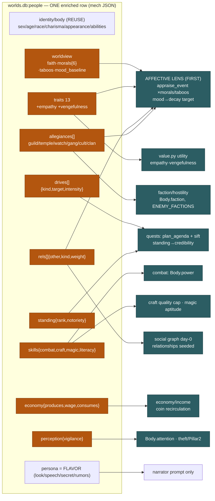

# NPC Entity Enrichment — Design Spec

**Goal:** enrich the pool NPC entity with everything a person must carry to be a full emergent agent — a **values/worldview lens**, **allegiances**, **social standing**, **competencies**, **structured drives**, **seeded ties**, an **economic role**, a **perception baseline**, and an **emotional baseline** — so that **ONE offline pool regeneration** seeds it all, and every consumer system (affective loop first, then economy, quests, faction dynamics, craft/combat) reads its slice from the same row.
**Status:** draft
**Discipline:** every structured field below names the CONSUMER code path that reads it and WHY. Anything with no consumer is demoted to the flavor bucket (`persona`, LLM-only). No speculative RPG stats.
**From:** audit `docs/superpowers/2026-07-15-systems-weakness-audit.md` (корни B, C; economy/quests/relationships weaknesses); first consumer = affective loop `docs/superpowers/specs/2026-07-15-affective-loop-design.md`.

---

## 1. STEP 1 — the CURRENT entity (inventory, cited)

The bank is **1354 rows** in `data/worlds.db:people` (900 adults + 454 dependents — `sqlite3 … GROUP BY json_extract(mech,'$.dependent')`). Schema (`store.py:37`):

```sql
people(id, role, name, charisma REAL, appearance REAL, mech TEXT, persona TEXT, portraits TEXT, seed, created)
```

`mech` and `persona` are **JSON TEXT blobs** (`store.py:284`) — this is load-bearing for migration (§4): enrichment adds JSON keys, **no `ALTER TABLE`**.

### 1a. What is already STRUCTURED (code-readable)
| Field | Where | Type | Read by |
|---|---|---|---|
| `role` | `mech.role` / column | RU string (open) | everything; trait/ability/wealth tables |
| `traits` (11) | `mech.traits` | scalar 0..1 each | `value.py` (utility), `appraisal.py` (impression), `emotion_gain` (`model.py:82`) |
| `abilities` (6) | `mech.abilities` | int 6..17 | guild wis-check (`combat.py:180`); **NOT wired to combat `power`** (see gap) |
| `charisma` | column → `Body.charisma` | scalar 0..1 | `impression` warmth (`appraisal.py:70`), proxemics-toward-talk |
| `appearance` | column → `Body.appearance` | scalar 0..1 (visible wealth) | `impression` revulsion, predator target-selection (`value.py`), `plan_agenda` «богат/простой» |
| `dependent` / `head` | `mech.dependent`, `mech.head` | bool / pid | `depgen.py` households; settle places dependent in head's home |
| `sex/age/build/race` | `persona.*` | enum | portrait, narrator; **`race`** → `Body.race` → `race_sentiment` (`appraisal.py:50`) |
| `voice/stance` | `persona.*` | enum | narrator voice |
| `gear` items | `persona.gear.*` | `{name, tier∈poor/modest/fine/rich, note}` | loot projection (`world.py:513`), inventory |
| `carry.coins` | `persona.carry.coins` | int | starting purse |

Vocabularies live in `persona_llm.py:27-32` (SEX/AGE/BUILD/VOICE/STANCE/ITEM_TIER), `model.py:21-25` (TRAITS/ABILITIES/NEEDS/EMOTIONS), `abilities.py:20` (ROLE_BIAS), `population.py:40` (ROLE_TRAITS).

### 1b. What is FREE-TEXT flavor today (`persona`)
`look{face,hair,skin,clothing,marks}`, `speech[]`, `origin`, `background[]`, `wants[]`, `fears[]`, `quirk`, `secret{what,where,gate}`, `ties[]`, `rumors[]`, `portrait[]` (EN tags), `carry.goods/personal`, `valuables[]`. Rich for the narrator; but **`wants`/`ties`/`secret`/`rumors` carry latent structure the code cannot read** — the quest sifter can only `bool(persona.wants)` (`pipeline.py:157`), never *what* the want is.

### 1c. The runtime mind (`mind/model.py`)
- `NpcConfig` (`model.py:29`): id/name/race/role/level/max_hp + `traits` + `abilities`. Built from a pool row at `worldbuild/person.py:39` — **only `traits`+`abilities` are read from `mech`**; everything else in `mech`/`persona` is dropped at mind-build time.
- `NpcState` (`model.py:60`): 7 `needs`, 5 `emotion` (anger/fear/joy/distress/disgust), `relationships` (id→trust/affinity/fear), `agendas`, `memory`. `emotion_gain`/`emotion_baseline` (`model.py:82-92`) parameterize affect from **traits only**.

### 1d. Generation today
`peoplegen.py`: `person_core` (name/sex/11 traits/charisma/wealth, `population.py:106`) → `roll_abilities` (`abilities.py:41`) → `LLMPersona.describe` (one LLM call, `persona_llm.py:204`) → 4 portraits. `depgen.py`: households by surname → 0-3 dependents (template persona, no LLM). `seed_races.py`: tags ~10 % non-human (`persona.race` only). **race_relations** (`content/race_relations.json`): a 4-race sentiment table.

---

## 2. STEP 2 — consumers, and the structured field each WANTS but lacks

| # | Consumer (file) | Reads today | Missing structured field it needs | Audit link |
|---|---|---|---|---|
| C1 | **Affective lens** `appraise_event(kind,tier,rel_id)` (affective-loop spec §4) | event×**relationship-bucket** table only | a **values/worldview** profile so the SAME event lands per-worldview: `morals{violence,theft,authority,outsiders,magic,death}`, `faith{deity,devotion}`, `taboos[]`; plus `mood_baseline` (decay target) and richer traits (`empathy`,`vengefulness`) to modulate fear/anger | корень B |
| C2 | **Mind utility** `value.py` | 10 of 11 traits (`ambition` unused in utility) | `empathy` → moral brake in `_u_harm`/`_u_protect`; `vengefulness` → sustains revenge payoff | — |
| C3 | **Faction/hostility** `value.hostility` (`value.py:70`) reads `Body.faction` (defaults `"town"` for all) | **nothing** — no group membership exists | `allegiances[]` (guild/temple/watch/clan/gang/cult/patron) → sets faction & co-member affect | корень B, citysim |
| C4 | **Social graph** `appraise_present`/`bucket` read `state.relationships` (starts **empty**); quest `_has_grudge` (`pipeline.py:160`) | co-presence-grown edges only | **seeded `rels[]`** (kin/friend/rival/debtor/creditor/patron/beloved/enemy) so the town isn't mechanical strangers on day 0 | «relationships only grow from presence» |
| C5 | **Economy** purses/`worldsim` | `carry.coins` start only; ~30/1354 earn | `economy{produces,output_rate,wage,consumes,self_sufficient}` → an income source; fixes the money-sink | «доход у ~30/1354; осушается в ноль» |
| C6 | **Quests** sift/`plan_agenda` (`llm_agent.py:305`, `pipeline.py:155`) | `bool(persona.wants)`, grudge edge | **structured `drives[]`** (aspiration kind+target+intensity) the sifter/planner cast directly; `standing.notoriety` for giver credibility | «wealth/affinity uncompletable», «agendas not persisted», sift material |
| C7 | **Combat** `_pc_combatant`/`Body.power` (`world.py:517` sets **`power=1.0` for every NPC**) | abilities exist, unused for power | `skills.combat` → `Body.power`; **big latent gap: NPC power is a flat 1.0 today** | «первый бой невыигрываем» |
| C8 | **Craft** commission quality (`items.py`) | role tag only | `skills.craft{material:0..1}` → lifts the plain-quality cap | «commission кап качества = plain» |
| C9 | **Magic** budget/law | — | `skills.magic` (aptitude) → can a newcomer learn/draw | «может ли новичок в магию» |
| C10 | **Geo/knowledge** `known_by`, geo memory | `secret`, `rumors`, known_places (mem) | mostly covered; add `literacy` for letters/quests | — |
| C11 | **Perception (Pillar 2)** theft primitive; `Body.attention` set **randomly** (`world.py:522` `rng.uniform(.45,.85)`) | random per-tick | `perception.vigilance` scalar → deterministic `Body.attention` from the entity | «attention Pillar 2 отсутствует» |
| C12 | **Social standing** narrator/guild/quest credibility | `appearance` (wealth) | `standing{rank, notoriety}` (class + infamy) | — |

---

## 3. STEP 3 — the enriched entity schema

**Placement rule.** All new *structured* keys go under **`mech`** (the code-readable blob `NpcConfig`/`world.py` already parse). All *flavor* stays in **`persona`** (narrator-only). Nothing is duplicated: `charisma`, `appearance`(=wealth tier), `race`, `sex`, `age`, `abilities`, existing `traits` are **reused**, never re-encoded.

Legend for columns: **S** = structured (enum/scalar/id-list, code reads it) · **F** = flavor (free text, prompt-only). Seeding: **D** = derived/sampled cheaply offline (pure Python, deterministic per pid) · **L** = new offline **LLM batch** pass · **R** = reuse existing.

### 3.0 Identity / body — REUSE (no new fields)
`id, name, sex, age, build, race, charisma, appearance, abilities` — all already present and consumed. (R)

### 3.1 Temperament / traits — `mech.traits` extended 11 → 13
| field | type | range | consumer | seed |
|---|---|---|---|---|
| `empathy` | S scalar | 0..1 | C2: `_u_harm` moral brake ↑, `_u_protect` payoff ↑; C1: witness-distress scaling in the lens | D (sampled around role: жрец/знахарка high, головорез low) |
| `vengefulness` | S scalar | 0..1 | C2/C6: revenge-agenda payoff & **slower grudge decay** (feeds affective-loop `anchored` slow rate) | D |
*(Existing 11 kept verbatim; `piety`=`faith.devotion` and `cruelty`=`malice` and `courage`=`bravery` already exist — NOT duplicated.)*

### 3.2 Values & worldview — new `mech.worldview` (the affective-lens slice, consumed FIRST)
| field | type | vocabulary / range | consumer | seed |
|---|---|---|---|---|
| `faith.deity` | S enum | authored pantheon (RU, ~7): `Светлая-Мать` (дом/плодородие), `Кузнец-под-горой` (труд/ремесло), `Серый-Странник` (дороги/удача), `Владыка-Костей` (смерть/предки), `Багровый` (кровь/война — культ), `Тень-Безымянная` (запретный культ), `нет` | C1: blasphemy/desecration/sacrifice events land per-deity; C6: cult drives; C9: divine aptitude | D (weighted sample by role — жрец devout to a light god, головорез leans Багровый/нет) |
| `faith.devotion` | S scalar | 0..1 (= piety) | C1: weight of sacred/taboo reaction; C9: `skills.magic` divine bonus | D |
| `morals.violence` | S scalar | −1 осуждает … +1 одобряет | **C1: modulates/flips `appraise_event` deltas** — a headsman/`Багровый`-cultist near +1 feels little horror (even joy) at a killing; a peasant near −0.6 spikes fear/disgust | D (from traits `malice`/`bravery` + role + faith) |
| `morals.theft` | S scalar | −1..+1 | C1: theft-witness anger scaling; C4/C6 | D (from `honesty`/`lawful`) |
| `morals.authority` | S scalar | −1 презирает закон … +1 чтит | C1: reaction to guard/authority events; C3 watch loyalty | D (from `lawful`/`loyalty`) |
| `morals.outsiders` | S scalar | −1 ксенофоб … +1 радушен | C1: amplifies `race_sentiment` reaction to strangers/non-humans | D (from `sociability` + race) |
| `morals.magic` | S scalar | −1 страшится/клеймит … +1 чтит | C1: reaction to a cast/wild-magic spectacle; C9 | D (from faith + `curiosity`) |
| `morals.death` | S scalar | −1 табу/скорбь … +1 буднично | C1: **the demon-worshipper-vs-peasant knob** for corpses/killing/undead | D (from role: гробовщик/знахарка/головорез high) |
| `taboos` | S enum-list | subset of the **event-kind vocab** the lens keys on: `убийство, воровство, кощунство, людоедство, клятвопреступление, осквернение-мёртвых, кровосмешение` | C1: if witness *holds* a taboo, the matching `appraise_event` gets a disgust/outrage multiplier | D (from morals + faith) |
| `mood_baseline` | S scalar | −1 угрюм … +1 светел | C1: **decay target** for the two-speed emotion relaxation (`emotion_baseline`, `model.py:90`) — a melancholic rests low, a cheerful rests warm | D (from `sociability`/`irritability`) |
| `sacred` | F list | RU prose | narrator only ("клянётся костями предков") | R/L (from persona) |

> **Why this is the first slice.** The affective-loop spec's `appraise_event` currently reads *only* the relationship bucket. To make the SAME event land differently on a `Багровый` cultist vs a peasant, the lens multiplies each table delta by the witness's `morals.<axis>` and `taboos`. All ten worldview fields are **D (cheap, no LLM)** — so the affective lens is unblocked by the cheap pass alone.

### 3.3 Allegiances — new `mech.allegiances` (id-list)
Each entry: `{group, kind, role, standing}`.
| sub | type | vocabulary | |
|---|---|---|---|
| `group` | S id | authored town groups: `гильдия-кузнецов, гильдия-искателей, храм-Светлой-Матери, стража, купеческая-ложа, шайка-оврага, культ-Багрового, клан-<фамилия>` | |
| `kind` | S enum | `guild, order, temple, watch, guild-mercantile, gang, cult, clan, patron` | |
| `role` | S enum | `leader, member, initiate, client` | |
| `standing` | S scalar | 0..1 rank within group | |

Consumers: **C3** `Body.faction` = the primary allegiance (drives `value.hostility` `ENEMY_FACTIONS`); **C1** an event to a co-member lands via shared `group`; faction dynamics & guild board. Seed: **D** — role→group table (кузнец→гильдия-кузнецов member; стражник→стража; жрец→temple leader/member; головорез/бродяга→шайка-оврага; clan from surname) + a small sampled cult minority. No LLM.

### 3.4 Social standing — new `mech.standing`
| field | type | vocabulary/range | consumer | seed |
|---|---|---|---|---|
| `rank` | S enum | `отребье, простолюдин, ремесленник, зажиточный, служилый, духовенство, знать` | C12 narrator deference; C6 quest-giver credibility; C1 lens deference | D (role + `appearance`) |
| `notoriety` | S scalar | 0..1 | C6 credibility & "known villain"; C1 wariness of the infamous; grows from deeds at runtime | D (base by role: головорез/бард high, else ~0.05) |
*(`wealth_tier` = existing `appearance` — reused, not duplicated.)*

### 3.5 Competencies — new `mech.skills`
| field | type | range | consumer | seed |
|---|---|---|---|---|
| `combat` | S scalar | 0..1 | **C7: → `Body.power`** (replaces the flat `1.0`); guild CR gating | D (from `str/dex/con` + `bravery` + role: стражник/головорез high) |
| `craft` | S map | `{material→0..1}` (`металл, кожа, дерево, ткань, камень`) | **C8: lifts commission quality cap** past plain | D (role→its material at 0.4-0.8; else empty) |
| `magic` | S scalar | 0..1 aptitude | **C9: can-learn / draw budget** | D (from `int` + `faith.devotion` + `curiosity`; mostly ~0) |
| `literacy` | S scalar | 0..1 | C10: letters/quests, guild wis-check flavor, jrec | D (from `int` + role: жрец/бард/лавочник/писец high) |

### 3.6 Drives & grievances — new `mech.drives` (id-list) — **the LLM-batch slice**
Each: `{kind, target, amount?, intensity}`.
| sub | type | vocabulary | |
|---|---|---|---|
| `kind` | S enum | `wealth, craft, courtship, revenge, status, faith, escape` (maps 1:1 to `Agenda.kind`) | |
| `target` | S id/string | pid / place / thing (RU) | |
| `amount` | S int | for `wealth` | |
| `intensity` | S scalar | 0..1 → `Agenda.importance` | |

Consumer: **C6** — `plan_agenda` (`llm_agent.py:305`) casts a drive straight into an `Agenda`/`Milestone` (kinds already align: need/affiliate/trade/acquire/harm); the sifter (`pipeline.py:155`) gets structured hooks instead of `bool(wants)`. Seed: **L** — one offline LLM call per NPC distills free-text `wants`/`fears`/`secret` into 1-3 structured drives. This is the **only** field that genuinely needs the batch pass (wants are open free text; distillation gives quality a role-table can't).

### 3.7 Relationships & ties — new `mech.rels` (id-list, seeds `NpcState.relationships`)
Each: `{other, kind, weight}`.
| sub | type | vocabulary | |
|---|---|---|---|
| `other` | S pid | a real pool id | |
| `kind` | S enum | `kin, friend, rival, debtor, creditor, patron, beloved, enemy` | |
| `weight` | S scalar | −1..+1 → seeds `{affinity,fear,trust}` | |

Consumer: **C4** — hydrated into `state.relationships` at build so `bucket()`/`_has_grudge`/proxemics/hostility work on **day 0** (town starts with a social fabric, not strangers). Seed: **D** — `kin` from `depgen` households (real ids, free); `rival/debtor/creditor/patron/beloved` **sampled deterministically within a locality/role cluster** to real neighbour pids (avoids fragile free-text `ties` NLP). Free-text `ties` stays **F** flavor. *(Optional future upgrade: an LLM pass resolving `ties` prose to ids — not required for the win.)*

### 3.8 Economic role — new `mech.economy`
| field | type | vocabulary/range | consumer | seed |
|---|---|---|---|---|
| `produces` | S string/null | RU good (`хлеб, подковы, кожа, эль, …`) or null | **C5** income system: a producer mints coin/goods per day | D (role table) |
| `output_rate` | S scalar | 0..1 daily throughput | C5 | D |
| `wage` | S int/null | daily coin for waged roles (стражник/подёнщик) | C5 wage income | D |
| `consumes` | S list | RU goods bought (`хлеб, эль`) | C5 demand side (coin recirculation) | D |
| `self_sufficient` | S bool | — | C5: dependents/farmers don't drain | D |

### 3.9 Perception — new `mech.perception`
| field | type | range | consumer | seed |
|---|---|---|---|---|
| `vigilance` | S scalar | 0..1 | **C11: → `Body.attention`** (deterministic, replaces `rng.uniform`); theft primitive & Pillar 2 | D (from `wis` + role: стражник/head high, пьяница low) |

### 3.10 Emotional baseline
Covered by `worldview.mood_baseline` (§3.2) + existing `emotion_baseline` (`model.py:90`); no separate field. Consumer C1 (decay target).

### 3.11 Flavor bucket (stays in `persona`, LLM-only, NO structured consumer)
`look`, `voice`-color, `speech[]`, `origin`, `background[]`, `quirk`, `secret` prose, `rumors[]`, `portrait[]`, `carry.goods/personal`, `valuables[]`, `sacred` prose. These feed only the narrator prompt — kept out of the structured schema by discipline.

### 3a. System map



---

## 4. STEP 4 — generation pipeline & migration

### 4.1 Two seeding passes (one regen)
**Pass A — cheap derived (`scripts/enrich_pool.py`, pure Python, no LLM):** seeds §3.1 traits, §3.2 worldview (all 10), §3.3 allegiances, §3.4 standing, §3.5 skills, §3.7 kin+sampled rels, §3.8 economy, §3.9 perception. Deterministic `random.Random(f"enrich|{pid}")` (same discipline as `abilities.py`/`seed_races.py`). Cost: **seconds** for 1354 rows; free; re-runnable/idempotent. **This pass alone unblocks the affective lens** (§5).

**Pass B — LLM batch (`scripts/enrich_drives.py`, mirrors `peoplegen`):** the single **L** field — `mech.drives` — one `character_writer`-style call per NPC that reads `persona.{wants,fears,secret,role}` and returns 1-3 structured drives. Concurrency 6-8, resume flag, `LLMBadOutput` on unparseable (no stub — honors no-LLM-fallback). Cost: **1354 calls × 1** ≈ same order as the existing persona gen; on deepseek ≈ **\$1-3**, **~15-20 min** wall. Dependents (454) can be skipped (they carry no agenda) → ~900 calls, cheaper.

### 4.2 worlds.db change & regen story
- **No `ALTER TABLE`.** `mech`/`persona` are JSON TEXT (`store.py:284`); enrichment adds keys via `save_person(... mech=updated ...)`. worlds.db is git-tracked → regen = run Pass A (+ optionally B) → **commit worlds.db** → `/deploy` (`git reset --hard` + restart) picks up the new bank.
- **Consume side** (small code follow-ups, per slice): `worldbuild/person.py:39` reads the new `mech.*` into `NpcConfig`; `mind/model.py` gets the 2 new traits + `worldview`/`skills` accessors; `world.py:517,522` sets `Body.power=skills.combat`, `Body.attention=perception.vigilance`, `Body.faction=allegiances[0].group`. These land **with** the consumer program, not in the regen.

### 4.3 Backward-compat (audit S5)
- Existing **live.db** worlds reference pool ids and re-hydrate NPCs from the pool row every load (`person.py:36`). After regen they simply gain the new `mech.*` keys — **no read breaks** because there is no new *column* (S5's failure mode is a missing column; here it's absent JSON keys).
- Every consumer reads `mech.get("worldview", {})` / `mech.get("skills", {})` with **defaults** → a pre-enrichment row (or a legacy save) degrades to neutral (morals 0, power from a fallback) rather than crashing. Saved `npc_state` (relationships/needs/memory/emotion) is untouched by regen.

---

## 5. STEP 5 — consumption ordering (one regen serves all)

| Order | Program | Slice it consumes | Blocked by which pass |
|---|---|---|---|
| **1 (now)** | **Affective lens** (next after affective-loop Inc2) | §3.2 worldview (morals/taboos/faith/mood) + §3.1 empathy/vengefulness + §3.7 rels (buckets) | **Pass A only** — no LLM needed to unblock |
| 2 | Faction dynamics | §3.3 allegiances → `Body.faction`, co-member affect | Pass A |
| 3 | Social-graph day-0 | §3.7 rels seeded into relationships | Pass A |
| 4 | Economy / income | §3.8 economy | Pass A |
| 5 | Quests | §3.6 drives (Pass B) + §3.4 standing (Pass A) | **Pass B** for drives |
| 6 | Combat / craft / magic | §3.5 skills → power/quality/aptitude | Pass A |
| 7 | Perception / Pillar 2 | §3.9 vigilance → attention | Pass A |

Because 6 of 7 slices are Pass-A (cheap), a **single regen** (run A, then B, commit once) lights up every downstream program; the affective lens — the first consumer — needs **nothing from the LLM batch**.

---

## 6. Worked example — one fully-enriched entity (every field, real RU values)

Base = the pool's dog-strangler archetype (`SELECT persona FROM people LIMIT 1`), promoted to a full agent. `id = pool:0142`, `Гвен Овражная`, role `подёнщица`.

```jsonc
// people row  (charisma/appearance = columns; mech/persona = JSON blobs)
"charisma": 0.22, "appearance": 0.18,          // REUSE (visible wealth = poor tier)
"mech": {
  "role": "подёнщица", "dependent": false, "head": null,
  "abilities": {"str":12,"dex":12,"con":8,"int":6,"wis":6,"cha":10},   // REUSE
  "traits": {                                                          // 11 REUSE + 2 NEW
    "bravery":0.39,"greed":0.43,"honesty":0.52,"curiosity":0.48,"pride":0.44,
    "loyalty":0.46,"sociability":0.46,"ambition":0.56,"lawful":0.49,
    "irritability":0.56,"malice":0.55,
    "empathy":0.18, "vengefulness":0.78                                // NEW (D)
  },
  "worldview": {                                                       // NEW — affective lens (D)
    "faith": {"deity":"Владыка-Костей","devotion":0.35},
    "morals": {"violence":+0.40,"theft":+0.20,"authority":-0.55,
               "outsiders":-0.30,"magic":-0.15,"death":+0.60},
    "taboos": ["клятвопреступление"],            // SHE is outraged by broken oaths
    "mood_baseline": -0.42                        // угрюмая — emotions rest low
  },
  "allegiances": [                                                     // NEW (D)
    {"group":"шайка-оврага","kind":"gang","role":"initiate","standing":0.20}
  ],
  "standing": {"rank":"отребье","notoriety":0.30},                    // NEW (D)
  "skills": {"combat":0.35,"craft":{},"magic":0.05,"literacy":0.00},  // NEW (D) → Body.power=0.35
  "drives": [                                                          // NEW (L, from wants/secret)
    {"kind":"revenge","target":"обидчик из прошлого","intensity":0.80},
    {"kind":"wealth","target":"нож получше","amount":15,"intensity":0.50},
    {"kind":"status","target":"власть хоть над кем-то","intensity":0.40}
  ],
  "rels": [                                                            // NEW (D: sampled real pids)
    {"other":"pool:0143","kind":"debtor","weight":-0.20},   // должна трактирщику
    {"other":"pool:0201","kind":"rival","weight":-0.45},    // вражда с мясником
    {"other":"pool:0301","kind":"patron","weight":+0.25}    // знахарка — держит её секрет
  ],
  "economy": {"produces":null,"output_rate":0.15,"wage":1,
              "consumes":["хлеб"],"self_sufficient":false},           // NEW (D)
  "perception": {"vigilance":0.72}                                     // NEW (D) → Body.attention=0.72
},
"persona": {   // FLAVOR — unchanged, narrator-only
  "sex":"f","age":"adult","build":"lean","race":"человек",
  "look":{ "face":"узкое, острые скулы, взгляд колючий", "...":"" },
  "voice":"clipped","stance":"hostile",
  "speech":["говорит отрывисто","угрожает вполголоса"],
  "wants":["накопить на нож","выследить обидчика","заполучить власть"],
  "fears":["снова стать беспомощной","голодной зимы","долговой ямы"],
  "quirk":"носит заточенную кость как талисман",
  "secret":{"what":"душит бродячих собак, продаёт шкуры","where":"овраг за кузницей","gate":"знает знахарка"},
  "ties":["должна медный грош трактирщику","враждует с мясником"],
  "rumors":["видели, как резала кого-то в подворотне"]
}
```

**Trace — the SAME event, two worldviews (why this schema exists).** PLAYER kills a beggar in the tavern; witnesses Гвен (above) and Освин the priest (`worldview.morals.death=-0.7`, `taboos=["осквернение-мёртвых","убийство"]`, `faith.deity="Светлая-Мать"`, `devotion=0.8`, `empathy=0.75`).

| Witness | `appraise_event('murder', stranger-bucket)` base `{fear:0.6}` | ×worldview lens | felt |
|---|---|---|---|
| **Гвен** | fear 0.6 | `morals.death +0.6` & `violence +0.4` → horror **damped ×0.3**; holds no murder-taboo | fear→**0.18**, no disgust — barely stirred (inured to death) |
| **Освин** | fear 0.6 | `morals.death −0.7` + `taboos∋убийство` → **×2.0 disgust add**, `empathy 0.75` → +distress | fear→0.6, **disgust→0.7, distress→0.5** — recoils, may intervene |

Same table row, opposite lands — delivered purely by the `worldview` slice (Pass A, no LLM). Downstream: Гвен's `vengefulness 0.78` makes her `revenge` drive (Pass B) the one `plan_agenda` casts; `combat 0.35` gives her `Body.power=0.35` (not the flat 1.0); `allegiances` puts her in `шайка-оврага` so a strike on a fellow member would land via C3; `rels` mean she starts the world already owing pool:0143 and hating pool:0201 — a social fabric on day 0.

---

## 7. Self-review
- **Every structured field names a consumer** (§2 table + §3 per-row "consumer" column). Fields with no code path — `look`, `speech`, `origin`, `quirk`, `secret` prose, `rumors`, `sacred` prose, free-text `ties` — are in §3.11 flavor, not the schema.
- **No flavor leaked into the structured schema**; no speculative RPG stats (no HP/AC/XP/spell-slots invented — combat power derives from existing abilities+the one `skills.combat` scalar).
- **Reuse honored:** identity/body/abilities/charisma/appearance/race/existing-11-traits are marked REUSE; `piety`/`cruelty`/`courage` folded into existing faith/malice/bravery, not duplicated.
- **Worked persona shows all fields** with real RU values, and traces the demon-worshipper-vs-priest divergence the task demands.
- **Regen cost honest:** Pass A = free/seconds (pure Python); Pass B = ~900-1354 LLM calls ≈ \$1-3, ~15-20 min — the same order as the existing persona forge; no `ALTER TABLE`; additive-JSON keeps live.db backward-compatible.

---

## 8. Final summary

### Field inventory (grouped, ~counts)
- Identity/body — **REUSE** (0 new; 9 fields consumed as-is)
- Temperament — **+2** traits (`empathy`,`vengefulness`)
- Values/worldview — **+10** (`faith`{2}, `morals`{6}, `taboos`, `mood_baseline`)
- Allegiances — **+1** id-list (4 sub-fields)
- Standing — **+2** (`rank`,`notoriety`)
- Skills — **+4** (`combat`,`craft`,`magic`,`literacy`)
- Drives — **+1** id-list (the LLM slice)
- Rels — **+1** id-list (kin+sampled)
- Economy — **+5**
- Perception — **+1** (`vigilance`)
- Flavor — unchanged (persona)
→ **≈ 27 new structured fields** across ~10 groups, all additive JSON under `mech`.

### Seeding split
- **Cheap derived / sampled (Pass A, no LLM):** traits+2, all worldview, allegiances, standing, skills, kin+sampled rels, economy, perception — **26 of 27**. Deterministic per pid; seconds; free.
- **Offline LLM batch (Pass B):** `drives` only — ~900-1354 calls, **≈ \$1-3, ~15-20 min**, resume-able, no stub fallback.

### Regen cost estimate
`enrich_pool.py` (Pass A) < 1 min + `enrich_drives.py` (Pass B) ~15-20 min → commit worlds.db (few MB) → `/deploy`. No schema migration; live worlds keep working (additive JSON + defaulted reads).

### 5 highest-leverage additions (field → weakness it closes)
1. **`worldview.morals` + `taboos` + `mood_baseline`** → корень B: the affective lens can finally make the SAME event land per-worldview (demon-worshipper vs peasant); cheap, unblocks the first consumer with zero LLM.
2. **`skills.combat` → `Body.power`** → корень C / «первый бой невыигрываем»: NPC combat power is a flat `1.0` today (`world.py:517`); deriving it from the entity is the missing rung for honest combat/gear ramps.
3. **`economy` role** → «доход у ~30/1354, осушается в ноль»: a structured producer/wage/consumer per NPC is the money-source the recirculation loop lacks.
4. **`drives`** → «wealth/affinity uncompletable», sift material: structured aspirations the quest planner/sifter cast directly instead of `bool(wants)`.
5. **`rels` seed + `allegiances`** → «relationships only grow from presence» / no faction structure: the town starts with a social fabric and group memberships on day 0, so events land through kin/co-member ties rather than among mechanical strangers.
