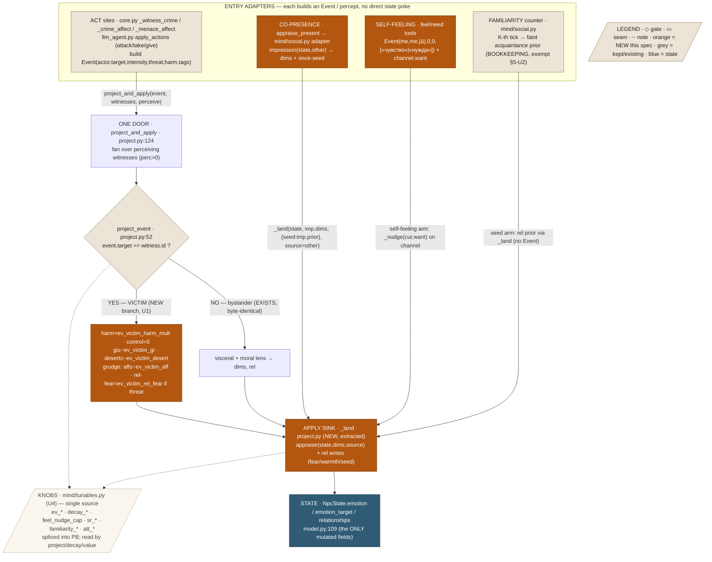
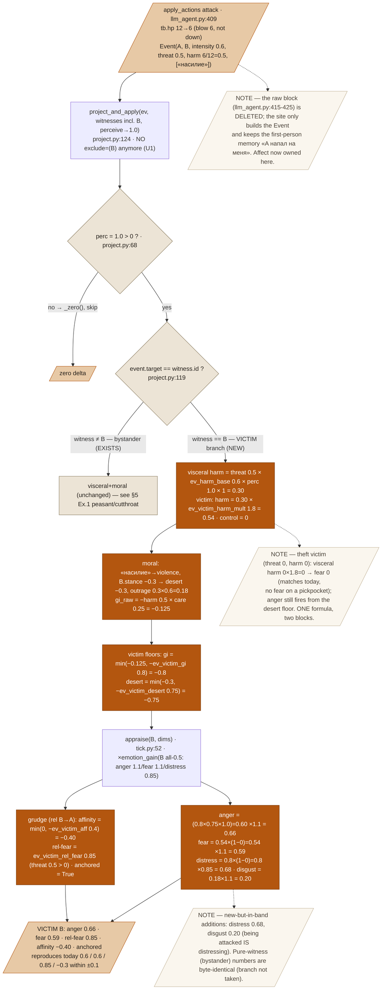

# Единый контур психики — Design Spec

**Goal:** route EVERY mutation of NPC psyche (emotion / emotion_target / relationship deltas) through ONE door — the `Event` and its single pipeline `Event → perception gate → project (visceral + moral lens; victim = target==witness branch) → appraise → state` — deleting the five differently-shaped writers that mutate that state today, with zero behavior change on pure-witness paths and today's victim outcomes reproduced within a ±0.1 band.
**Status:** draft · **From:** [[brain-affective-loop]], [[mind-decision-core]]; builds on `docs/superpowers/specs/2026-07-15-brain-design.md` (МОЗГ Inc1–6).

---

## 1. Problem & context

The affective loop shipped (МОЗГ Inc1–6). But the state it governs — `NpcState.emotion`, `NpcState.emotion_target`, `NpcState.relationships` (`src/aidnd/mind/model.py:109` `rel()`) — is mutated by **five differently-shaped writers**, each with its own knobs, its own clamp discipline, and its own idea of what a "victim" is. Verified against the code:

1. **The good path — Event bus.** An act-resolution site builds an `Event` (`src/aidnd/mind/event.py:12`) and fans it out: `project_and_apply` (`src/aidnd/mind/project.py:124`) → `project_event` (`project.py:52`) → `tick.appraise` (`src/aidnd/mind/tick.py:52`). Visceral + moral-lens channels, data-driven `TAG_AXIS` (`project.py:14`). This is the door everything else should use.

2. **`appraise_present`** (`src/aidnd/mind/appraisal.py:105`) — the continuous co-presence channel. Every present other, every tick: `appraise(state, imp.emo, source=other.id)` with a **bespoke `dims` shape** built in `impression()` (`appraisal.py:136`, keys `revulsion/harm/desert/goal_impact/intent`), plus a **once-only** relationship-prior seed (`appraisal.py:131`) and a memory note.

3. **RAW hand-writes** — four sites poke `emotion`/`rel` directly:
   - `_witness_crime` victim block (`src/aidnd/server/play/engine/core.py:402-405`): `rel["affinity"]=min(cur,-0.5)`, `rel["anchored"]=True`, `emotion["anger"]+=0.7`, `emotion_target["anger"]=PLAYER`, then a memory line (`:406`).
   - `apply_actions` attack victim block (`src/aidnd/mind/llm_agent.py:415-425`): `r["fear"]=max(cur,0.85)`, `r["affinity"]=min(cur,-0.3)`, `r["anchored"]=True`, `emotion["fear"]+=0.6`, `emotion["anger"]+=0.6`, both targeted, memory line.
   - gift-warmth arm inside `project_and_apply` (`project.py:152-155`) — the beneficiary-warms-toward-giver special case. (Already behind the door, but a bespoke arm.)
   - `_menace_affect` (`core.py:374`) — builds a targetless Event (good) **but also** hand-writes a witness memory line + `_npc_save` per witness (`core.py:387-393`).

4. **`feel`/`need` LLM tools** (`llm_agent.py:492-501`) — direct writes clamped by `_nudge` (`llm_agent.py:33`, `±feel_nudge_cap`).

5. **Familiarity accrual** (`src/aidnd/server/play/engine/world.py:768` `_accrue_familiarity`) — direct relationship seeding of a faint acquaintance tie at the K-th co-presence tick.

Consequences of five doors: the **victim tier is hardcoded twice with different numbers** (attack: anger 0.6 / rel-fear 0.85 / affinity −0.3; theft: anger 0.7 / affinity −0.5 / no fear) and is unreachable from the Event bus (the victim is *excluded* from the fan-out — `llm_agent.py:432` `exclude=(tb.id,)`; `core.py:407` `w != npc`). The **knobs are mirrored in four dicts** — `PB` (`config.py:16`), `value.BAL` (`value.py:35`), `decay._K` (`decay.py:13`), `project._K` (`project.py:27`) — guarded only by a brittle sync test (`tests/mind/test_knob_sync.py`). And the **brain's own logic lives in the play layer** (`world.py`): familiarity, greet, attention all sit in `server/play/engine/world.py`, not in `mind/`.

This spec builds the RAILS: one entry, one pipeline, one knob registry, brain logic back in `mind/`. It adds **no new phenomena**.

---

## 2. Goals / Non-goals

**Goals** (each an increment U1–U5, shippable in order):
- **U1** — Victim = a signature-driven branch of `project_event`. Delete both raw victim blocks; the sites only build+emit the Event (target set) and keep their memory line. One formula reproduces attack- and theft-victim tiers within ±0.1.
- **U2** — Co-presence routes through the shared apply sink. The `impression()` social read stays; the direct `appraise`+seed pokes become one `_land()` call. Familiarity decision made and written (see §5-U2).
- **U3** — `feel`/`need` become self-events entering the same door, with the `±feel_nudge_cap` clamp and emotion-target semantics preserved byte-identically.
- **U4** — One knob registry `src/aidnd/mind/tunables.py`; `PB`/`BAL`/`decay._K`/`project._K` reference it; the four sync tests collapse to one splice-guard.
- **U5** — Brain logic (familiarity/greet → `mind/social.py`; attention → `mind/attention.py`) moves out of `world.py`; `world.py` keeps thin call-throughs. Pure moves.

**Non-goals** (explicit):
- **No new phenomena** — no prosocial channel, no emotion contagion, no reputation, no new emotion dims. This is the rails those ride later.
- **Player-facing narrator / LLM paths untouched.** Code still owns dice, inventory, budgets. No new LLM call anywhere.
- **No LOD / wave changes** (B2/B3 just shipped). **No DB / persistence changes** (additive-only reads of the same `NpcState` fields).
- **Decision side (`decide_hybrid`, `value.py` utilities) untouched**, except deleting the victim-affect writes that squatted inside `apply_actions`.
- **Testbed quarantine** (moving `mind/sim.py`/`fsm.py`/`brain.py` MODULARBRAIN to `experimental/`) is OUT — noted as follow-up (§9).

---

## 3. Architecture

The thesis in one line: **one door (`Event`), one sink (`_land`)**. `project_and_apply` today already owns the fan-out + apply; U1–U3 fold the other writers into it, and we extract the per-witness apply into a private `_land(state, dims, rel, source)` so co-presence and self-feeling can share it without dressing themselves as full acts.

Seams the pipeline touches:
- Entry: `event.py:12 Event`, `project.py:124 project_and_apply`.
- Projection: `project.py:52 project_event` (+ NEW victim branch), `appraisal.py:136 impression` (co-presence read, unchanged).
- Apply sink: NEW `project.py _land()` (extracted from `project_and_apply:138-155`), `tick.py:52 appraise`.
- Knobs: NEW `mind/tunables.py` (owns the brain subset), read by `project.py`, `decay.py`, `value.py`; spliced into `config.py:PB`.
- Brain logic: NEW `mind/social.py` (familiarity/greet), NEW `mind/attention.py` (attention); `world.py` call-throughs.

### 3a. Overview block-scheme — five writers become five adapters onto one door



### 3b. Detailed block-scheme — U1 victim branch, traced with real numbers

NPC A attacks NPC B (B at 12 HP, blow = 6 dmg → 6 HP, not killed). The Event built at `llm_agent.py:428` and fanned WITHOUT excluding B:



---

## 4. Data model

### 4a. The mutated state (unchanged — the ONLY fields any writer touches)
```python
# model.py — NpcState
emotion:        dict   # {anger,fear,joy,distress,disgust} → [0..1]
emotion_target: dict   # channel → source body id (who I'm angry AT)
relationships:  dict   # id → {"trust","affinity","fear","anchored"}  (rel() seeds this, model.py:109)
familiarity:    dict   # id → co-presence tick count (bookkeeping; model.py:85)
```

### 4b. NEW victim knobs (in `mind/tunables.py`, U4) — chosen to reproduce both raw blocks within ±0.1
```python
"ev_victim_harm_mult": 1.8,   # visceral harm ×this for the one struck (0 stays 0 → no fear on threatless crime)
"ev_victim_gi":        0.8,   # victim goal_impact floor (drives distress + couples anger)
"ev_victim_desert":    0.75,  # victim desert floor (guarantees deserved-anger fires)
"ev_victim_aff":       0.4,   # grudge affinity ceiling: affinity = min(cur, −0.4)
"ev_victim_rel_fear":  0.85,  # grudge rel-fear when the event carried physical threat (>0)
# victim branch also forces control = 0.0 (no bravery agency-dampening under the blow)
```

### 4c. Existing brain knobs consolidated into `tunables.py` (U4) — enumerated (values byte-identical)
| Group | Keys (current value) | Was in |
|---|---|---|
| decay | `decay_emo_days` 0.5, `decay_rel_anchored_days` 14, `decay_rel_loose_days` 2, `rel_faint_prior` 0.10 | `decay._K` + `PB` |
| event projection | `ev_perc_l2` 0.6, `ev_perc_l3` 0.3, `ev_harm_base` 0.6, `ev_harm_familiar` 0.4, `ev_viol_damp` 0.5, `ev_empathy_care` 0.5, `ev_taboo_mult` 1.6, `ev_approval_k` 0.25, `ev_rel_fear` 0.5, `ev_rel_aff` 0.4, `ev_warmth` 0.2, `ev_control_brave` 0.6 | `project._K` + `PB` |
| self-regulation | `feel_nudge_cap` 0.25 | `value.BAL` + `PB` |
| self_regard | `sr_pride` 0.35, `sr_brave` 0.35, `sr_amb` 0.30, `sr_span` 1.5 | `value.BAL` + `PB` |
| familiarity / greet | `familiarity_k` 4, `familiarity_affinity` 0.05, `greet_sociability_base` 1.4 | `PB` only |
| attention | `att_asleep` 0.2, `att_drunk` 0.4, `att_absorbed` 0.6, `att_alert` 1.3 | `PB` only |
| NEW victim (4b) | `ev_victim_harm_mult` 1.8, `ev_victim_gi` 0.8, `ev_victim_desert` 0.75, `ev_victim_aff` 0.4, `ev_victim_rel_fear` 0.85 | — |

`value.BAL`'s **decision-layer** knobs (`gamma_base`, `transgress`, `caught_per_witness`, …) are NOT brain-affect knobs and stay in `BAL` (out of `tunables`). Direction of import: `tunables.py` lives in `mind/` (import-clean of play); `decay.py`/`project.py`/`value.py` import it directly (same package); `config.py:PB` does `PB.update(BRAIN)` so every existing `PB["ev_…"]`/`PB["att_…"]` read site is unchanged (zero call-site churn).

---

## 5. Behavior — worked examples & the five increments

### U1 — Victim = special case of witness

**Change:** (a) NEW victim branch in `project_event` (§3b). (b) DELETE the raw victim affect blocks (`llm_agent.py:415-425`, `core.py:402-405`), keeping their memory lines. (c) STOP excluding the victim: `llm_agent.py:432` `exclude=(tb.id,)` → `exclude=()`; `core.py:407` includes `npc` in the fanned witnesses so the victim's own Event (target=npc) hits the victim branch.

**Example 1 — A attacks B before two witnesses.** Event: `intensity 0.6, threat 0.5, harm 0.5, [«насилие»]`, actor A, target B. Perc 1.0 for all (co-present). Witnesses: peasant (morals.violence −0.7, empathy 0.6, bravery 0.3, aff→B 0.2); cutthroat (morals.violence +0.5, empathy 0.2, bravery 0.8, aff→B 0.0). B ordinary (all 0.5, morals.violence −0.3).

| Who | Path | harm (visceral) | gi | desert | control | appraise → emotion (×gain) | rel→A |
|---|---|---|---|---|---|---|---|
| **B (victim)** | victim branch | 0.30 ×1.8 = **0.54** | −0.8 (floor) | −0.75 (floor) | **0** | anger 0.60×1.1=**0.66** · fear 0.54×1.1=**0.59** · distress 0.8×0.85=0.68 · disgust 0.20 | aff −0.40 · fear 0.85 · anchored |
| **peasant** | bystander (EXISTS) | 0.5×0.6×(1−0)=0.30 | −0.5×care0.5=−0.25 | −0.7 | 0.6×0.3=0.18 | fear 0.246×1.3=**0.32** · anger 0.175×1.1=0.19 · distress 0.205×0.95=0.20 · disgust 0.42×1.1=**0.46** | fear 0.30×0.5=0.15 · loose |
| **cutthroat** | bystander (EXISTS) | 0.5×0.6×(1−0.5×0.5)=0.225 | −0.5×0.10+approval0.075=**+0.025** | +0.5 | 0.6×0.8=0.48 | joy 0.025×1.1=**0.03** (grim satisfaction) · fear 0.117×0.8=**0.09** · anger 0 (deserved) | fear 0.225×0.5=0.11 · loose |

The SAME Event lands as horror (peasant: disgust 0.46, fear 0.32) and grim satisfaction (cutthroat: joy 0.03, fear 0.09) — the moral lens (`project.py:87-97`) and `ev_control_brave` dampening (peasant bravery 0.3 → control 0.18, barely damped; cutthroat 0.8 → 0.48, fear halved) are byte-identical to today because the bystander branch is untouched. B's tier reproduces today's 0.6 / 0.6 / 0.85 / −0.3 within ±0.06.

**Reconciliation — theft victim** (Event `PLAYER→npc, воровство, intensity 0.4, threat 0, harm 0`; npc morals.theft −0.5): visceral harm 0 ×1.8 = **0 → fear 0** (matches today: no fear on a pickpocket). anger = 0.8×0.75×1.0 ×1.1 = **0.66** (today 0.7, Δ0.04). affinity min(0,−0.4) = **−0.40** (today −0.5, Δ0.10). anchored True. One formula reproduces BOTH raw blocks within ±0.10.

### U2 — Co-presence routes through the shared sink; familiarity stays bookkeeping

**Change:** Extract `_land(state, dims, rel, source, seed=None)` from `project_and_apply` (`project.py:138-155`). `appraise_present` (moving to `mind/social.py` in U5) becomes a thin adapter: for each present other it still computes `impression(state, other, race_rel)` (the tier-a/b/c social read — **real content, unchanged**, `appraisal.py:136`), then calls `_land(state, imp.emo, rel={}, source=other.id, seed={"prior":imp.prior,"remember":imp.remember,"once":True})` instead of poking `appraise()` + `state.relationships[...]` directly. **Emotion is byte-identical** (same `imp.emo` into the same `appraise`); the once-seed is byte-identical (same `imp.prior`, same skip rules incl. `skip_seed_id`). The flat `Event(other,me,0.05,0,0,[«видит»])` is retained only as the conceptual salience marker / `source` tag; it does not re-derive the impression (a flat presence event carries no appearance/armed/charisma read → would DESTROY the tier-a/b/c content), so the impression is passed as the payload. Mapping of every current write:

| `appraise_present` write today | Under U2 |
|---|---|
| `appraise(state, imp.emo, source=other.id)` (per tick) | `_land(...)` emotion arm — same dims, same appraise, same source |
| `state.relationships[other.id] = imp.prior` (once) | `_land(...)` seed arm — same prior, same once-guard |
| `state.memory.add(imp.remember, …)` (once) | `_land(...)` seed arm carries `remember` |

**Familiarity decision (the fork I was asked to settle): (b) — the counter stays pure bookkeeping; its one output (a faint acquaintance prior at the K-th tick) uses the shared seed sink but is NOT wrapped as an Event.** Rationale, written down: an `Event` models an ACT with an actor, salience, and tags scored against a moral axis. "We have now shared a room 4 times" is not an act — it is an accumulated statistic with no actor-intent, no visceral threat, no tag in `TAG_AXIS`. Wrapping it as `Event(other,me,~0,0,0,[«знакомство»])` yields `_zero()` from `project_event` (intensity ~0, tag ∉ axis, harm 0) and would need a bespoke seed arm ANYWAY — pure ceremony that adds fake traffic to the bus. So `familiarity_k`/`familiarity_affinity` accrual (`world.py:768`) moves to `mind/social.py` unchanged as a counter, and at the K-th tick it seeds the faint tie through the SAME `_land` seed arm the co-presence prior uses (unifying the *write*), skipping only the Event wrapper. This honors "one door for every mutation" at the state-write level without inventing a content-free event. `_menace_affect`'s hand-written witness memory line (`core.py:387-393`) similarly stays: memory is not affect (not one of the three mutated affect fields), so it is out of the unification's scope — flagged, not moved.

### U3 — feel / need = self-event through the same door

**Change:** `feel`/`need` tool handlers (`llm_agent.py:492-501`) build a self-event `Event(me, me, intensity=|want−cur|, 0, 0, tags=[«чувство»|«нужда»])` carrying `(channel, want)` and route it to the door's **self-feeling arm** of `_land`: since `actor==target==witness==me`, the pipeline recognizes the `чувство`/`нужда` tag and applies `_nudge(cur, want)` to the named channel (NOT the visceral/moral projection — a deliberate self-regulation is not an appraisal of an external act), with `emotion_target[channel]=me` preserved. The `±feel_nudge_cap` clamp is the same `_nudge` (`llm_agent.py:33`), now living beside `_land`.

**Example 2 (boundary) — feel exceeding the clamp.** `feel {emotion:"anger", value:0.9}`, current `emotion.anger = 0.2`.

| Step | Rule | Input | Output |
|---|---|---|---|
| 1 | build self-event | cur 0.2, want 0.9 | `Event(me,me, |0.9−0.2|=0.7, 0,0,[«чувство»], channel=anger, want=0.9)` |
| 2 | door → self-feeling arm | tag `чувство`, actor==target | routes to `_nudge`, NOT project_event |
| 3 | `_nudge(0.2, 0.9)` (`llm_agent.py:33`) | cap 0.25 | 0.2 + clamp(0.7, ±0.25) = 0.2 + 0.25 = **0.45** |
| 4 | write | | `emotion.anger 0.20 → 0.45`, `emotion_target[anger]=me` |

Byte-identical to today (a capped +0.25 move); the model still cannot erase a justified grudge in one call.

### U4 — One knob registry

**Change:** NEW `mind/tunables.py` exports `BRAIN` (the dict in §4b+§4c). `decay._K`, `project._K` are deleted → both import `from .tunables import BRAIN` and read `BRAIN[...]`. `value.BAL` drops `feel_nudge_cap`/`sr_*` and reads them from `BRAIN`. `config.py` does `from aidnd.mind.tunables import BRAIN; PB.update(BRAIN)` (or a shallow merge) so every `PB["…"]` read is unchanged. The four `test_knob_sync.py` tests (`test_decay_knobs_match_pb`, `test_project_knobs_match_pb`, `test_feel_nudge_cap_matches_pb`, `test_self_regard_knobs_match_pb`) become obsolete — replaced by ONE splice-guard: `test_pb_reexports_brain_tunables` asserting `all(PB[k] == BRAIN[k] for k in BRAIN)` (guards the merge dropped/overrode nothing).

### U5 — Brain reassembles in `mind/`

**Change (pure moves, no behavior change):**
- `mind/social.py` (NEW): `_accrue_familiarity`, `_greet_impulse`, `_pick_newcomer`, `_greeted_toward` move from `world.py:763-817`. `world.py` keeps thin call-throughs (the live loop at `world.py:1196-1206` calls `social.accrue_familiarity`, `social.greet_impulse`, `social.pick_newcomer`, `social.greeted_toward`).
- `mind/attention.py` (NEW): `_body_attention`, `_activity_of` move from `world.py:105-128`. The **one seam that needs a param**: `_activity_of` reads play-layer time via `_phase(gt)`/`_gt()` (`session/time.py:19,52`); the moved version takes `gt: int` and (optionally) a resolved `phase: str` as parameters, and `world.py:569`'s call-through supplies `_gt()`/`_phase()`. `_body_attention` reads `PB[_ATT_MULT[...]]` → now `BRAIN[...]` via `tunables`. No logic change; only the clock/knob dependencies are threaded as arguments so `mind/` stays import-clean of play.

---

## 6. Edge cases & failure modes

**Example 3 (failure) — unknown tag + unperceiving witness.**
- **Unknown tag** (Event `[«пляска»]`, no `TAG_AXIS` row): `_dominant` (`project.py:43`) returns `None` → moral channel zeroed (`desert=outrage=approval=0`). The **visceral channel still fires** from `physical_threat` (harm → fear). A witness feels raw danger but no moral coloring — correct, and unchanged by this spec.
- **`perc = 0` witness**: `project_event` returns `_zero()` at `project.py:68-69`; `project_and_apply` also `continue`s at `:141-143`. **Zero delta** — no emotion, no rel touch. The victim branch is downstream of this gate, so an unperceiving victim (out of sight/earshot) is likewise untouched.
- **Un-enriched witness** (no `worldview.morals`): `morals={}` → every axis 0 → moral lens is a no-op; visceral still fires. Victim branch: `desert` floor `−ev_victim_desert` still drives anger even with empty morals (the wrong was done TO them regardless of their moral map).
- **Self-event on a non-existent channel** (feel with a typo emotion): the tool handler's existing `if e in state.emotion` guard (`llm_agent.py:494`) rejects it before the self-event is built — unchanged.
- **No LLM anywhere in U1–U5** — the whole contour is pure arithmetic over `NpcState`. It runs with the model offline, so it never trips the *no-LLM-fallback* rule. LLM stays narrator/planner only.

---

## 7. Testing strategy

**Migration / compat contract (the acceptance bands):**
- **Byte-identical (must NOT change):** all pure-witness (bystander) projections — spec-A Example numbers in `2026-07-15-brain-design.md` and `tests/mind/test_project_event.py` assertions; `feel`/`need` clamp results; co-presence emotion+seed (same `impression`→`appraise`); familiarity counter+seed; attention/greet/self_regard outputs; all knob VALUES.
- **Within ±0.10 (victim tiers only):** the U1 victim branch. Attack victim: anger 0.6→0.66, fear 0.6→0.59, rel-fear 0.85 (exact), affinity −0.3→−0.40. Theft victim: anger 0.7→0.66, affinity −0.5→−0.40, no fear (exact). Intended additions (in-band): victim distress ~0.68, disgust ~0.20; and trait-gain now modulates victim emotion (a hot-tempered victim rages harder) — a correctness improvement, not a regression.

**Unit-testable (no live model):**
- `project_event` victim branch: `event.target == witness.id` on the §5-Ex1 Event → `dims.harm == 0.54`, appraise → `emotion.anger ∈ [0.60,0.70]`, `emotion.fear ∈ [0.54,0.64]`, `rel.affinity == −0.40`, `rel.fear == 0.85`, `rel.anchored is True`.
- Theft-Event victim (threat 0) → `emotion.fear == 0.0`, `emotion.anger ∈ [0.60,0.70]`, `rel.affinity == −0.40`.
- Bystander regression: peasant/cutthroat from §5-Ex1 land the exact numbers in the table (guards "byte-identical").
- U3: `_nudge(0.2, 0.9) == 0.45`; feel self-event sets `emotion_target[anger]==me`.
- U4: `test_pb_reexports_brain_tunables` — `PB[k]==BRAIN[k]` for every brain key; `project`/`decay`/`value` read the same object.
- U5: import `mind/social.py`, `mind/attention.py` with no play-layer import; `_activity_of(state, gt=…, phase="night")` returns `"asleep"` for a routine mind (moved-logic parity).

**Live verify (haiku-playtester, the standing method):** in a running world — (1) attack an NPC before a lawful and a lawless bystander, confirm the victim's grudge + the split reaction survives a save/reload; (2) pickpocket an NPC, confirm anger-no-fear; (3) drive a `feel` over-nudge in `/minddebug`. Full 770-test suite green after each increment.

---

## 8. Constraints honored

- **No mechanical gates** ([[no-mechanical-gates]]) — nothing is capped or cooled down; the victim branch models the missing world piece (the victim IS a witness) and feeds signature into the same prompt-agnostic arithmetic. Verified with live LLM in §7.
- **No LLM fallback** ([[no-llm-fallback]]) — zero LLM on the whole contour; nothing to fall back from. An un-enriched witness → zeroed moral lens, never a canned stub.
- **Code owns dice/inventory/budgets** — all magnitudes are `tunables.py` constants in `mind/` (a pure module, the `value.BAL`/`DEFAULT_RULES` precedent); the LLM authors nothing on this path.
- **Docs canon** ([[docs-canon]]) — this decision is recorded here under `docs/superpowers/specs/`, not duplicated into memory.
- **Tunables single-sourced** — U4 replaces four mirror dicts with one `BRAIN` registry; `PB` splices it (play reads the brain subset FROM `mind/`, respecting `mind/` ⊥ play).

---

## 9. Scope & roadmap

- **U1** (victim branch) — ships first; standalone, immediately deletes the two most-divergent writers. Highest correctness payoff.
- **U2** (co-presence `_land` + familiarity decision) — depends on the `_land` extraction; familiarity settled as bookkeeping (§5-U2).
- **U3** (feel/need self-event) — independent of U1/U2; can land any time after `_land` exists.
- **U4** (tunables registry) — mechanical; do BEFORE U5 so the moved attention/greet code reads `BRAIN` not `PB`.
- **U5** (brain moves to `mind/`) — pure moves, last; depends on U4 for the knob source.
- **Deferred / follow-up (OUT of this spec):** testbed quarantine (`mind/sim.py`, `mind/fsm.py`, `mind/brain.py` MODULARBRAIN → `experimental/`); familiarity-counter cap/eviction (`world.py:779` backlog); the reparative-act (`norm`) channel emitter still un-wired (`project.py:113`). Each is its own increment.

---

## 10. Resolved decisions (were open; закрыты при ревью)

- **U4 splice mechanics:** `PB.update(BRAIN)` (flat merge, simplest, chosen above) vs `PB` holding a `PB["brain"] = BRAIN` sub-dict (namespaced, but churns every `PB["ev_…"]` call site). РЕШЕНО: flat merge `PB.update(BRAIN)`; сплайс-гард в тесте падает, если ключ коллидирует with a non-brain `PB` key (none do today — verified against `config.py:16-270`).
- **U1 victim distress:** the branch introduces victim distress (~0.68) that the raw blocks lacked. РЕШЕНО: keep — дистресс жертвы (~0.68) остаётся; это in-band (допуск §7 покрывает) и вернее модели аффекта, чем сырые блоки.
- **U2 `[«видит»]` marker:** РЕШЕНО: retain — плоский presence-Event с тегом `«видит»` остаётся на шине; он же становится точкой подвеса будущего заражения/Pillar 3.
